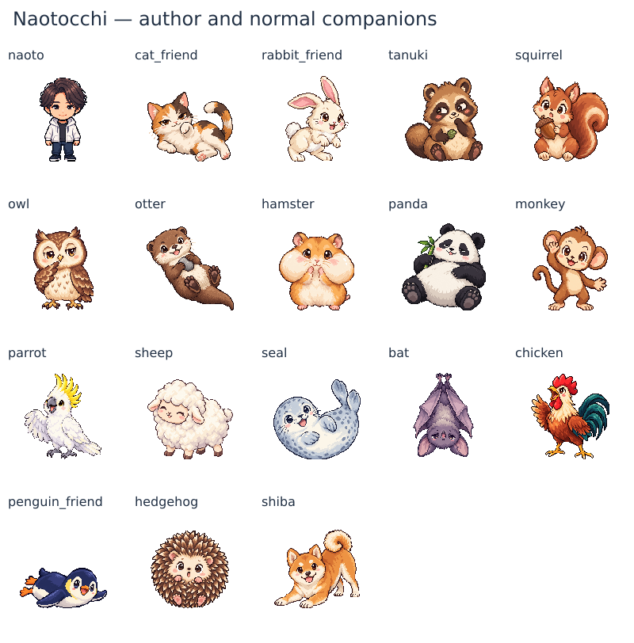

# 作者・通常仲間の128px画像（チェックポイントBD）

作者1枚と通常仲間17枚を追加。先行のせっかちなカタツムリを合わせ、通常仲間18体のPNGが揃った。プレイヤー31種248枚とカタツムリの計249枚は、GitHub HEAD `f6a43977297be2a557a1546b779ada17edbc1d8c` とバイト一致のまま保持している。

[濃色背景での2倍表示](normal-cast-128-dark.png) / [寸法・余白・色数・ハッシュ・生成指示の記録](normal-cast-128-validation.json)

## 実装した範囲

- 作者ナオトは承認済み「なおとのスペシャルキャラクターシート」の前向き立ち姿を参照。中央分けの黒褐色の髪、白いパーカー、暗色の服、穏やかな閉じ口の笑顔を保持した。
- 通常仲間は現行マスターの性格・行動から、寝そべる三毛猫、跳ねるうさぎ、葉を持つたぬき、木の実に驚くリス、考えるふくろう、石で遊ぶカワウソ、頬を膨らませるハムスター、笹を持ってくつろぐパンダ、手を振るサル、おしゃべりするオウム、眠そうなヒツジ、転がるアザラシ、逆さのコウモリ、鳴くニワトリ、腹ばいのペンギン、丸まるハリネズミ、遊びに誘うしばいぬを個別に制作した。
- 17体の定義にそれぞれのPNG参照を追加し、既存の画像表示処理で仲間列・図鑑・プロフィール・仲間の誘い画面に使う。カタツムリの画像・遭遇・会話、旧コアラの保存済みデータは維持する。
- 作者はPNGとマスター定義まで。作者の登場イベント・エンディングへの組み込みは未実装。今回の通常立ち姿を、歯を見せた笑顔のエンディング用画像と同一扱いにしない。

## 確認

全18枚を単体で生成し、作者だけ背景を個別修正した。単体ごとに全身を確認して透過・縮小し、一覧画像の均等分割・一括crop・GrabCutは使用していない。全身、顔、耳、手足、羽、尾、背景の混入を、原画・実寸・白背景・濃色背景で確認した。

267枚のPNGを実復号し、全chunk CRC、128×128・8-bit RGBA、二値alpha、全方向8px以上の透明余白を確認。新18枚は最大63不透明色。既存249枚は再減色していない。

Runtime smoke test（DOM 286 / ミニゲーム89 / variant collections 80）と会話・本文・旧セーブ互換の回帰テストが成功。新しいテストは通常仲間18体×5表示サイズ、左右9体ずつの画像参照、獲得済み図鑑、未遭遇キャラの非表示を確認する。

開発中のゲームURLはブラウザーから `ERR_BLOCKED_BY_CLIENT` となったため、今回の実ゲーム画面の撮影は未実施。画像一覧とRuntimeハーネスの検証を、実ブラウザーの確認とは区別している。

## 未完了

専用キャスト45素材のうち19枚が存在する。残りはレア仲間8枚と恋人18枚の計26枚。作者の登場・エンディングへの組み込みと、実画面での表示確認も残る。PR #183はopen / Draft・未マージで継続する。
