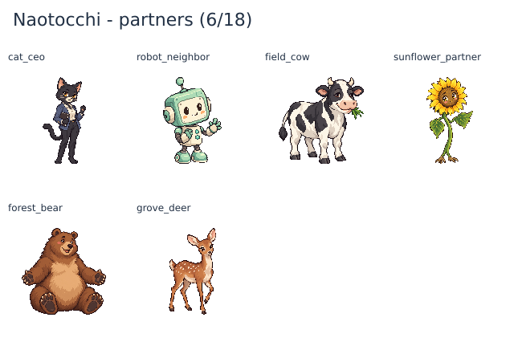

# 恋人キャラクターの128px画像（チェックポイントBG）

GitHub HEAD `20786e47a47424c63322cb3993e41a6ac8c808f3`、Runtime #224 SUCCESSを基準に、現在の恋人18体のうち最初の6体へ専用PNGを追加した。キャスト・性別・恋愛タイプ・初遭遇地域・会話・出会いや結婚の条件は変えていない。

[濃色背景での2倍表示](partner-cast-128-dark.png) / [生成指示・寸法・余白・色数・SHA-256](partner-cast-128-validation.json)

| ID | 見た目と役割の区別 |
|---|---|
| `cat_ceo` | 黒猫のスーツ姿、手帳、立ち姿。育成ねこ・気まぐれなねこと服装・姿勢を分けた。 |
| `robot_neighbor` | ミント色の四角い頭とクリーム色の体。胸に手を添えた、感情を覚えるロボット。 |
| `field_cow` | 白黒の牛、四本の足、口元の草。相手へ草を渡す日常を表す。 |
| `sunflower_partner` | 長い茎、大きな花の中心、葉の腕、根の足。タンポポと輪郭を分けた。 |
| `forest_bear` | 腕を開いて座る大きな茶色のクマ。寄りかかれる場所としての安心感を表す。 |
| `grove_deer` | 大きな耳と細い脚、片方の前脚を上げて近づくシカ。信頼による距離の変化を表す。 |

## 制作と表示

内蔵画像生成で1体ずつ制作し、原画・128px実寸・白背景・濃色背景で確認した。各体の全身を個別に縮小し、128×128 RGBA、二値alpha、最大63不透明色、全方向8px以上の透明余白へ統一。均等セル切り出し・一括crop・GrabCutは使っていない。既存276枚はバイト不変。

保存済みの恋人IDから現在のWORLD_MASTERの画像を解決し、左上の恋人表示・プロフィール・図鑑・初遭遇・デート・結婚記念日のムービーに接続した。左上の位置、ハート、既婚時の指輪を保ち、CSSは変更しない。デート・記念日では主人公も既存PNGを表示する。

旧セーブの恋人には画像パスの追加を要求せず、関係性・性別・恋愛対象・なかよし度を保存したまま画像を表示する。同一キャラの旧IDには既存aliasを使用し、通信相手や対応しない旧恋人は元のemojiを表示する。未制作12体と画像読み込み失敗時にもemoji表示を維持する。

## 検証と進捗

Runtime smoke、会話・全248段階本文、通常仲間・レア仲間・時計・旧コアラ/旧きのこの回帰テストが成功。恋人は6体×5表示サイズ、旧セーブ、左上・プロフィール・図鑑・初遭遇・デート・銀婚式、ハート/指輪、0/18・1/18・18/18、未遭遇非表示、旧ID・通信相手を確認した。

現在は恋人6/18枚、現行専用キャスト33/45枚。旧きのこ1枚とプレイヤー248枚を含めてキャラPNGは282枚。残る恋人12枚の制作を継続する。作者画像のイベント・エンディング反映と実画面確認も残る。実ゲームのブラウザー撮影は今回未実施。PR #183はDraft・未マージで継続する。
