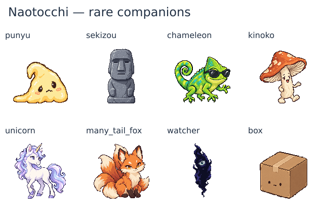

# レア仲間8体の128px画像（チェックポイントBE）

現行WORLD_MASTERのレア仲間8体に専用PNGを追加した。通常仲間18体と合わせ、仲間26体が既存のCharacter Rendererで画像を表示できる。先行267枚（プレイヤー248・作者1・通常仲間18）は、GitHub HEAD `79a47d46ee47075c238e08945ca458d8e7d38f41` とバイト一致のまま保持した。

[濃色背景での2倍表示](rare-cast-128-dark.png) / [寸法・余白・色数・ハッシュ・生成指示](rare-cast-128-validation.json)

## 個体ごとの特徴

| ID | 画像の特徴 |
|---|---|
| `punyu` | 淡い黄色の身体が片側へ広がる、困り顔のぷにゅ。丸い紫の？？？とは輪郭と材質を分けた。 |
| `sekizou` | 灰色の石像。細い彫り目・長い鼻・一直線の口で無表情を保持。台座まで一続きの像。 |
| `chameleon` | 緑と青緑の身体、サングラス、口元の笑み、巻いた尾。4本の脚と足先を残した。 |
| `kinoko` | 傾いた銅橙色の傘と長い柄、歩く足、話しかける腕と開いた口。育成キノコと姿勢・傘の輪郭を分けた。 |
| `unicorn` | 白い身体、淡い紫と青のたてがみ、一本の角、4本の脚。迷子でも落ち着いた表情。 |
| `many_tail_fox` | 琥珀色の目と穏やかな笑み。重なった尾の先を5つ見せ、数えたくなる輪郭にした。ゲーム側へ尾の本数の固定設定は追加しない。 |
| `watcher` | 細い紺色の影に一つの目と小さな口。ぷにゅの丸さやおばけの愛嬌と区別し、こちらを見る存在感を重視。 |
| `box` | テープで閉じた普通の段ボール。控えめな目と口だけを残し、中身を描かない。 |

## 制作・実装

内蔵画像生成で一体ずつ制作。カメレオンだけ、足先の省略を単体修正し、編集後に生じた市松背景を背景のみの再編集でマゼンタへ置き換えて透過した。巻いた尾の内側・脚の間も抜き、緑の身体・爪・サングラスの反射を保持した。他7枚は修正のたびに再生成していない。

各単体の全身を確認し、個別の縮尺で128pxへ書き出した。一覧の均等分割・一括crop・GrabCutは不使用。新8枚は128×128・8-bit RGBA・二値alpha・最大63不透明色・上下左右8px以上の透明余白。全275 PNGのCRC・実復号・寸法・透過・余白を確認し、先行267枚を再減色していない。

レア仲間の定義とRuntimeへassetを渡し、レア図鑑を共有画像表示関数へ接続した。誘い画面・プロフィール・仲間列は既存の共有処理をそのまま利用する。キャストID、名称、セリフ、遭遇・加入条件、セーブ形式、CSSは変更していない。

## 検証と残作業

Runtime smoke（DOM 286 / ミニゲーム89 / variant collections 80）と会話・本文・旧コアラ互換の回帰テストが成功。追加テストでは、8体×5表示サイズ、各体の誘い・プロフィール・仲間列・図鑑、未遭遇時のレア図鑑非表示、1/8表示、8/8表示、通常とレアを合わせた左右13体ずつの参照、なかよし度の保持を確認した。

画像は原画・128px実寸・白背景・濃色背景で目視確認済み。実ゲームのブラウザー撮影は未実施で、この環境では前回の開発URLへの接続が `ERR_BLOCKED_BY_CLIENT` になっている。Runtimeハーネスの成功を実画面確認の成功とは扱わない。

専用キャスト45素材のうち27枚（作者1・通常仲間18・レア仲間8）が存在する。残りは恋人18枚。作者画像のイベント・エンディングへの反映と、実画面での表示確認も残る。全体は未完了、PR #183はopen / Draft・未マージで継続する。
