# star-distance — 2789b990b800b0639914005dd4d4ed4e36bd3bae

PENDING_VISUAL_REVIEW — export success is not image approval. Chromium/SwiftShader is not Human/iPhone acceptance.

[All original selected images](raw-evidence.zip) · [SHA256 manifest](manifest.json)

## player-star-1-back.png

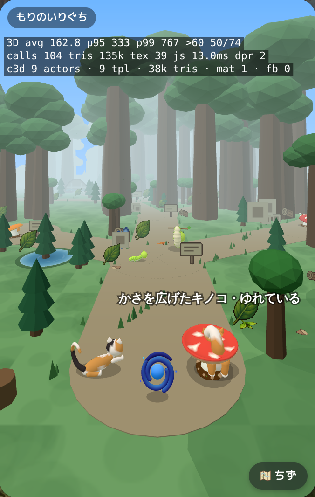

## player-star-1-front.png

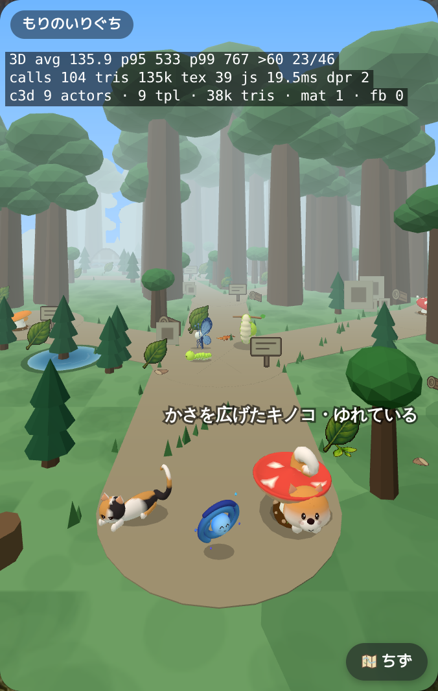

## player-star-2-back.png

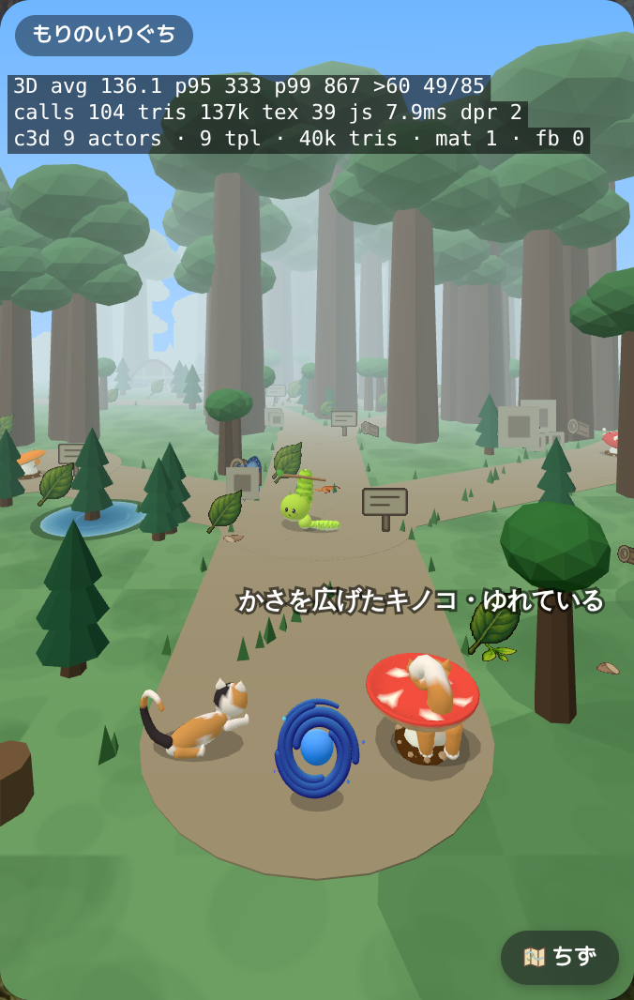

## player-star-2-front.png

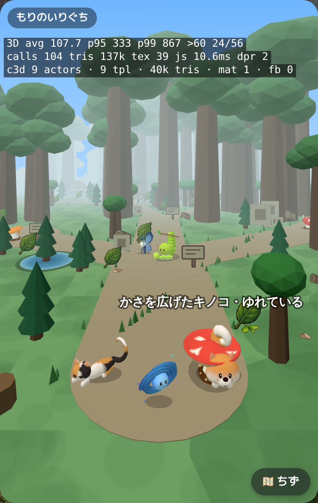

## player-star-3-back.png

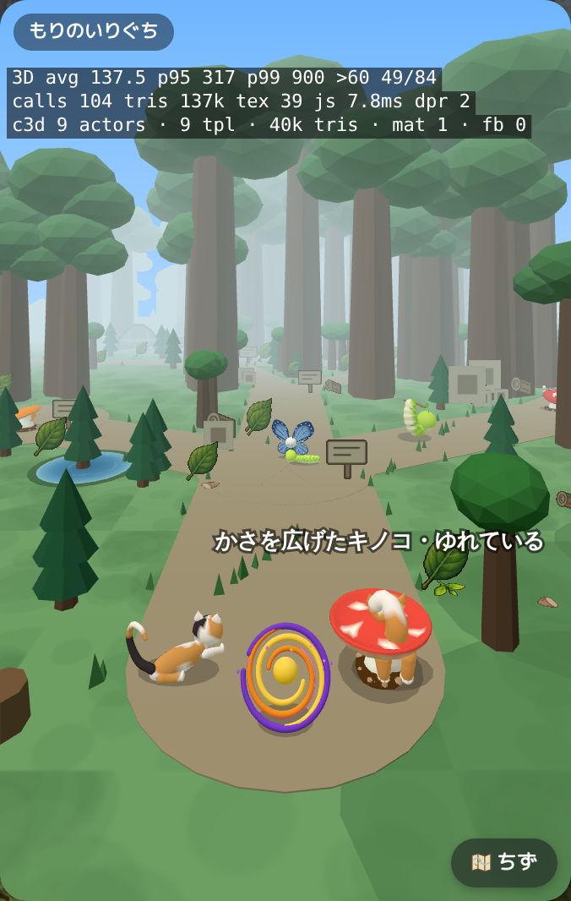

## player-star-3-front.png

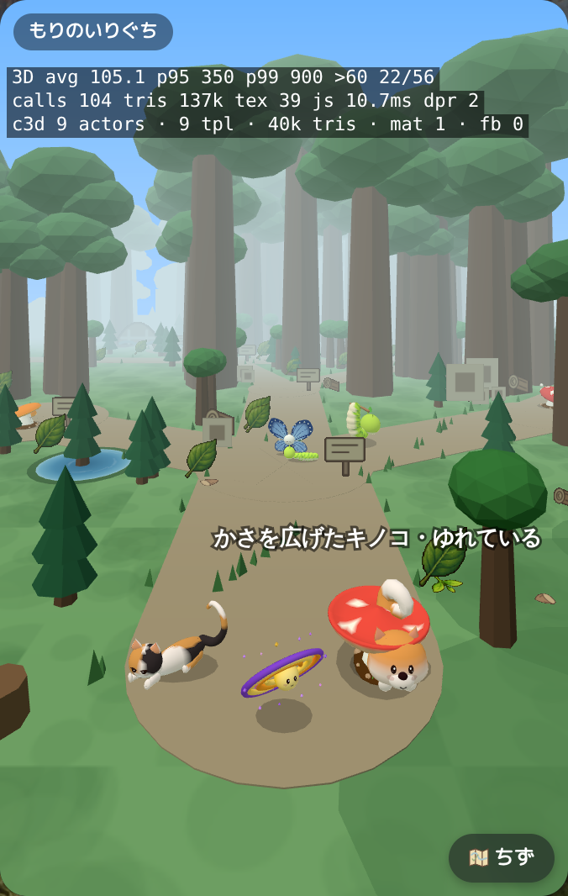

## player-star-4-back.png

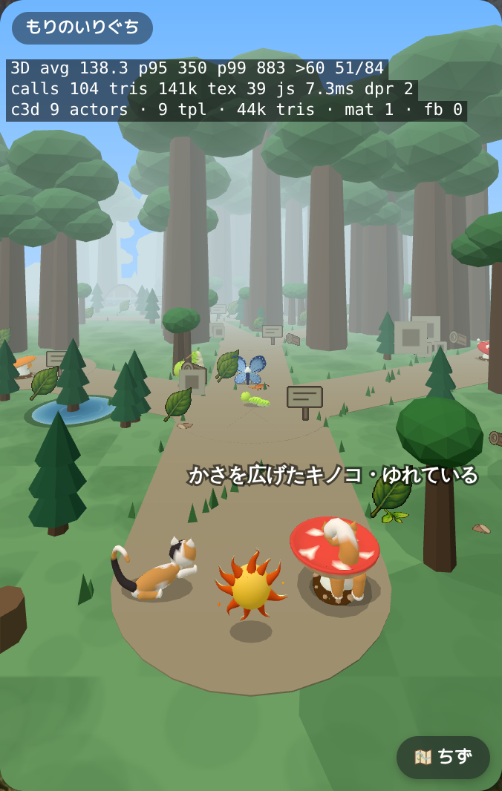

## player-star-4-front.png

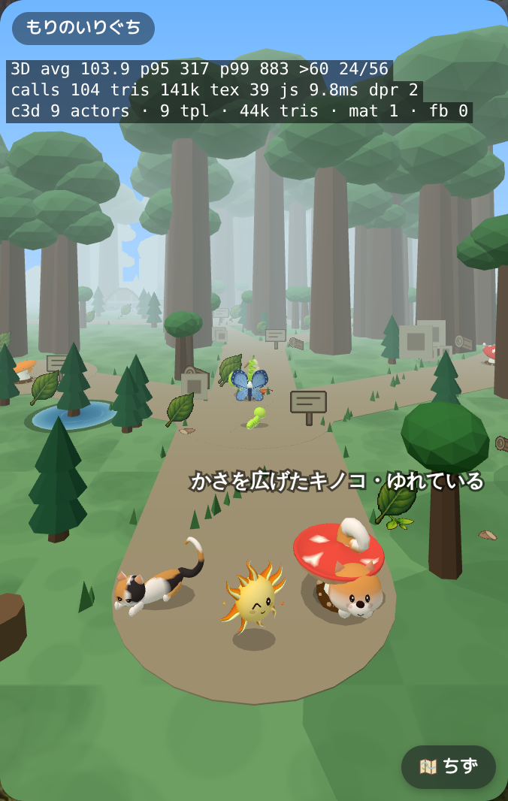

## player-star-5-back.png

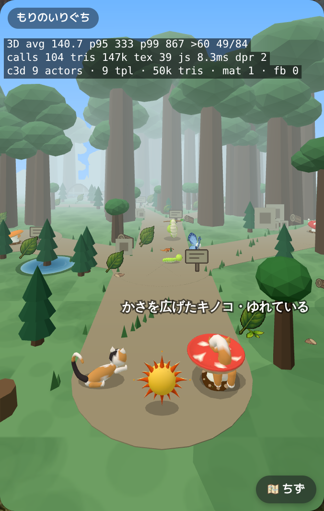

## player-star-5-front.png

## player-star-6-back.png

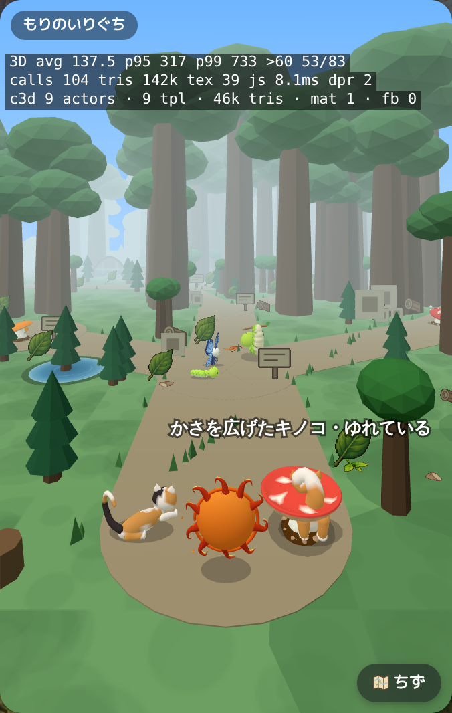

## player-star-6-front.png

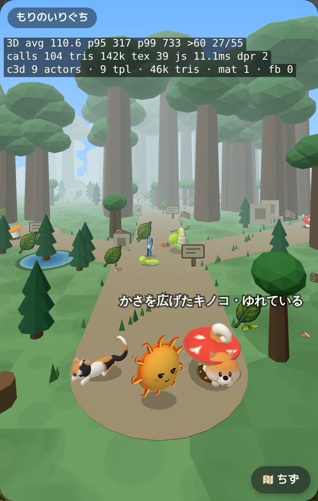

## player-star-7-back.png

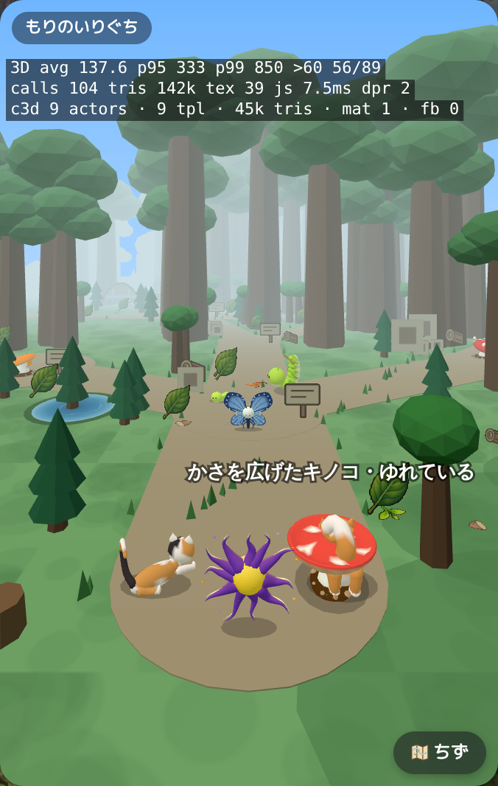

## player-star-7-front.png

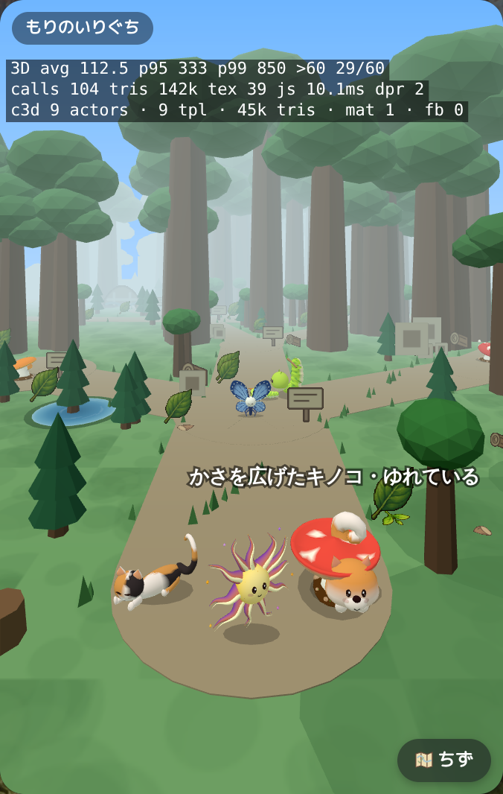

## player-star-8-back.png

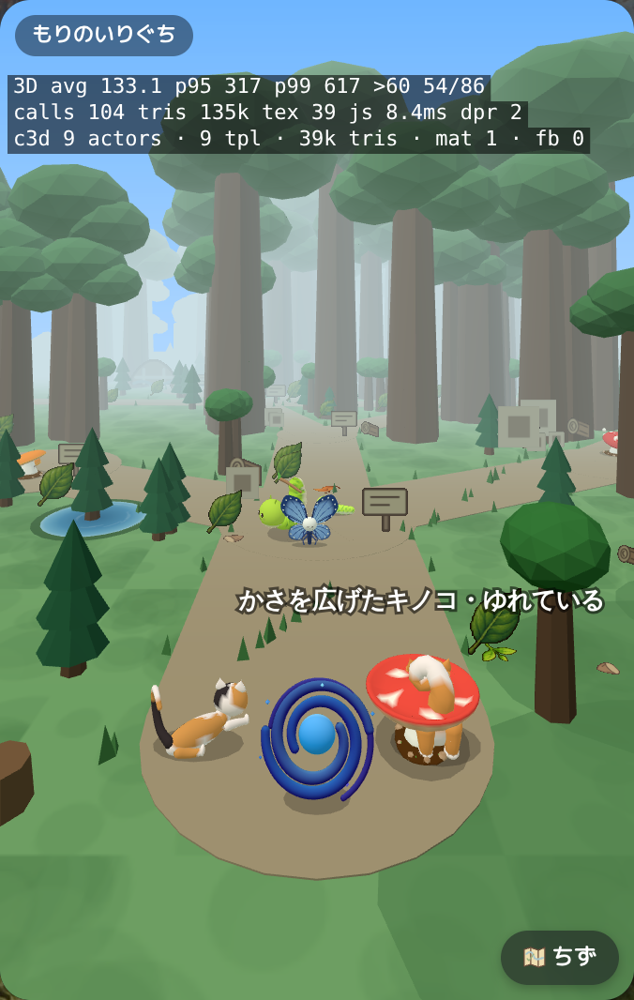

## player-star-8-front.png

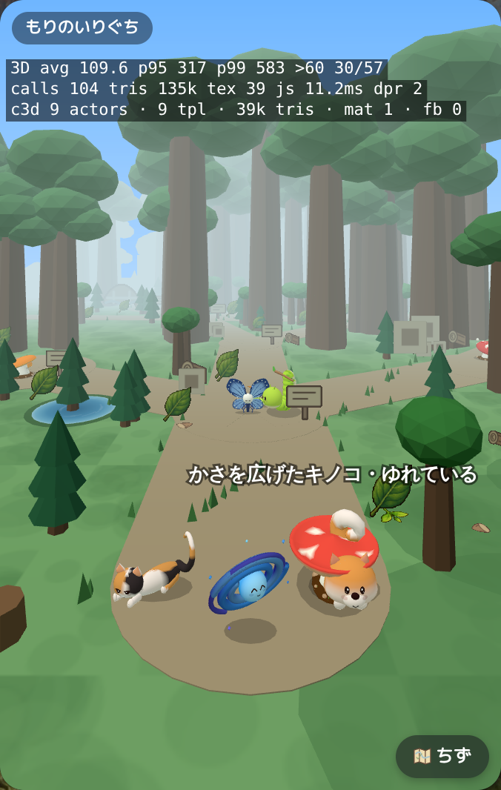
