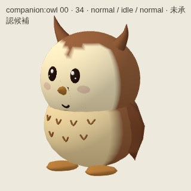
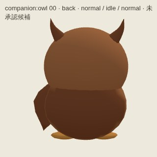
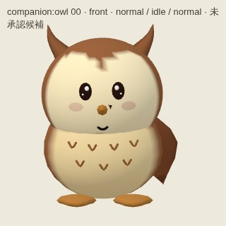
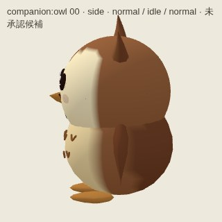
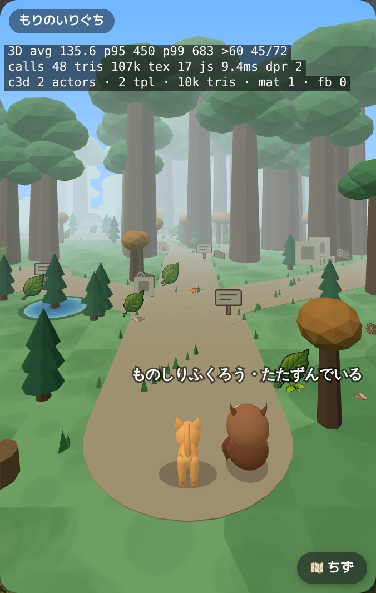
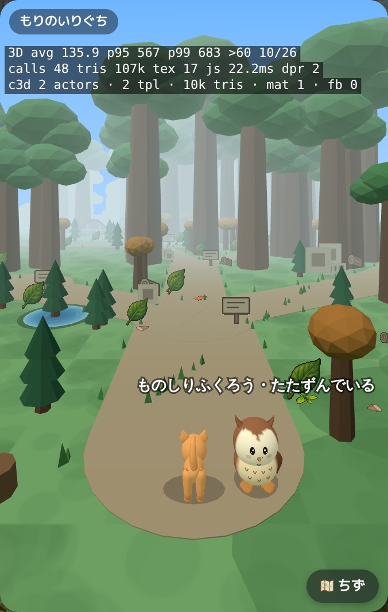
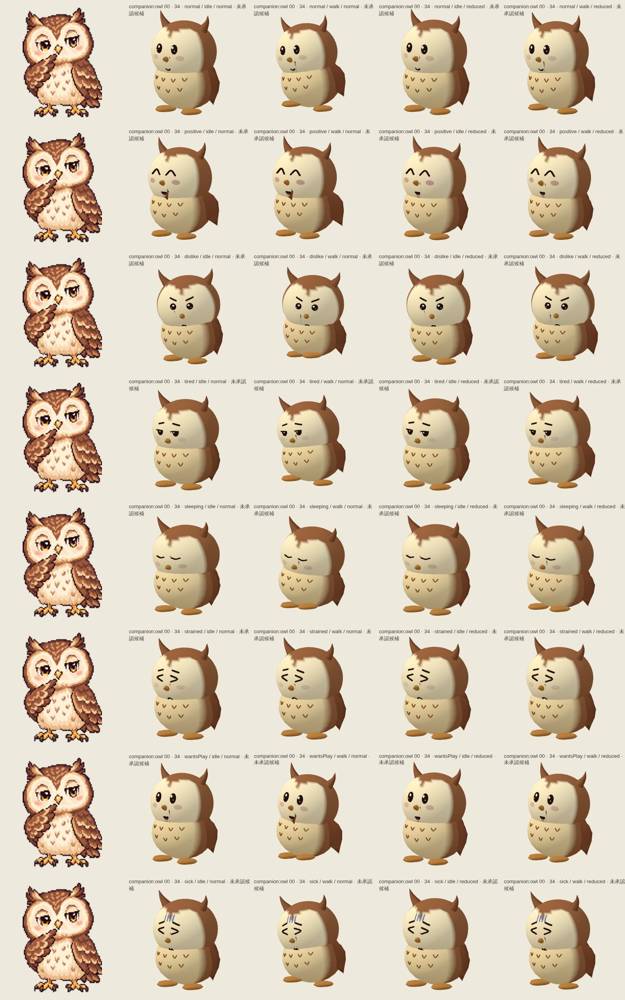
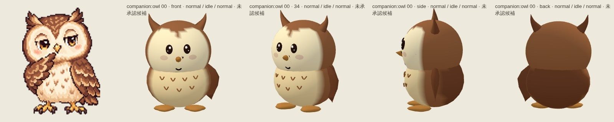

# owl — 46ff692b1c0f3900db2839cc7000a25fb5c0446c

PENDING_VISUAL_REVIEW — export success is not image approval. Chromium/SwiftShader is not Human/iPhone acceptance.

[All original selected images](raw-evidence.zip) · [SHA256 manifest](manifest.json)

## companion-owl-0-34.jpg

## companion-owl-0-back.jpg

## companion-owl-0-front.jpg

## companion-owl-0-side.jpg

## companion-owl-distance-back.jpg

## companion-owl-distance-front.jpg

## companion-owl-motion.jpg

## companion-owl-views.jpg

