# unknown-distance — 47e62641538e0fd59ea94ad3598f3596b994408f

PENDING_VISUAL_REVIEW — export success is not image approval. Chromium/SwiftShader is not Human/iPhone acceptance.

[All original selected images](raw-evidence.zip) · [SHA256 manifest](manifest.json)

## player-unknown-1-back.png

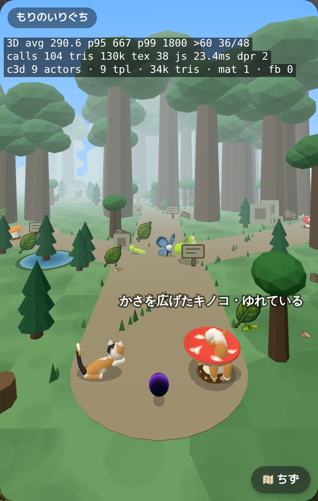

## player-unknown-1-front.png

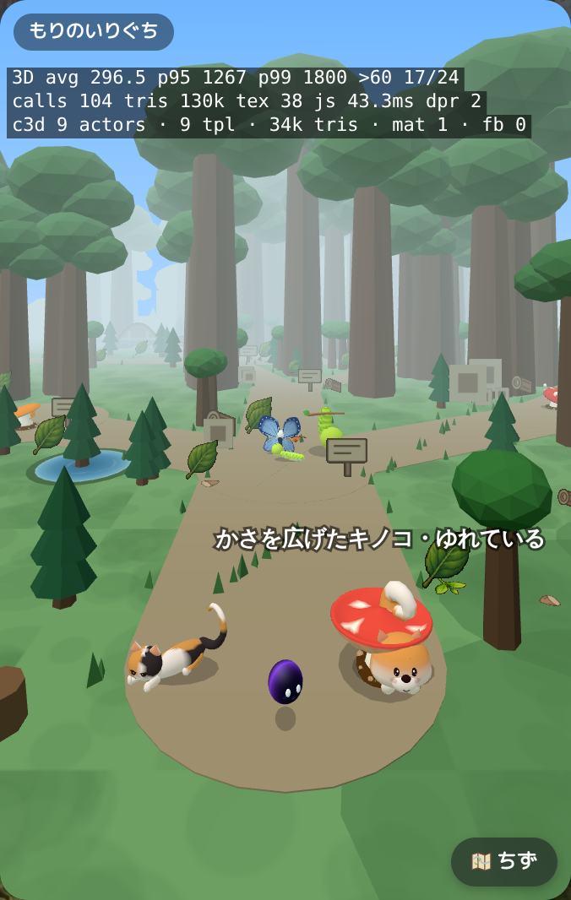

## player-unknown-2-back.png

## player-unknown-2-front.png

## player-unknown-3-back.png

## player-unknown-3-front.png

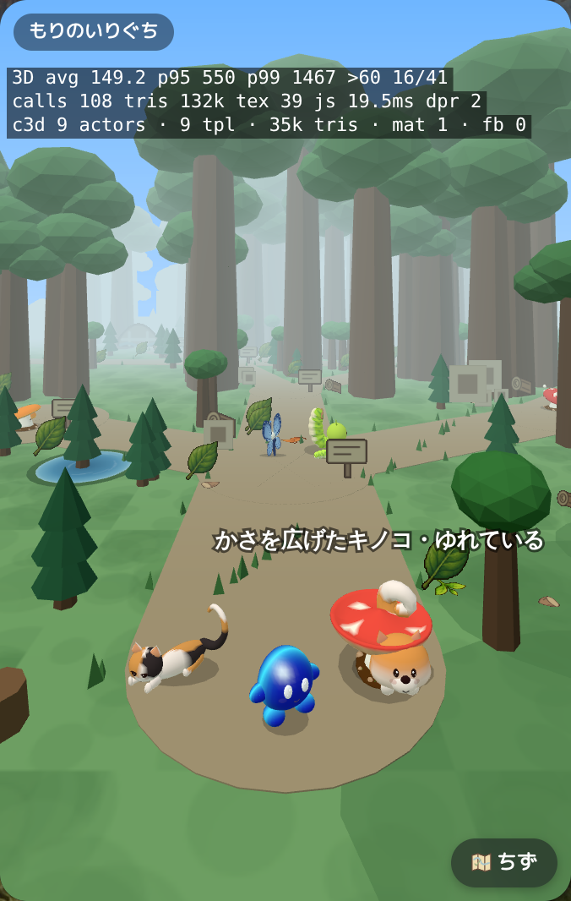

## player-unknown-4-back.png

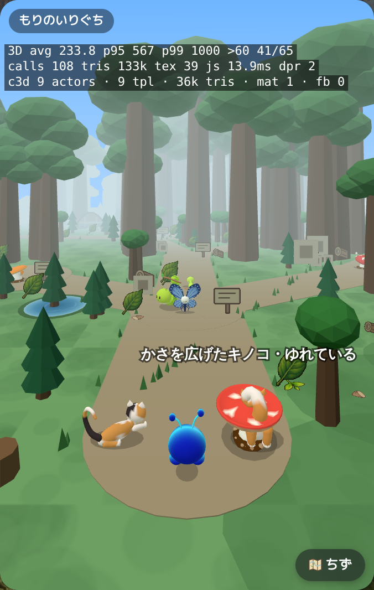

## player-unknown-4-front.png

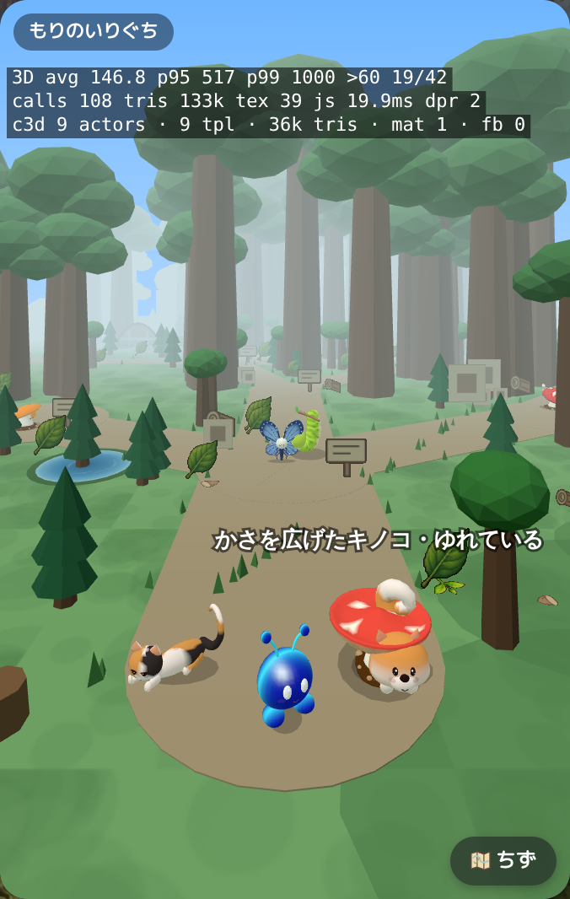

## player-unknown-5-back.png

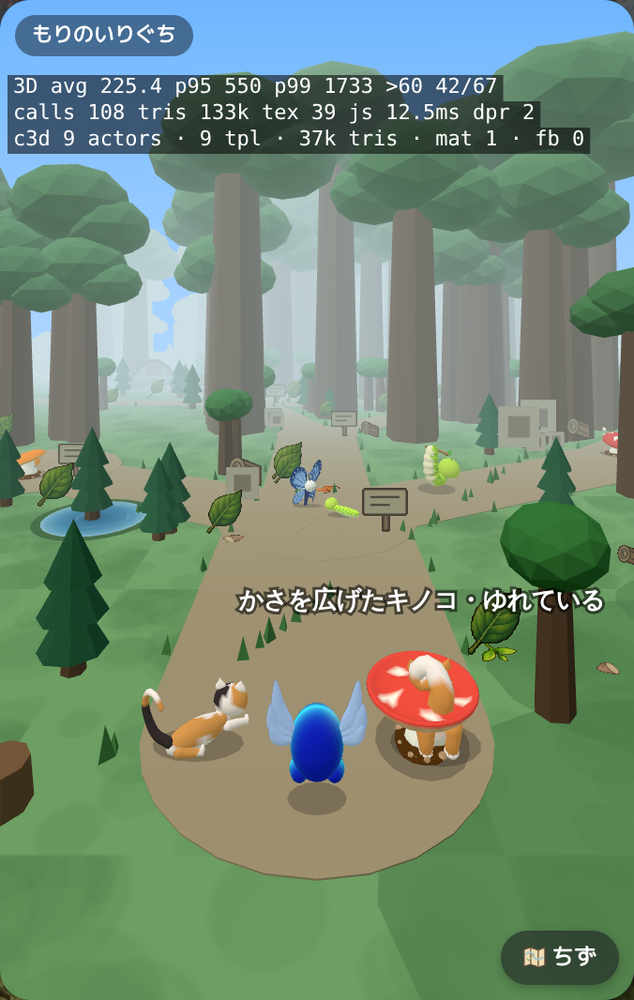

## player-unknown-5-front.png

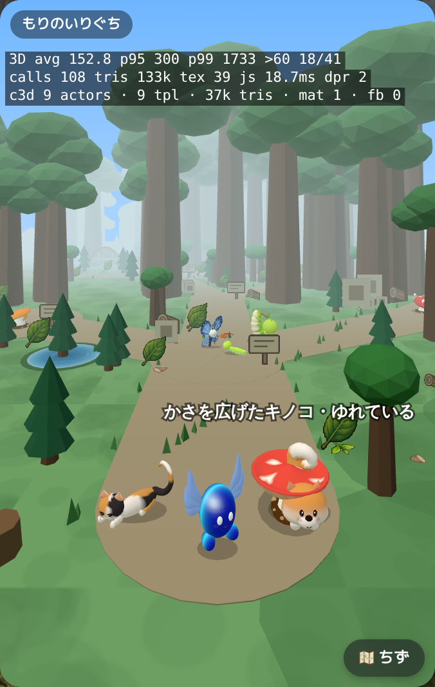

## player-unknown-6-back.png

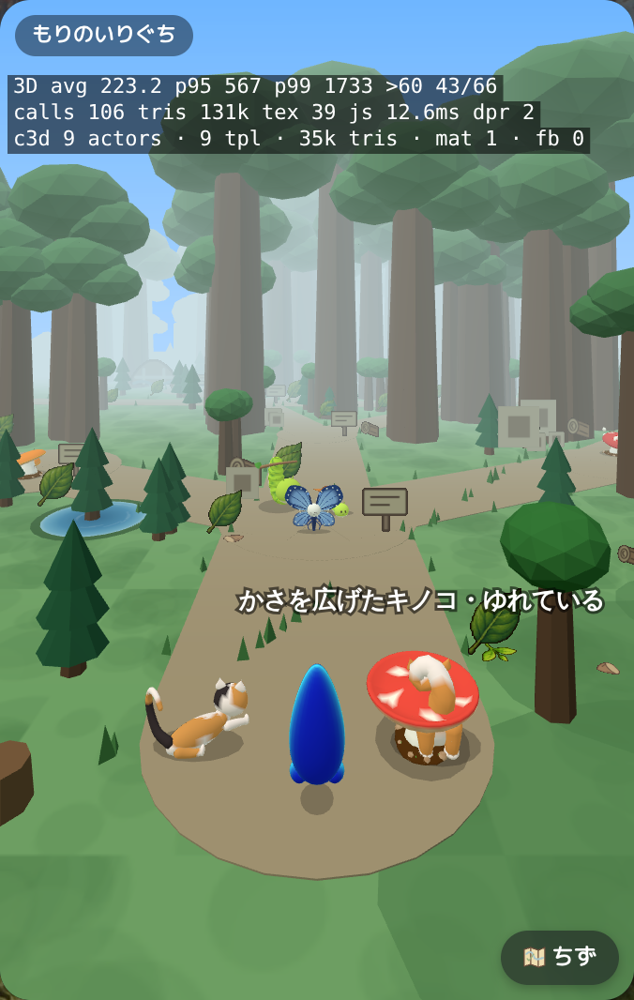

## player-unknown-6-front.png

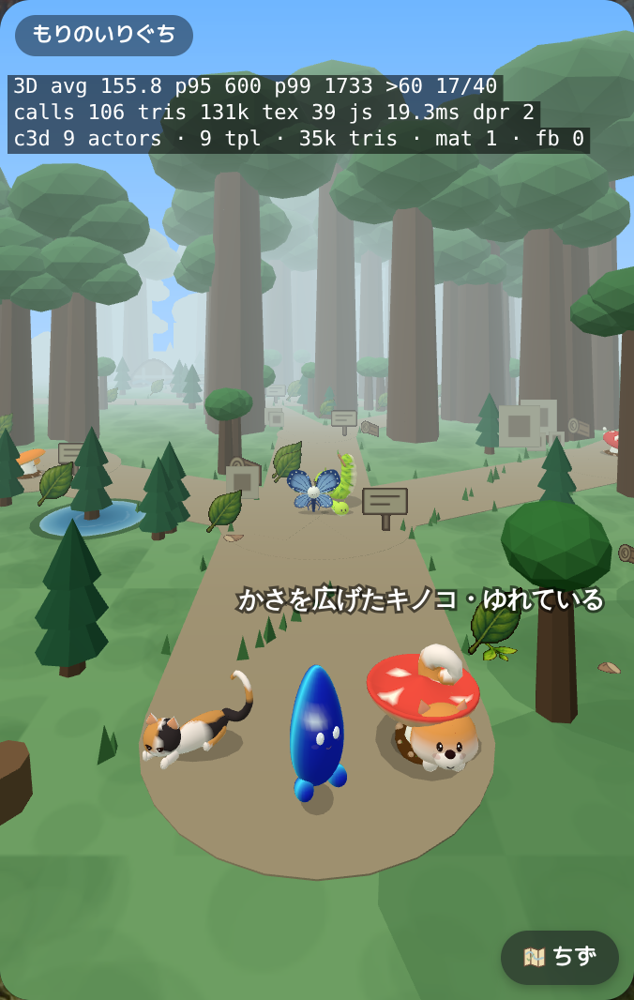

## player-unknown-7-back.png

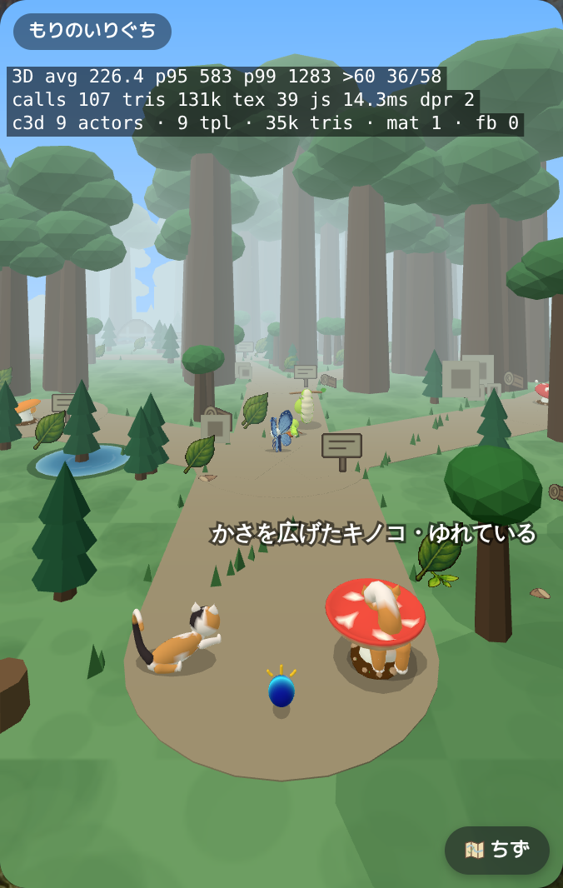

## player-unknown-7-front.png

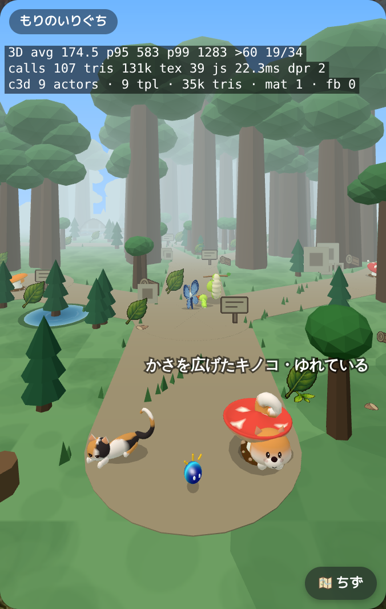

## player-unknown-8-back.png

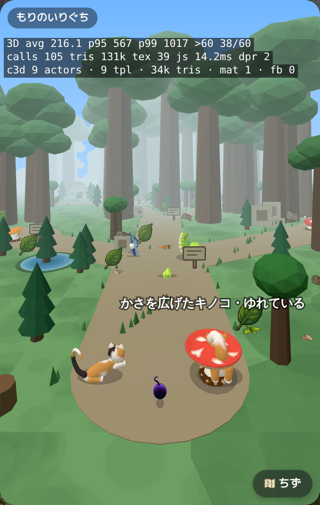

## player-unknown-8-front.png

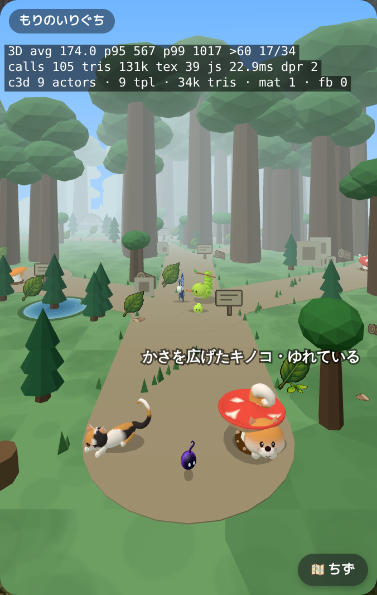
