# ghost-distance — 4f3a83933e0ef9ef26a6838d5530324d98b9f183

PENDING_VISUAL_REVIEW — export success is not image approval. Chromium/SwiftShader is not Human/iPhone acceptance.

[All original selected images](raw-evidence.zip) · [SHA256 manifest](manifest.json)

## player-ghost-1-back.png

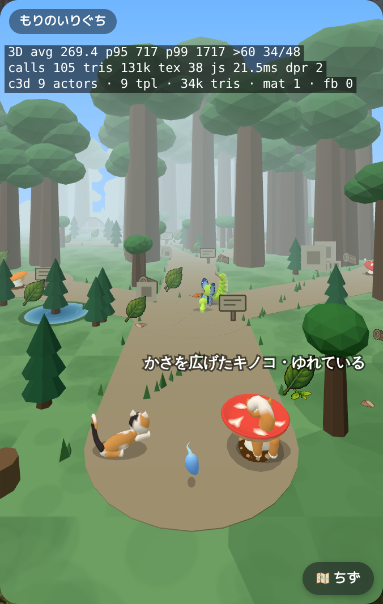

## player-ghost-1-front.png

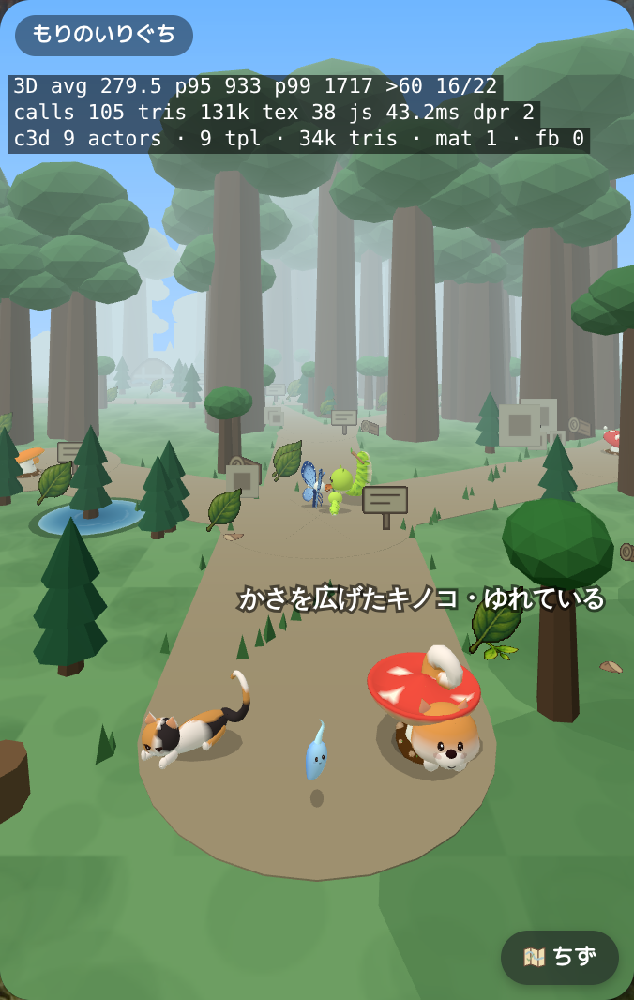

## player-ghost-2-back.png

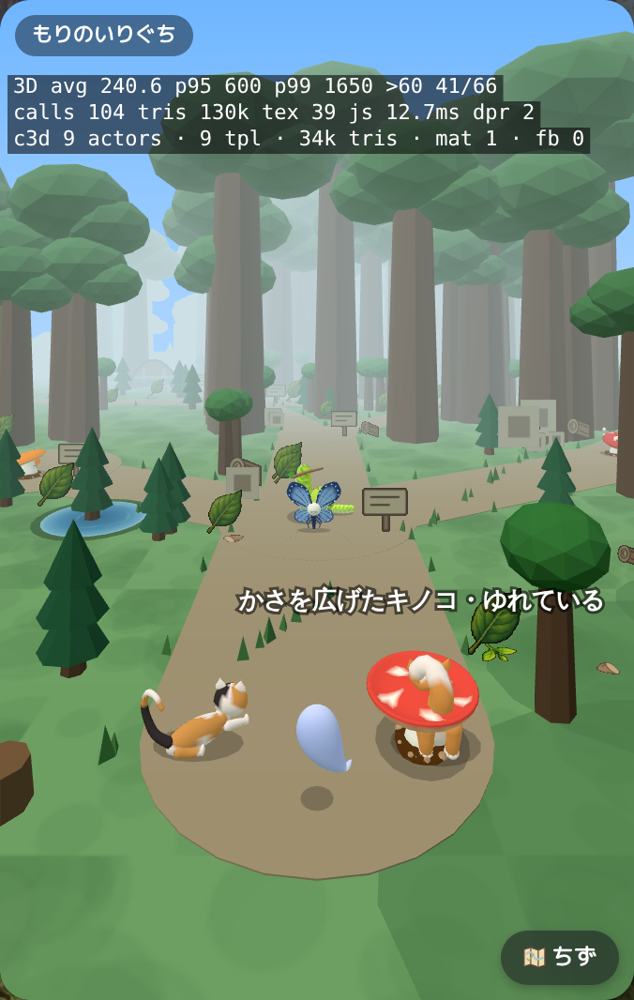

## player-ghost-2-front.png

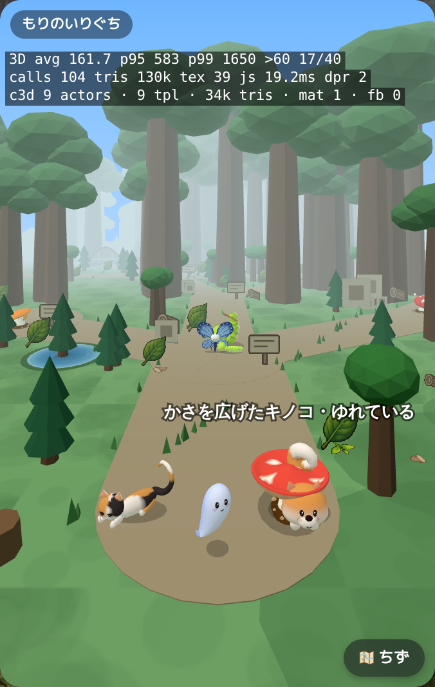

## player-ghost-3-back.png

## player-ghost-3-front.png

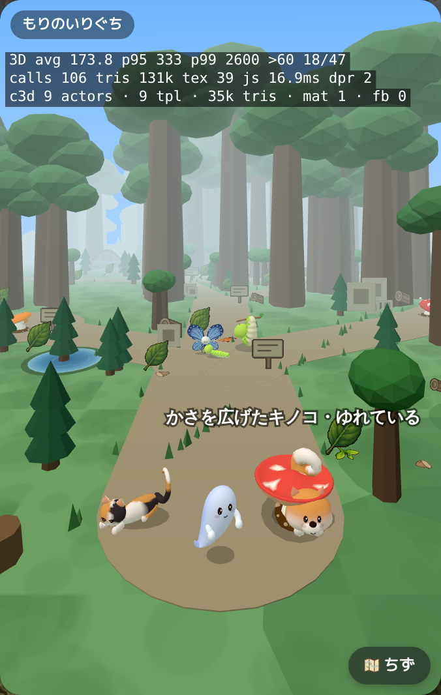

## player-ghost-4-back.png

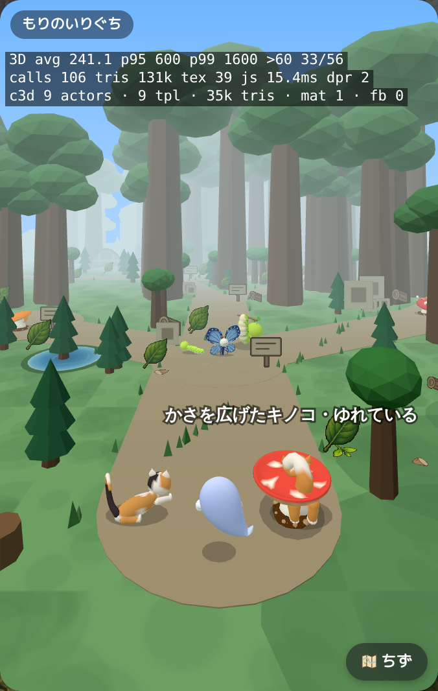

## player-ghost-4-front.png

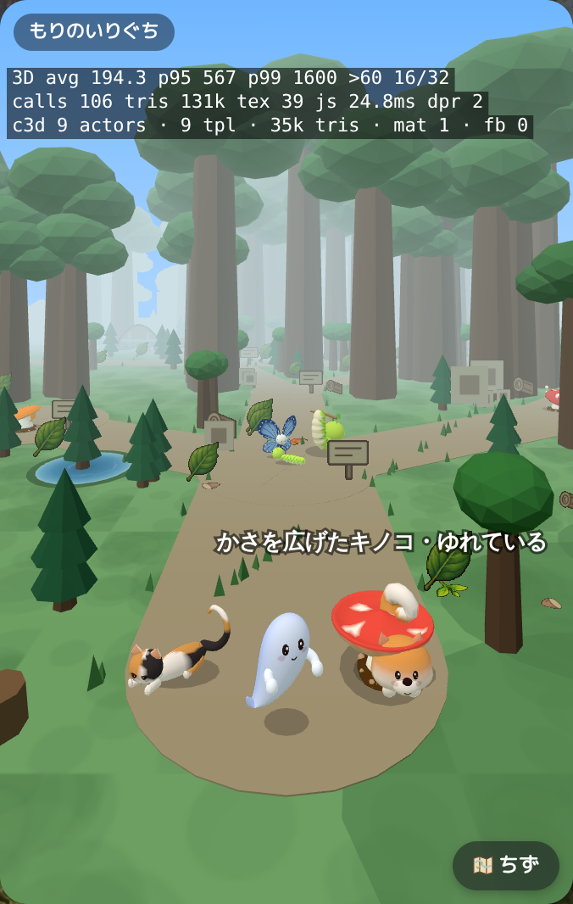

## player-ghost-5-back.png

## player-ghost-5-front.png

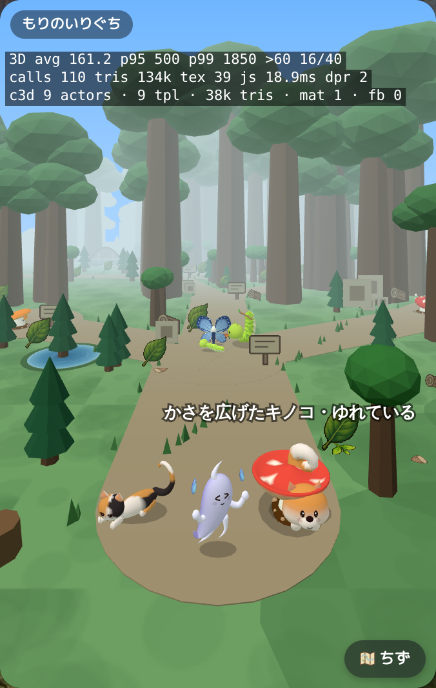

## player-ghost-6-back.png

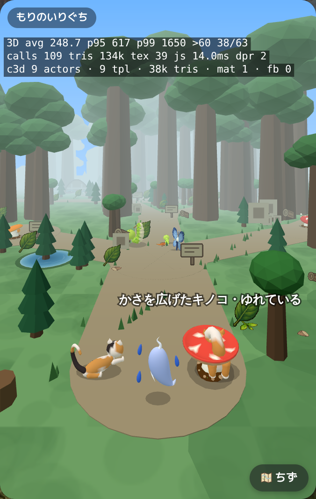

## player-ghost-6-front.png

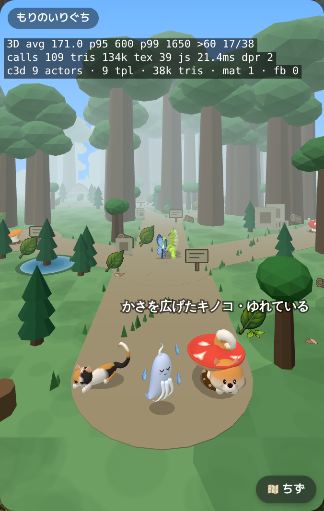

## player-ghost-7-back.png

## player-ghost-7-front.png

## player-ghost-8-back.png

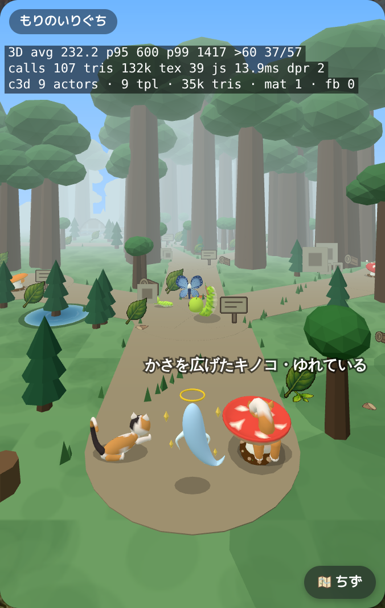

## player-ghost-8-front.png

