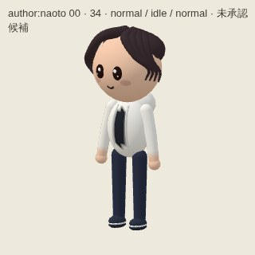
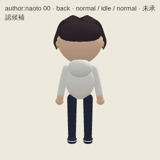
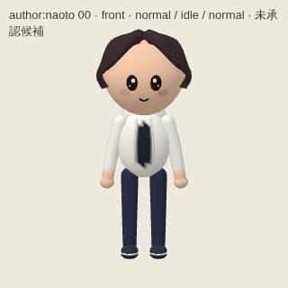
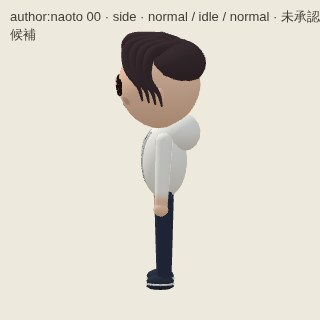
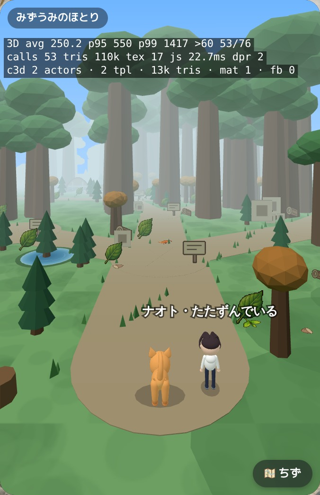
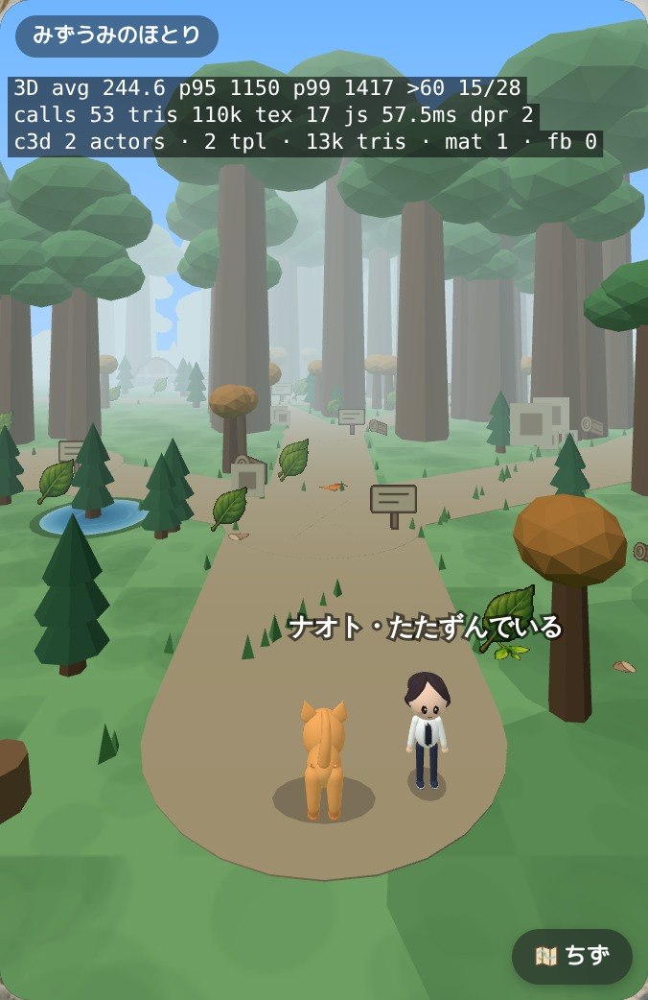
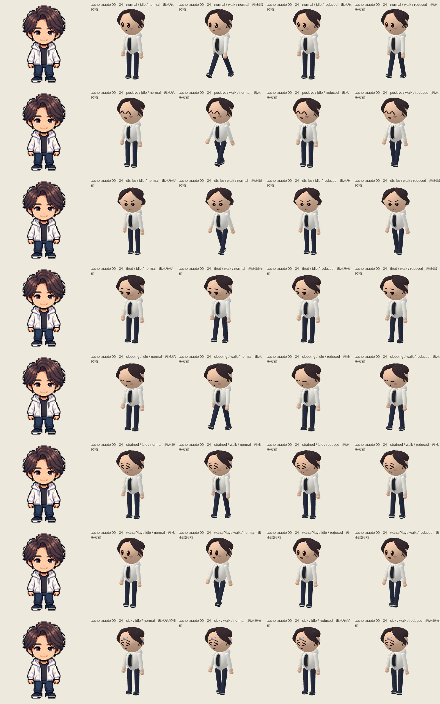
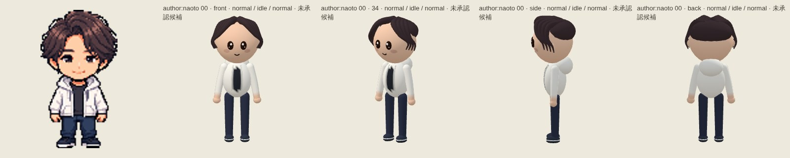

# author-hair-corrected — 6eb8f197401c17c62178f28d68d511413c737657

PENDING_VISUAL_REVIEW — export success is not image approval. Chromium/SwiftShader is not Human/iPhone acceptance.

[All original selected images](raw-evidence.zip) · [SHA256 manifest](manifest.json)

## author-naoto-0-34.jpg

## author-naoto-0-back.jpg

## author-naoto-0-front.jpg

## author-naoto-0-side.jpg

## author-naoto-distance-back.jpg

## author-naoto-distance-front.jpg

## author-naoto-motion.jpg

## author-naoto-views.jpg

