# god-distance — 86dfd3a306a7bb5de583ba9e2b88f525d2bfccf3

PENDING_VISUAL_REVIEW — export success is not image approval. Chromium/SwiftShader is not Human/iPhone acceptance.

[All original selected images](raw-evidence.zip) · [SHA256 manifest](manifest.json)

## player-god-1-back.png

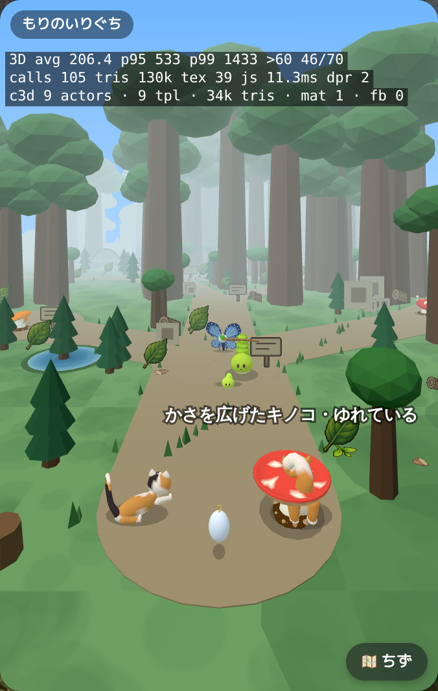

## player-god-1-front.png

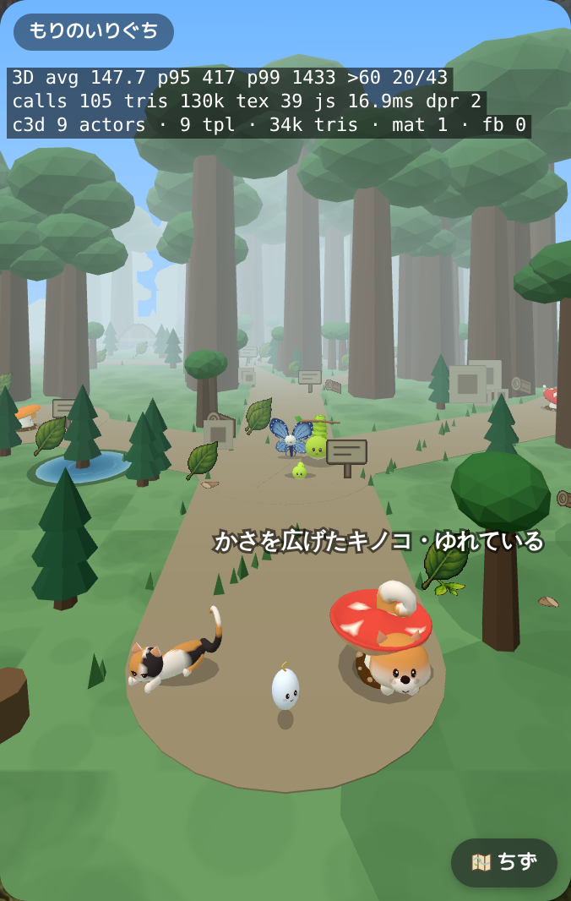

## player-god-2-back.png

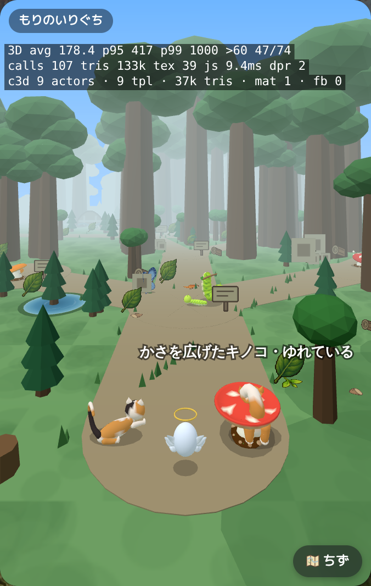

## player-god-2-front.png

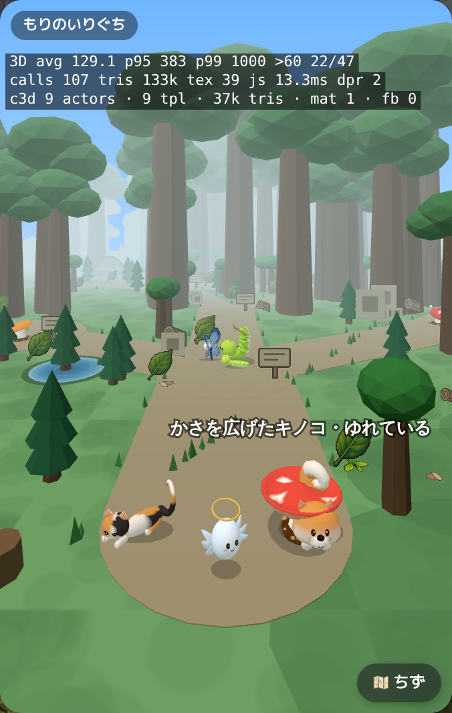

## player-god-3-back.png

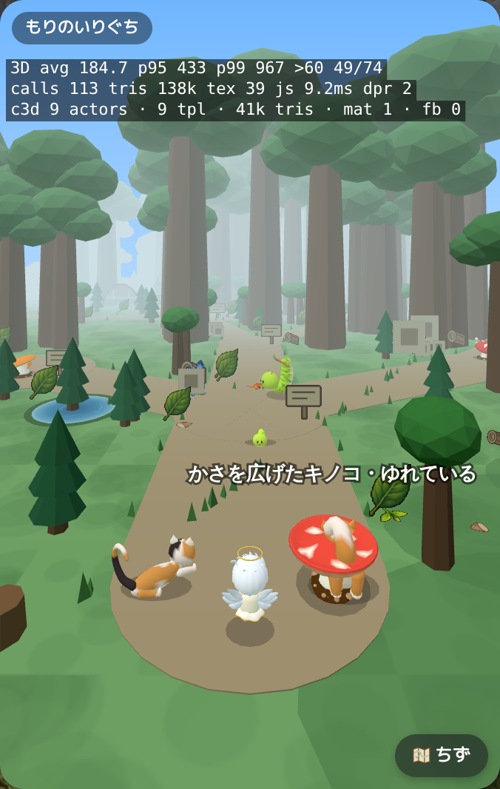

## player-god-3-front.png

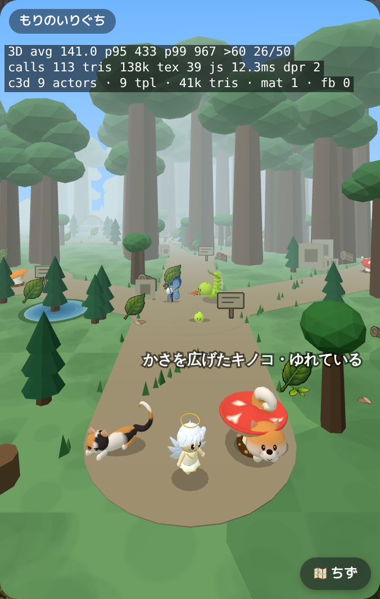

## player-god-4-back.png

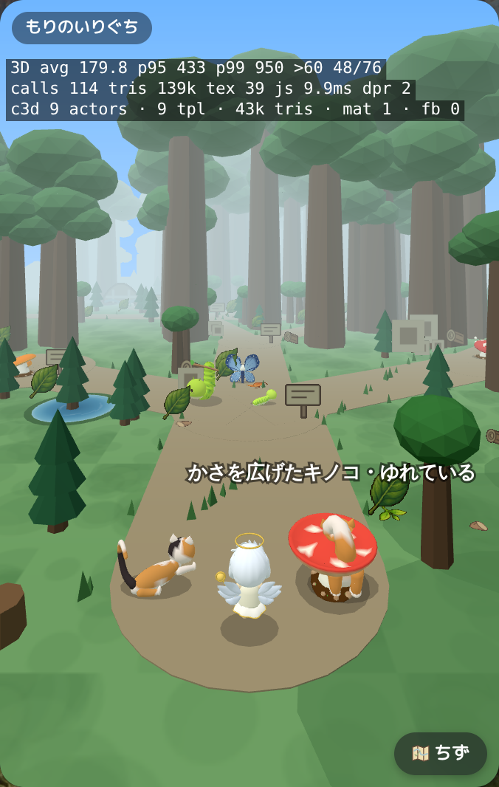

## player-god-4-front.png

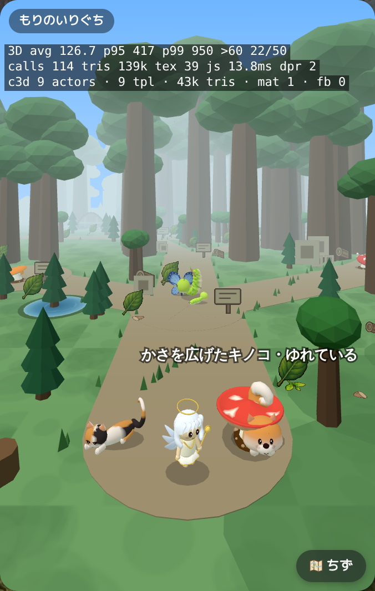

## player-god-5-back.png

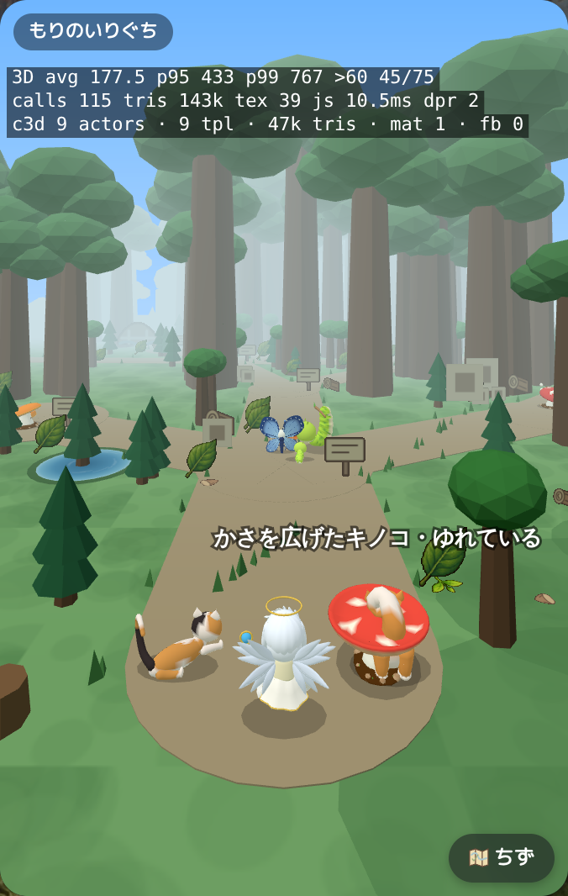

## player-god-5-front.png

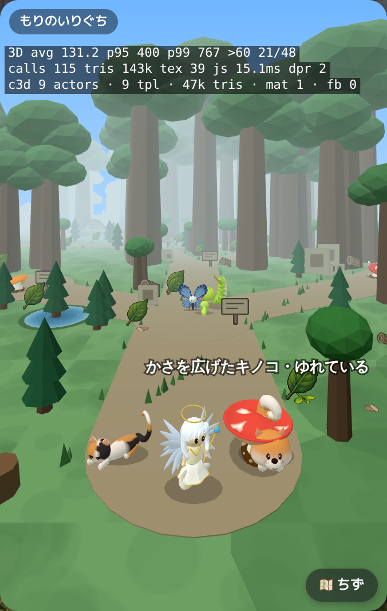

## player-god-6-back.png

## player-god-6-front.png

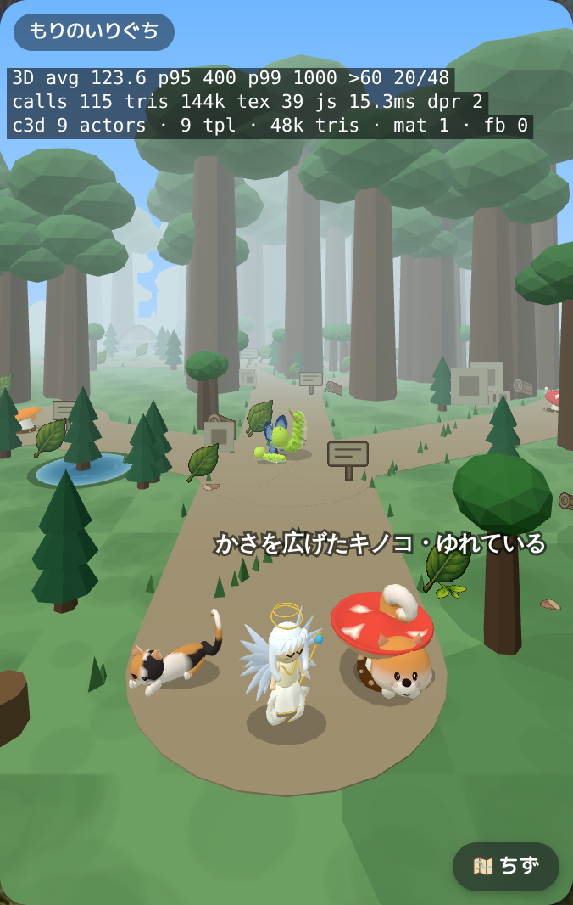

## player-god-7-back.png

## player-god-7-front.png

## player-god-8-back.png

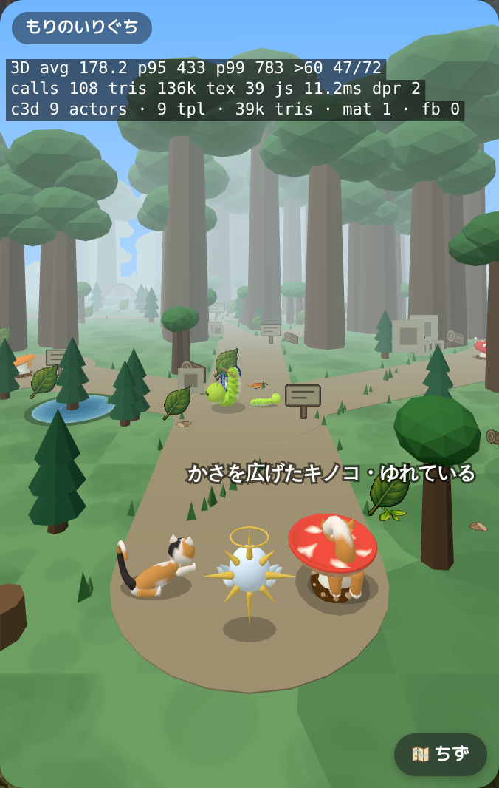

## player-god-8-front.png

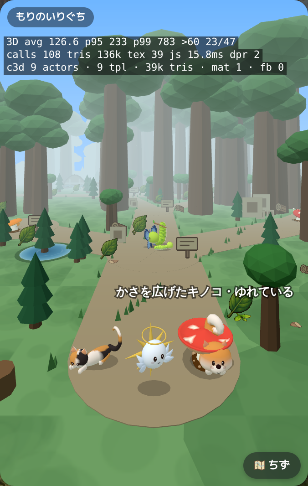
