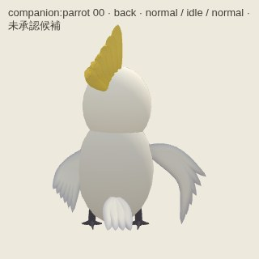
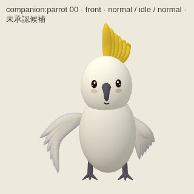
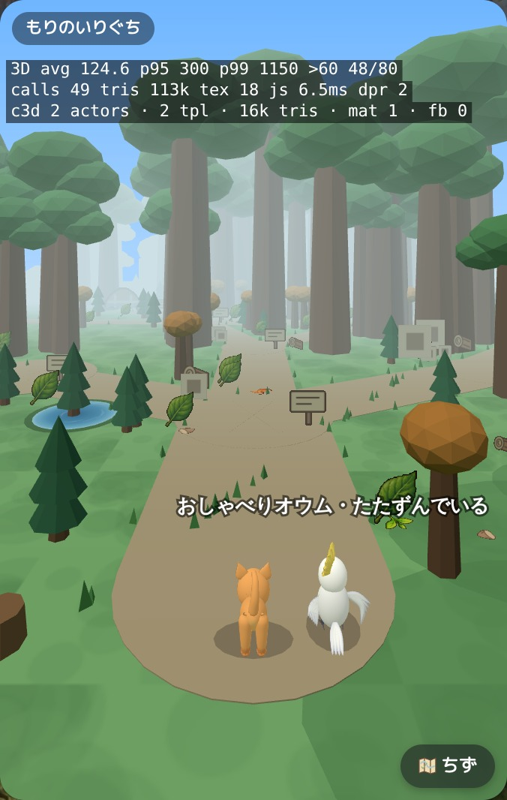
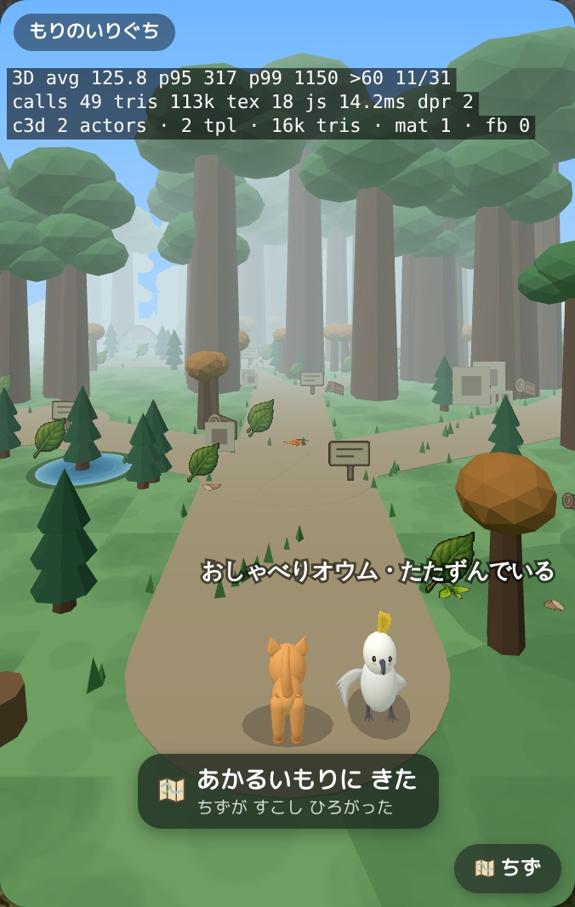
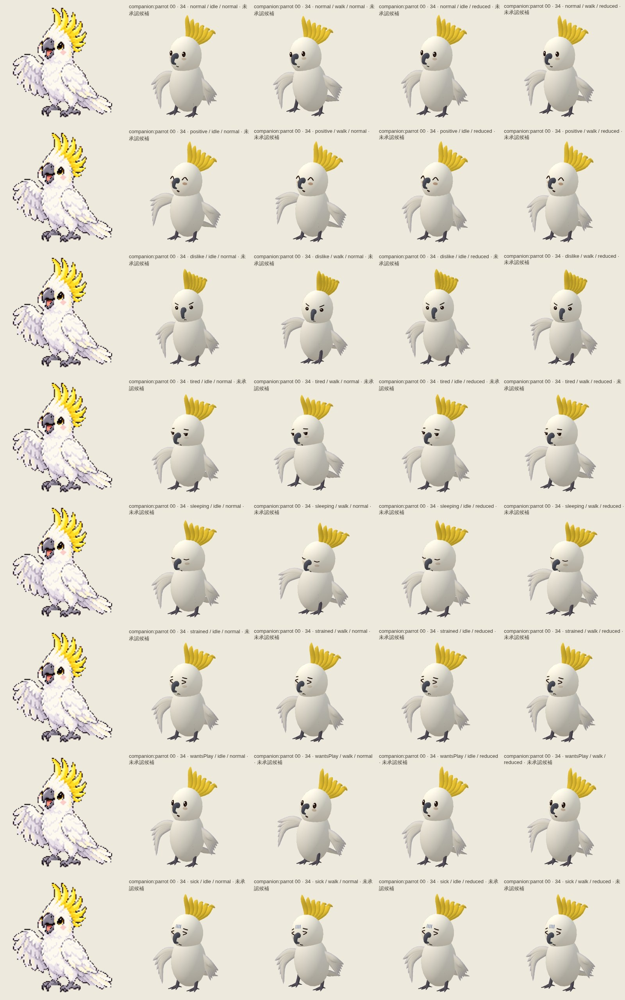

# parrot — 980b692577c87e7efc62298a42d0923c1eb71852

PENDING_VISUAL_REVIEW — export success is not image approval. Chromium/SwiftShader is not Human/iPhone acceptance.

[All original selected images](raw-evidence.zip) · [SHA256 manifest](manifest.json)

## companion-parrot-0-34.jpg

## companion-parrot-0-back.jpg

## companion-parrot-0-front.jpg

## companion-parrot-0-side.jpg

## companion-parrot-distance-back.jpg

## companion-parrot-distance-front.jpg

## companion-parrot-motion.jpg

## companion-parrot-views.jpg

