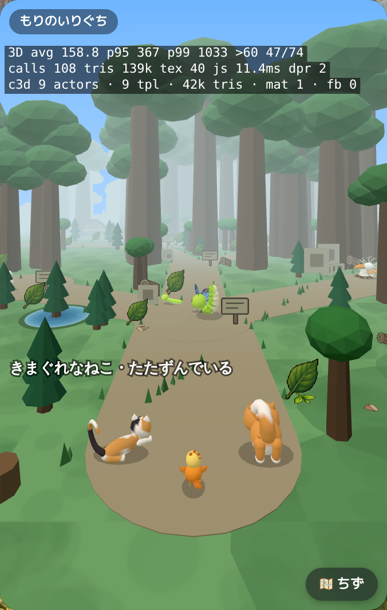
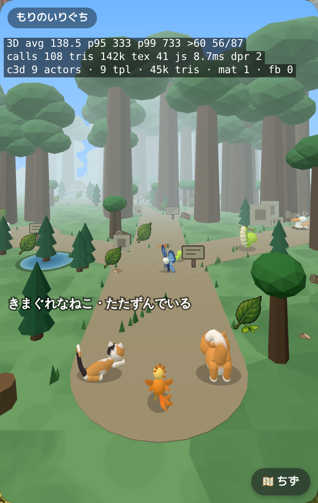
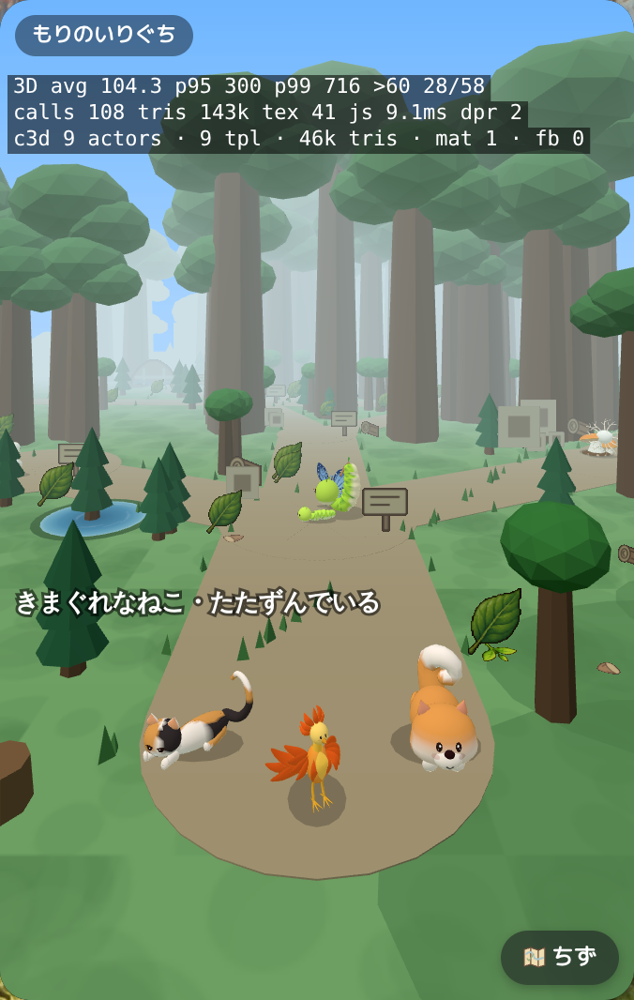
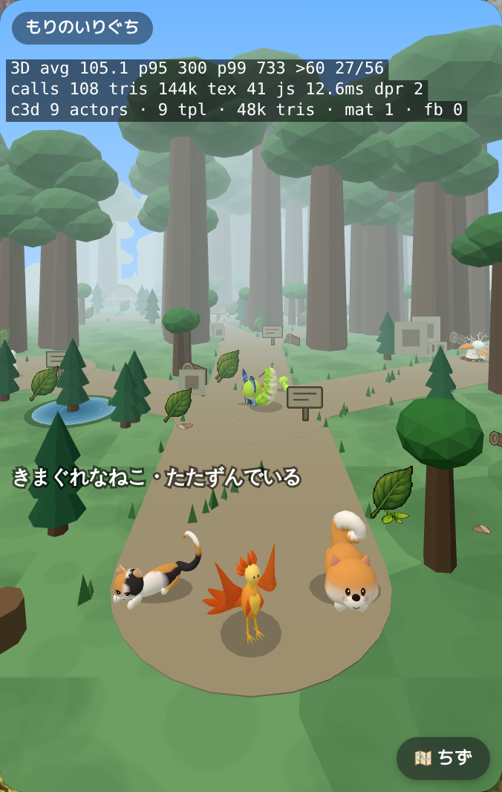
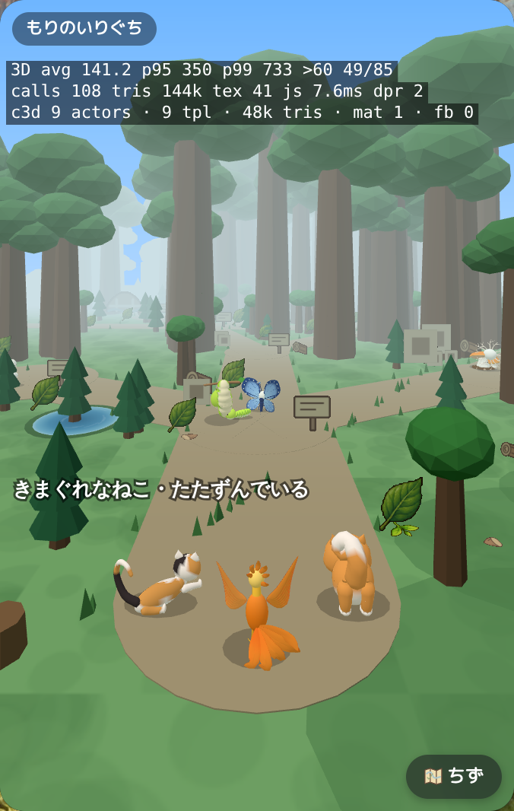
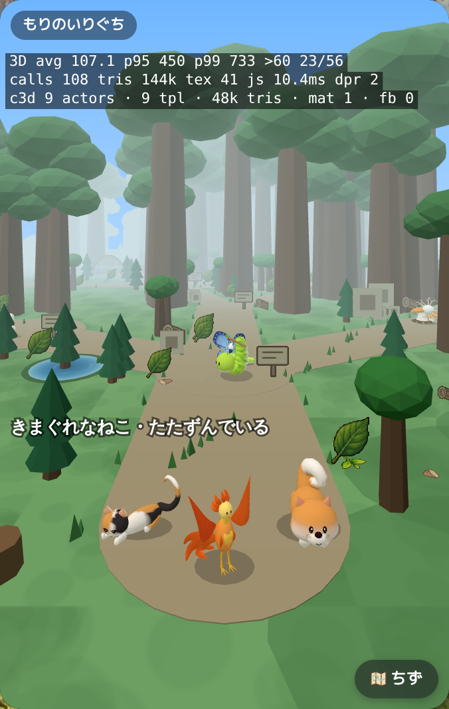
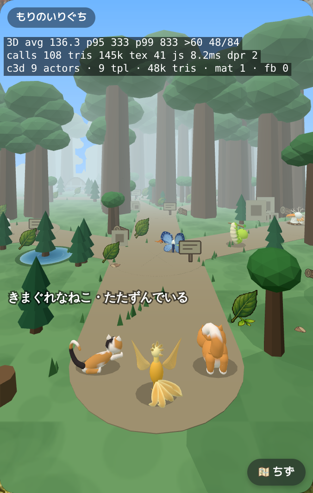
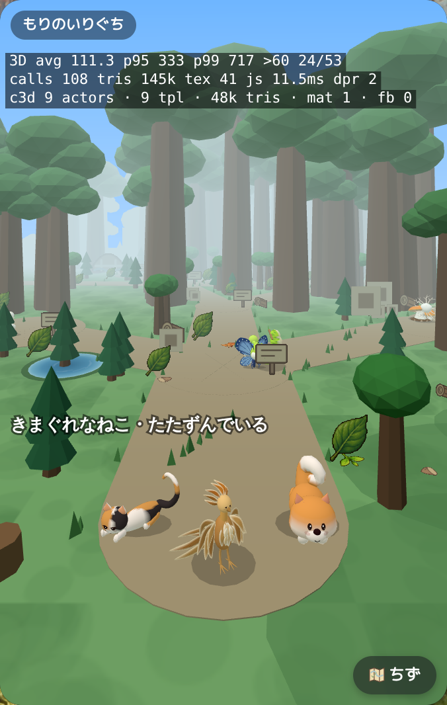
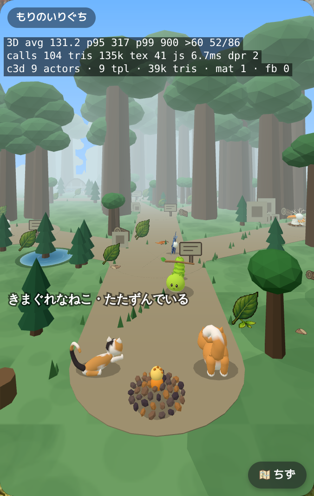
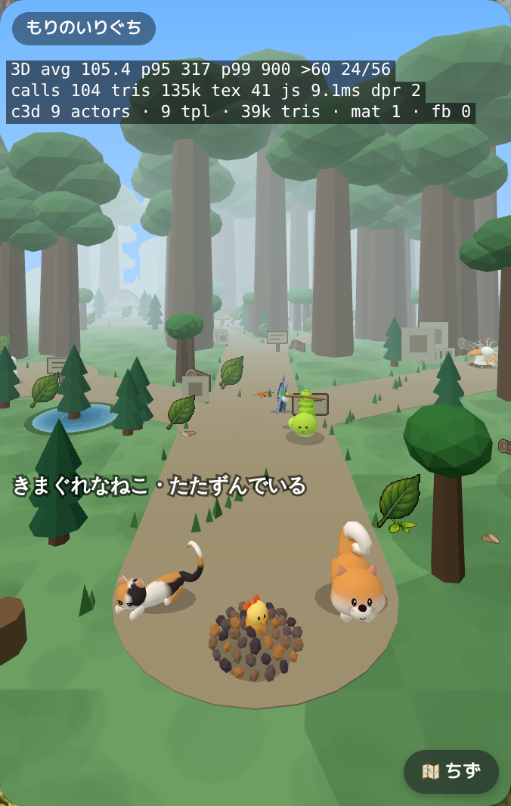

# phoenix-distance — 9fadab27a5abacedfb40add609f95fb14f2c69a3

PENDING_VISUAL_REVIEW — export success is not image approval. Chromium/SwiftShader is not Human/iPhone acceptance.

[All original selected images](raw-evidence.zip) · [SHA256 manifest](manifest.json)

## player-phoenix-1-back.png

## player-phoenix-1-front.png

## player-phoenix-2-back.png

## player-phoenix-2-front.png

## player-phoenix-3-back.png

## player-phoenix-3-front.png

## player-phoenix-4-back.png

## player-phoenix-4-front.png

## player-phoenix-5-back.png

## player-phoenix-5-front.png

## player-phoenix-6-back.png

## player-phoenix-6-front.png

## player-phoenix-7-back.png

## player-phoenix-7-front.png

## player-phoenix-8-back.png

## player-phoenix-8-front.png

