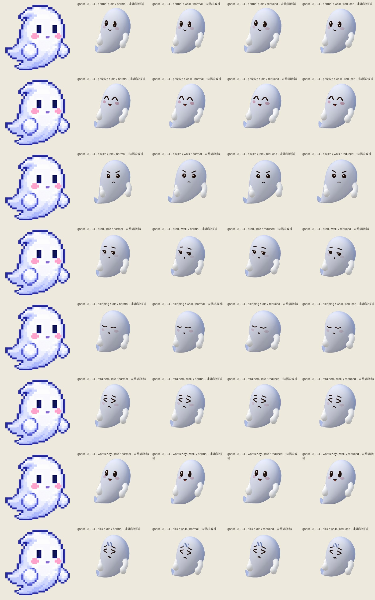
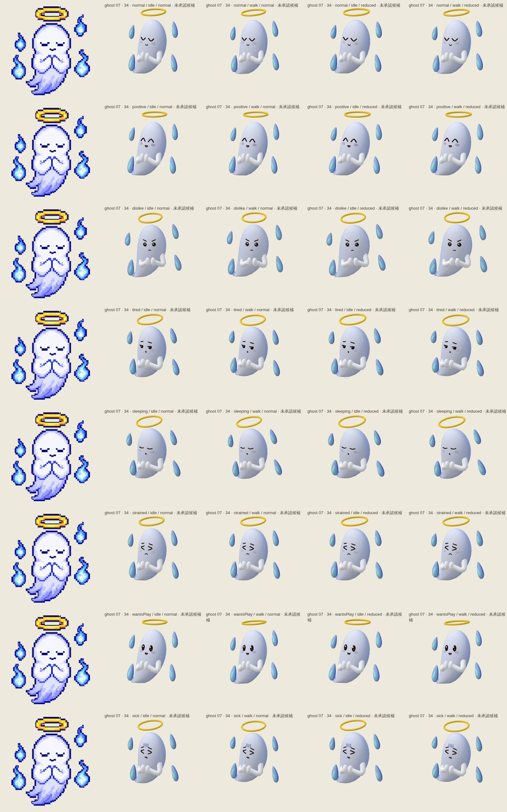
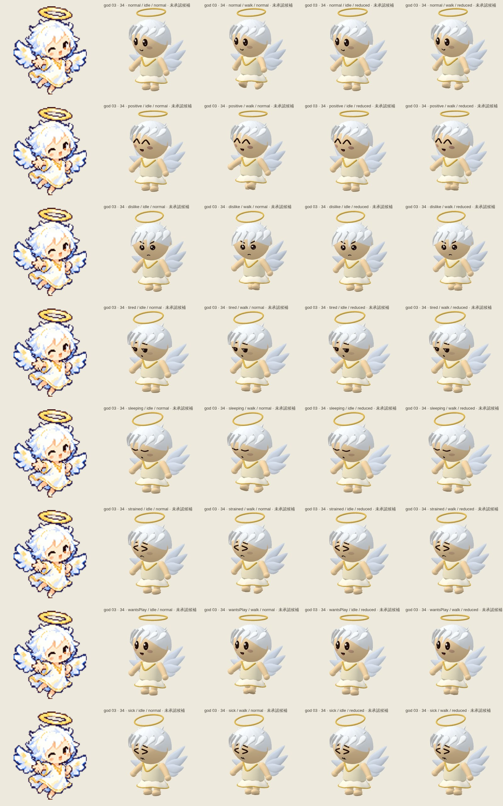
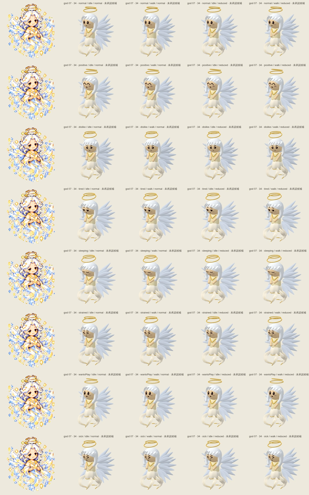
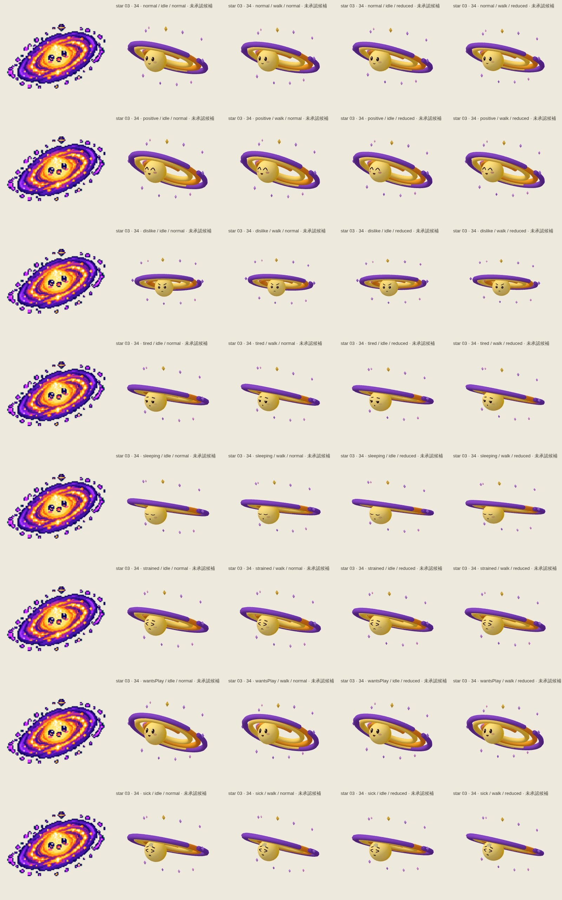
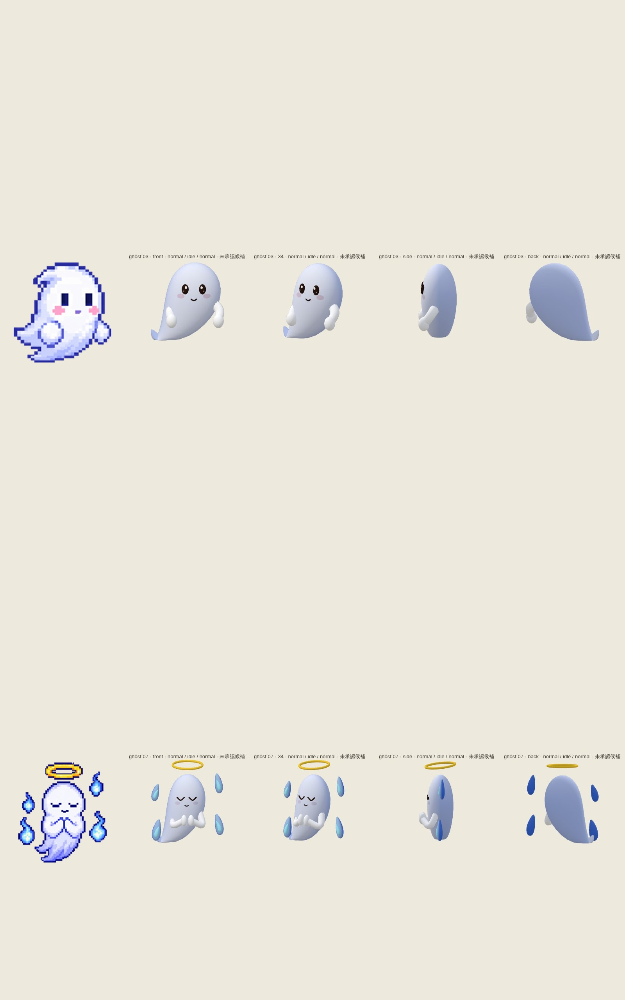
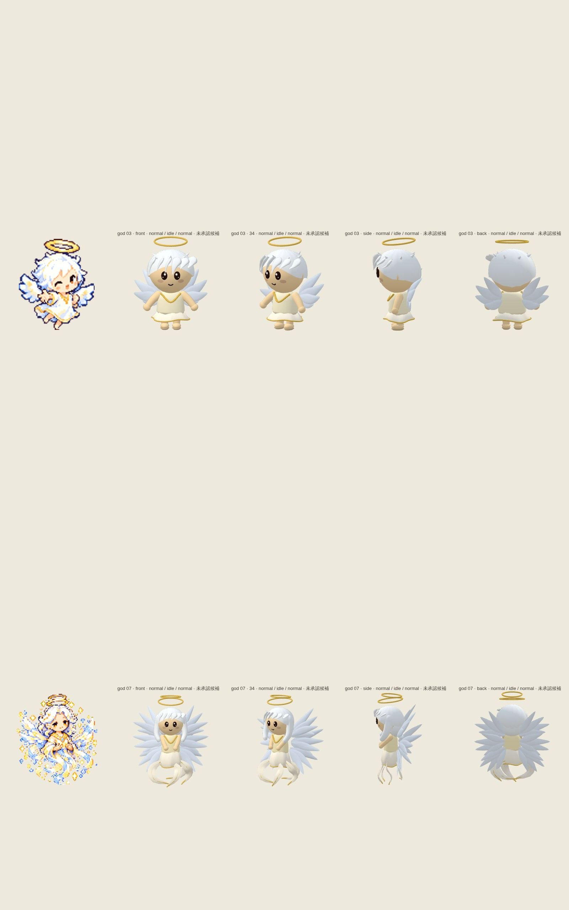
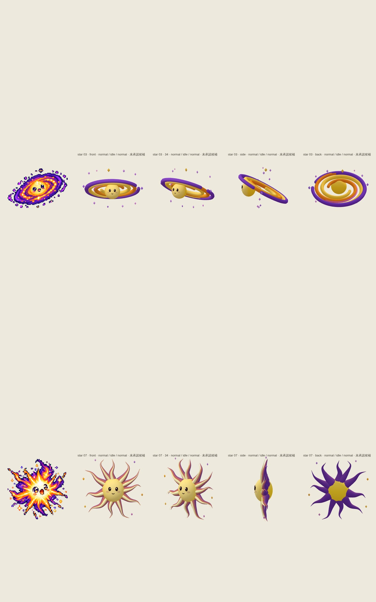
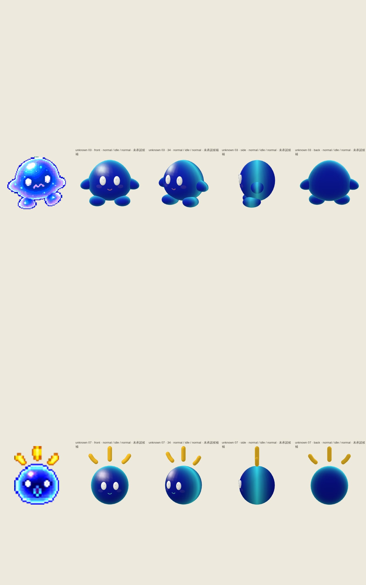

# remaining-mythic-representatives — 9fadab27a5abacedfb40add609f95fb14f2c69a3

PENDING_VISUAL_REVIEW — export success is not image approval. Chromium/SwiftShader is not Human/iPhone acceptance.

[All original selected images](raw-evidence.zip) · [SHA256 manifest](manifest.json)

## ghost-3-motion.jpg

## ghost-7-motion.jpg

## god-3-motion.jpg

## god-7-motion.jpg

## star-3-motion.jpg

## star-7-motion.jpg

## unknown-3-motion.jpg

## unknown-7-motion.jpg

## ghost-stages.jpg

## god-stages.jpg

## star-stages.jpg

## unknown-stages.jpg

