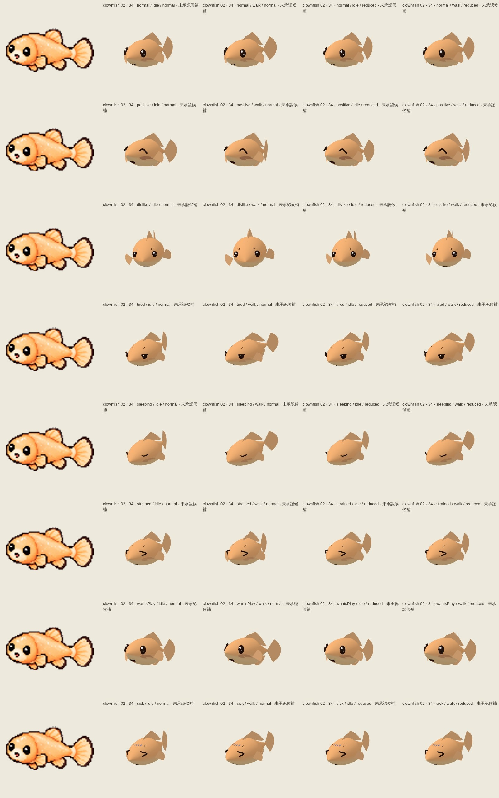
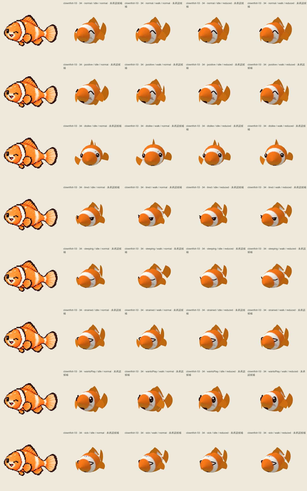
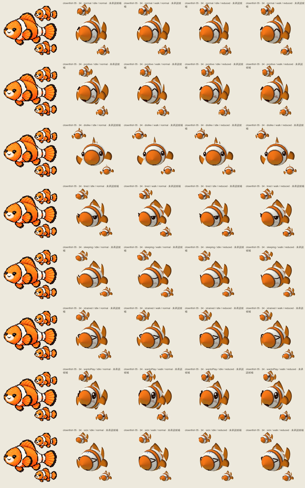
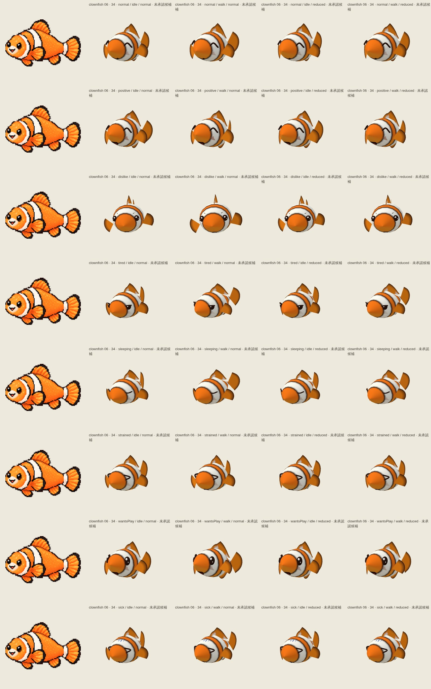
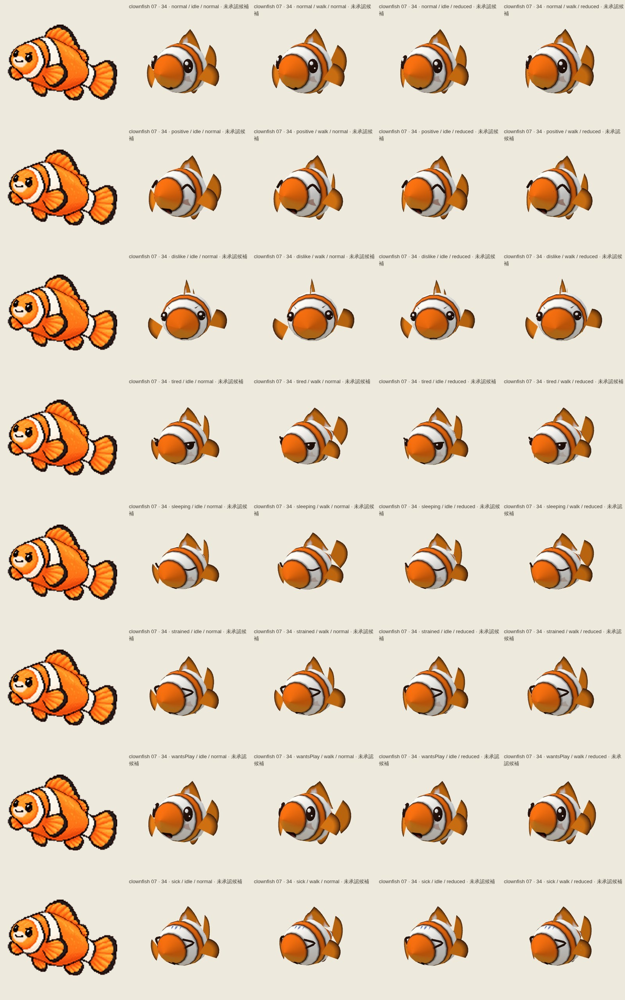
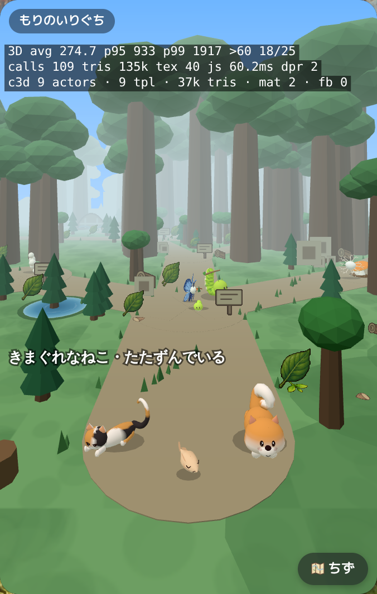
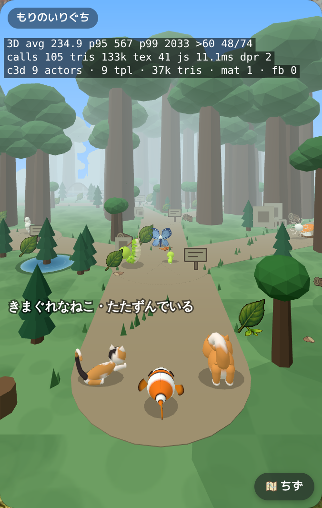
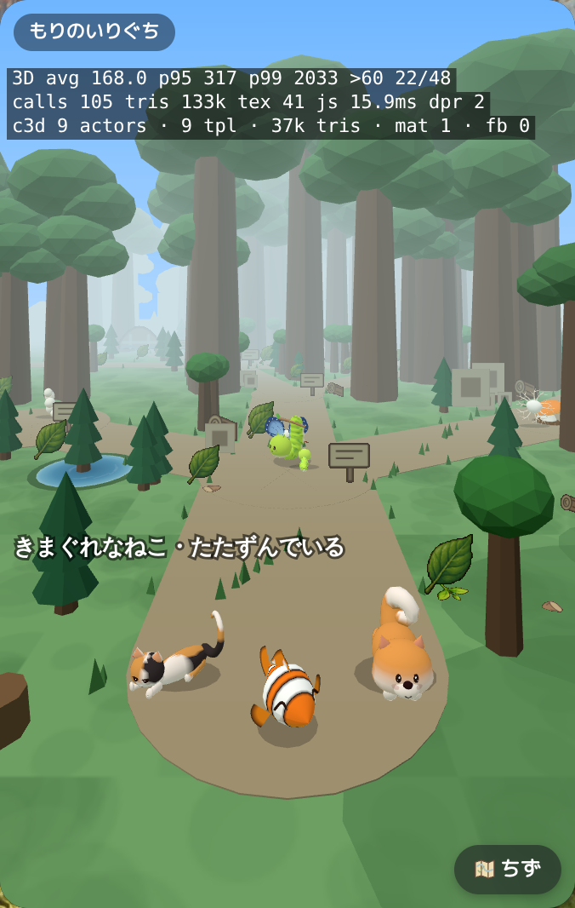
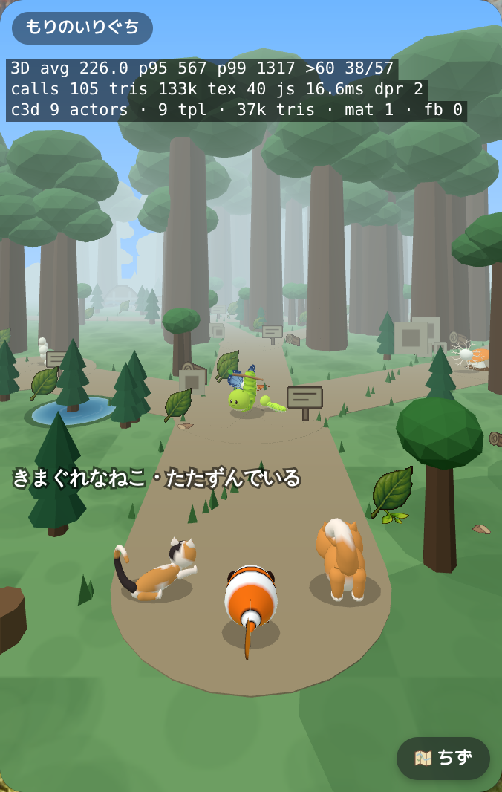

# integration-clownfish — ae9c9ffe20ef945ddc8eed0f4a882d807ba92c4f

PENDING_VISUAL_REVIEW — export success is not image approval. Chromium/SwiftShader is not Human/iPhone acceptance.

[All original selected evidence](raw-evidence.zip) · [SHA256 manifest](manifest.json)

## clownfish-2-motion.jpg

## clownfish-3-motion.jpg

## clownfish-5-motion.jpg

## clownfish-6-motion.jpg

## clownfish-7-motion.jpg

## player-clownfish-1-back.png

## player-clownfish-1-front.png

## player-clownfish-2-back.png

## player-clownfish-2-front.png

## player-clownfish-3-back.png

## player-clownfish-3-front.png

## player-clownfish-4-back.png

## player-clownfish-4-front.png

## player-clownfish-5-back.png

## player-clownfish-5-front.png

## player-clownfish-6-back.png

## player-clownfish-6-front.png

## player-clownfish-7-back.png

## player-clownfish-7-front.png

## player-clownfish-8-back.png

## player-clownfish-8-front.png

