# integration-dog — ae9c9ffe20ef945ddc8eed0f4a882d807ba92c4f

PENDING_VISUAL_REVIEW — export success is not image approval. Chromium/SwiftShader is not Human/iPhone acceptance.

[All original selected evidence](raw-evidence.zip) · [SHA256 manifest](manifest.json)

## dog-2-motion.jpg

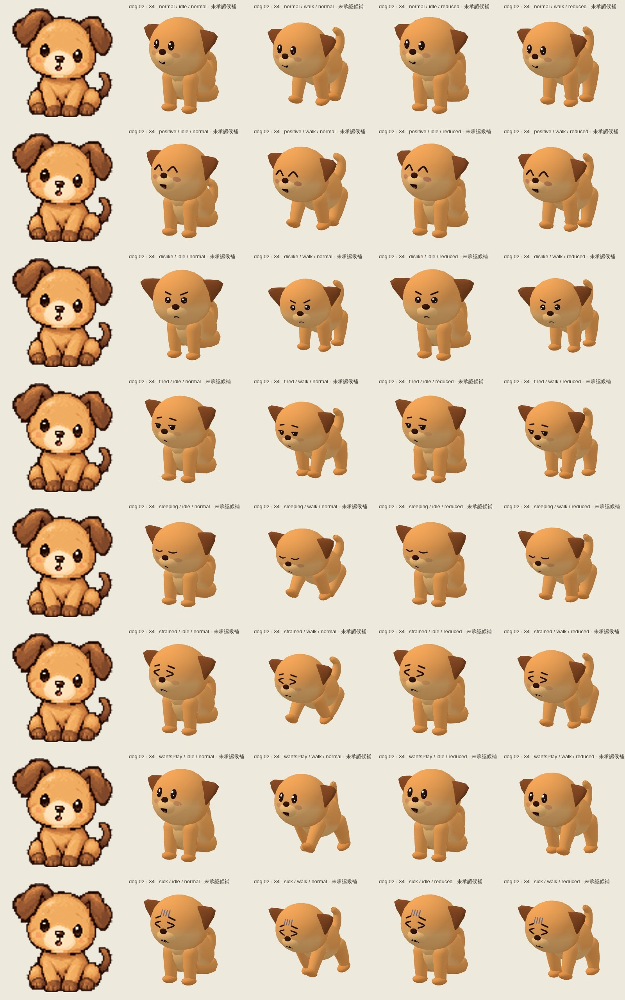

## dog-3-motion.jpg

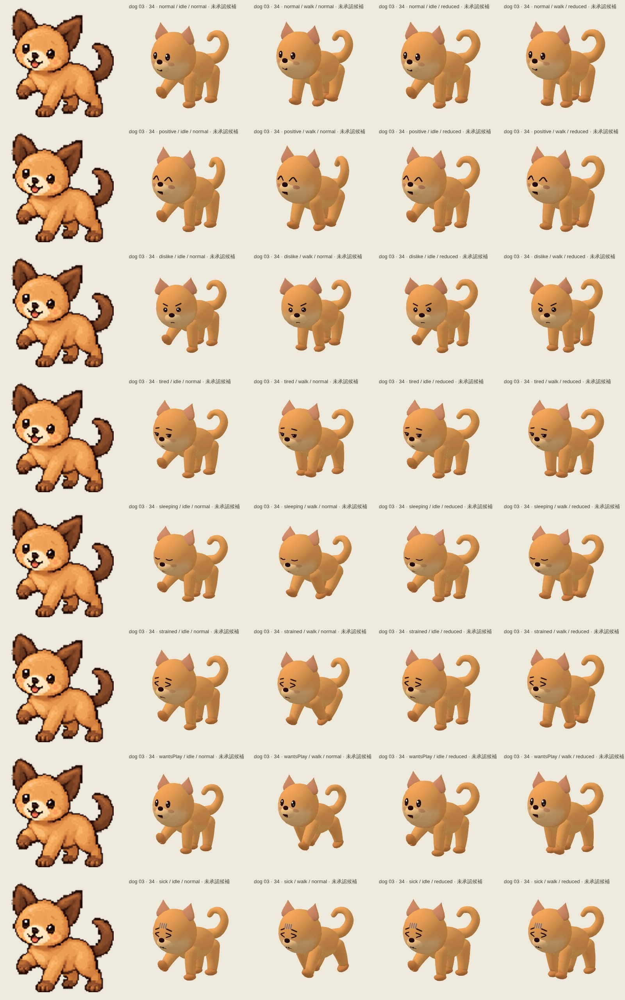

## dog-5-motion.jpg

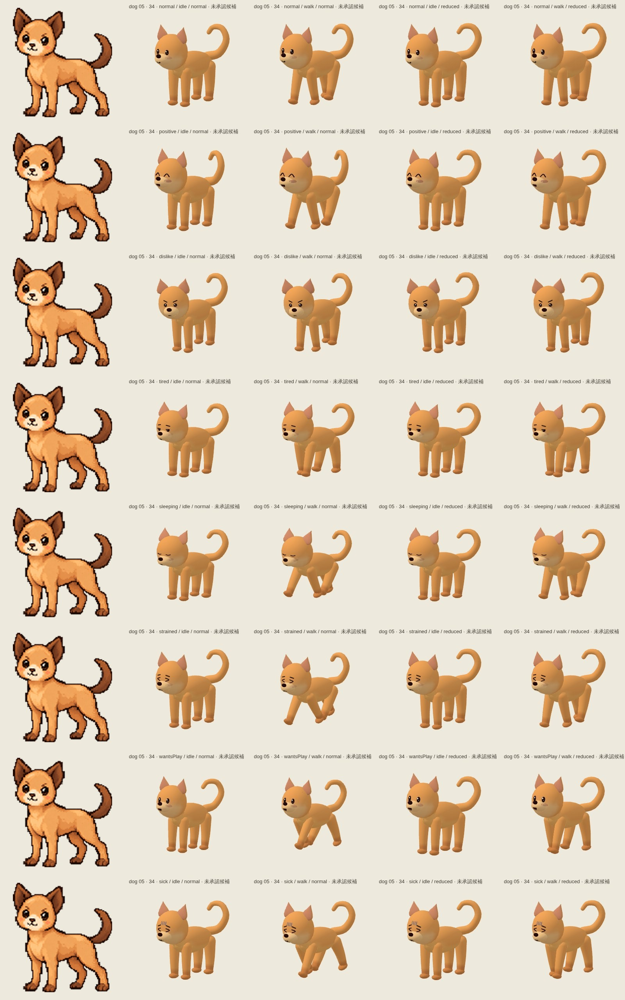

## dog-6-motion.jpg

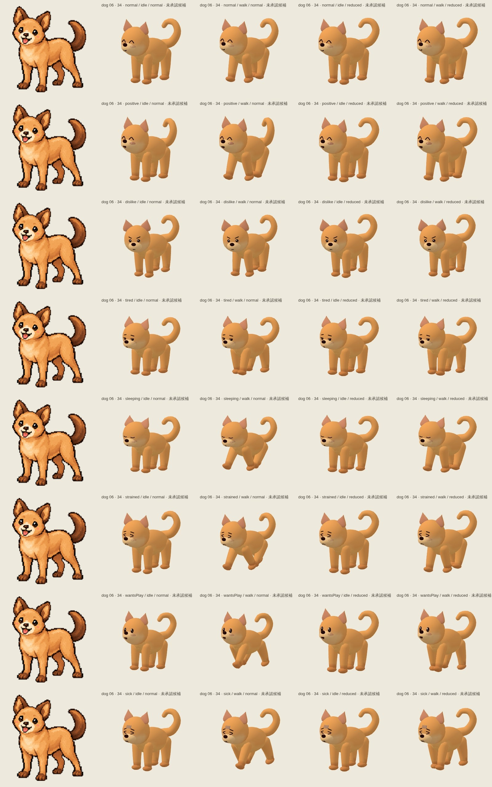

## dog-7-motion.jpg

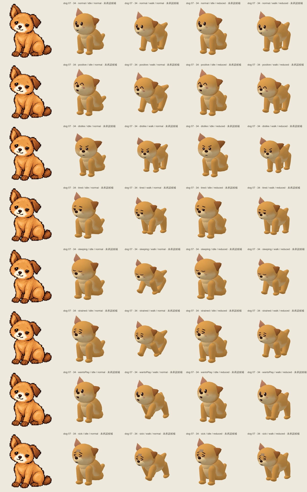

## player-dog-1-back.png

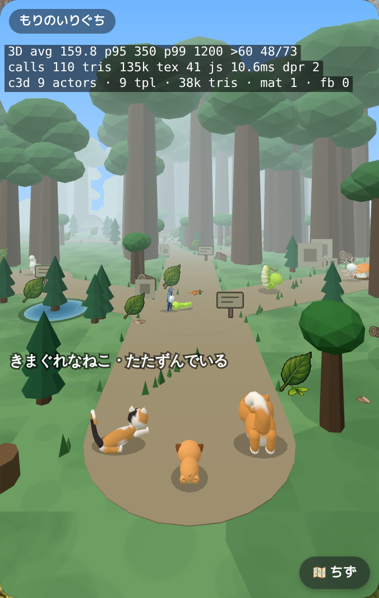

## player-dog-1-front.png

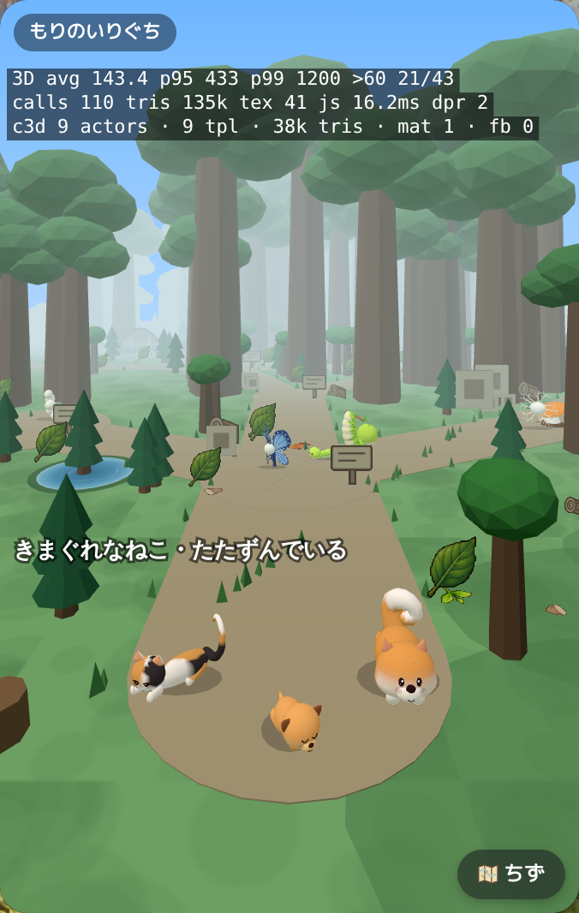

## player-dog-2-back.png

## player-dog-2-front.png

## player-dog-3-back.png

## player-dog-3-front.png

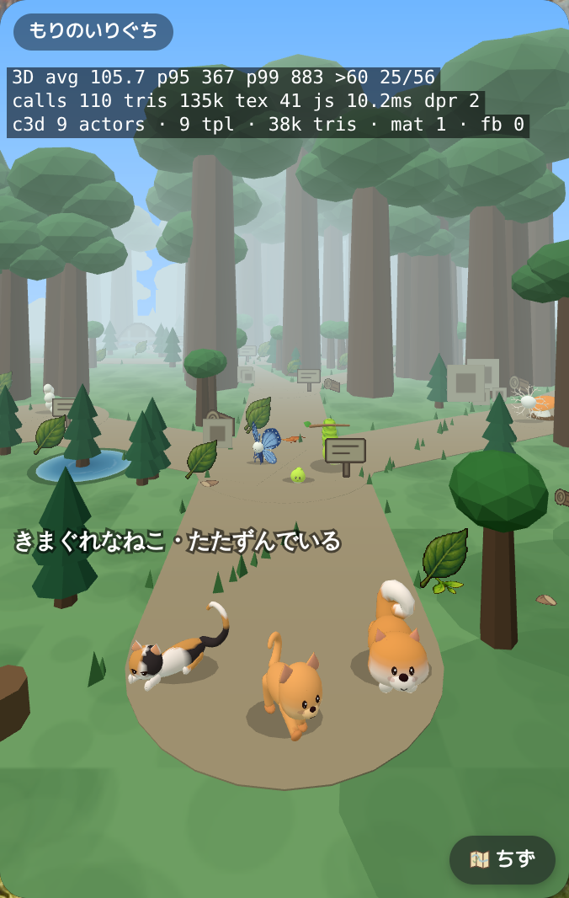

## player-dog-4-back.png

## player-dog-4-front.png

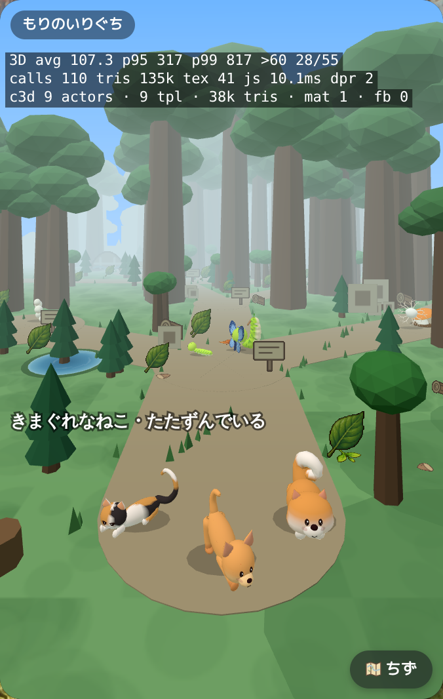

## player-dog-5-back.png

## player-dog-5-front.png

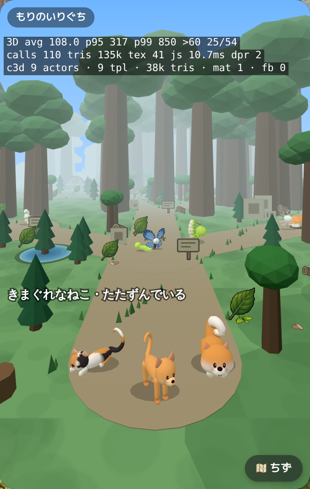

## player-dog-6-back.png

## player-dog-6-front.png

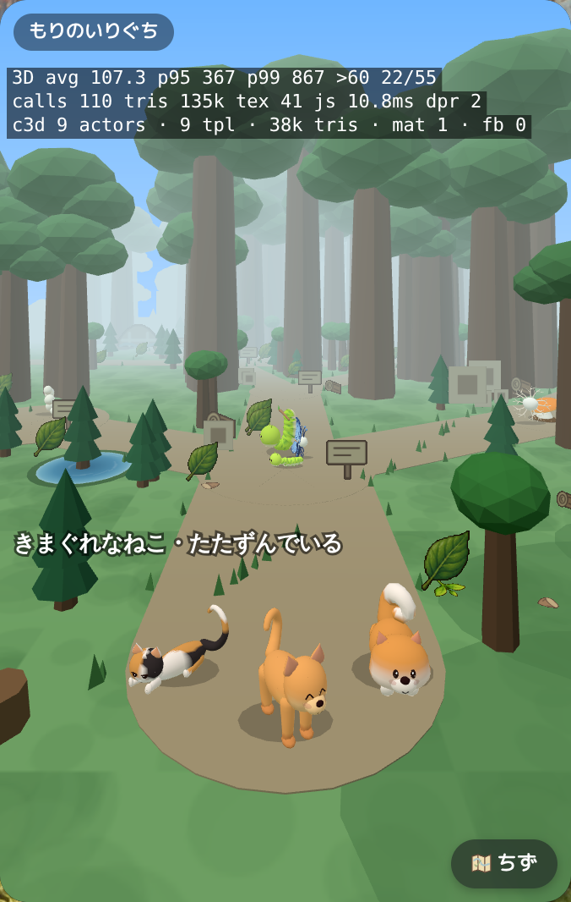

## player-dog-7-back.png

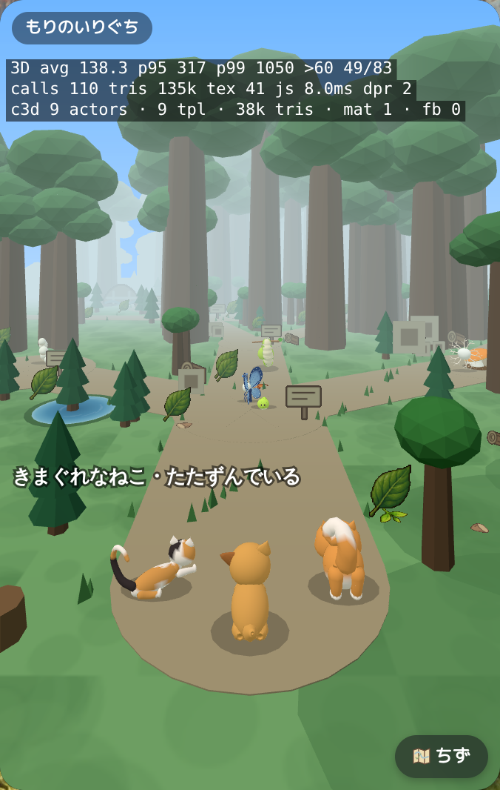

## player-dog-7-front.png

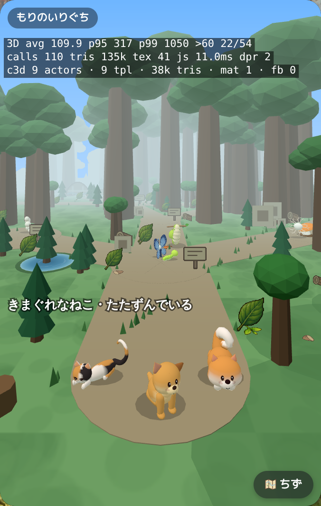

## player-dog-8-back.png

## player-dog-8-front.png

