# integration-frog — ae9c9ffe20ef945ddc8eed0f4a882d807ba92c4f

PENDING_VISUAL_REVIEW — export success is not image approval. Chromium/SwiftShader is not Human/iPhone acceptance.

[All original selected evidence](raw-evidence.zip) · [SHA256 manifest](manifest.json)

## frog-1-motion.jpg

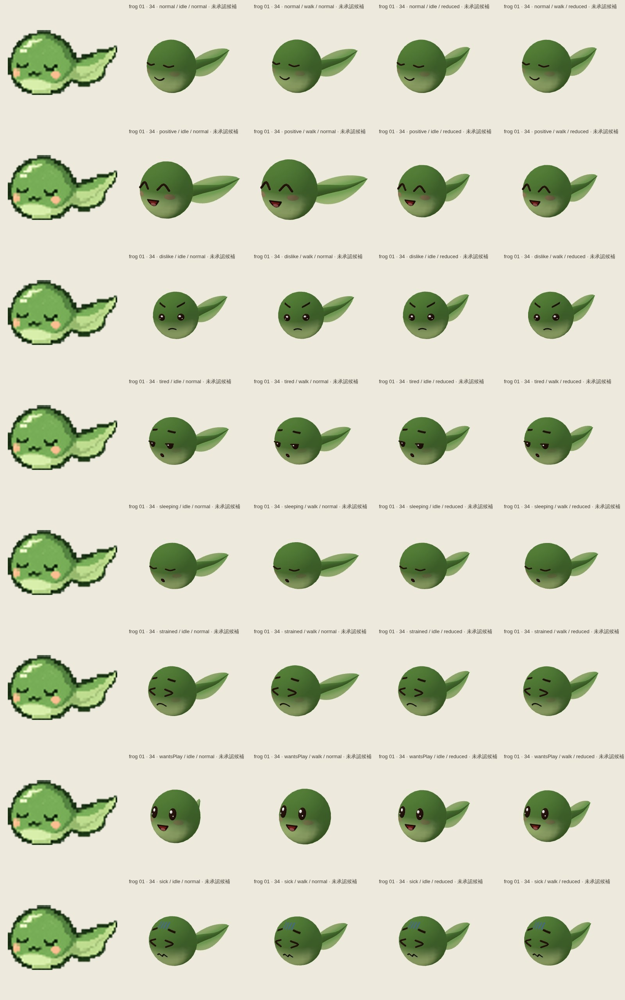

## frog-2-motion.jpg

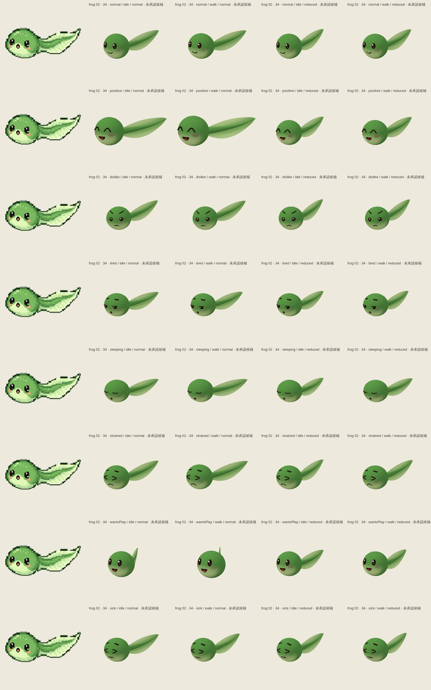

## frog-4-motion.jpg

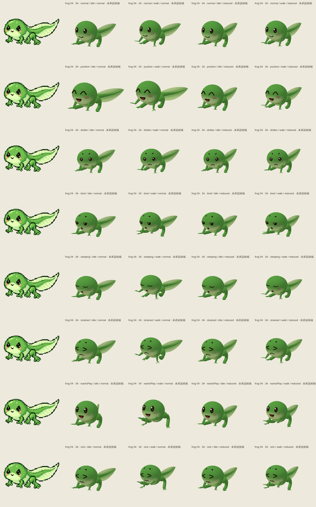

## frog-6-motion.jpg

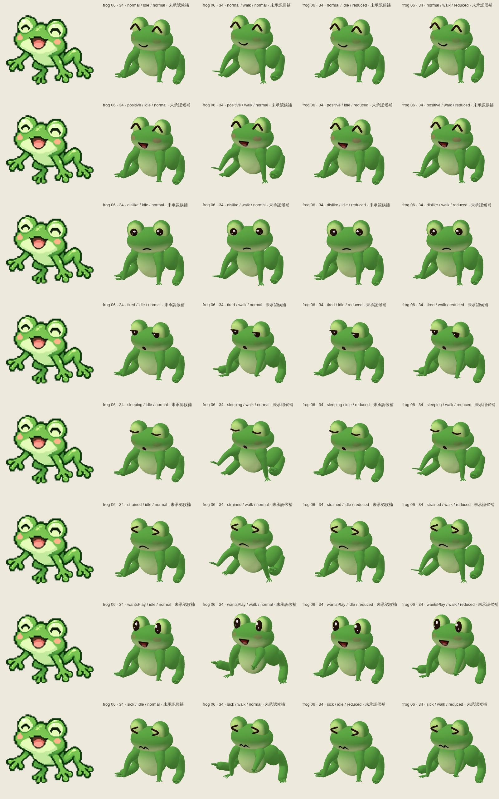

## frog-8-motion.jpg

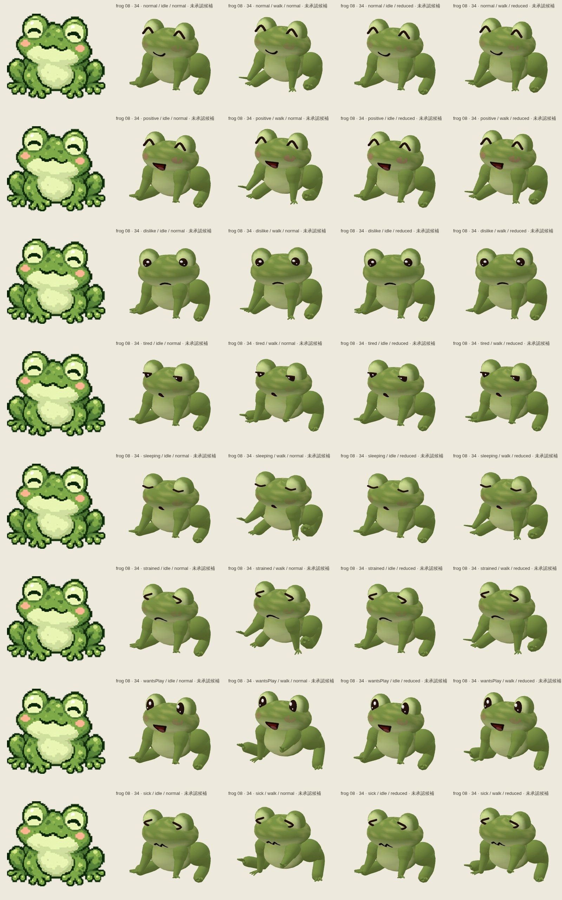

## player-frog-1-back.png

## player-frog-1-front.png

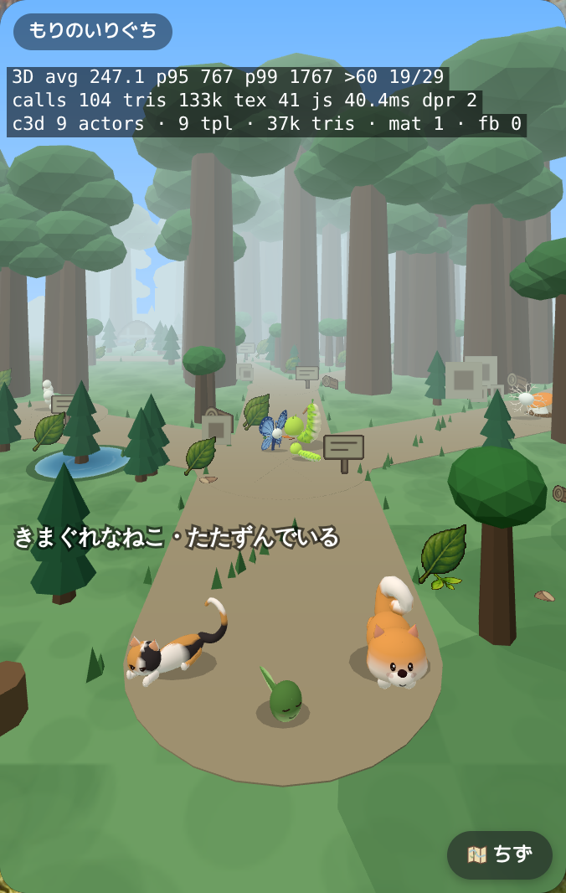

## player-frog-2-back.png

## player-frog-2-front.png

## player-frog-3-back.png

## player-frog-3-front.png

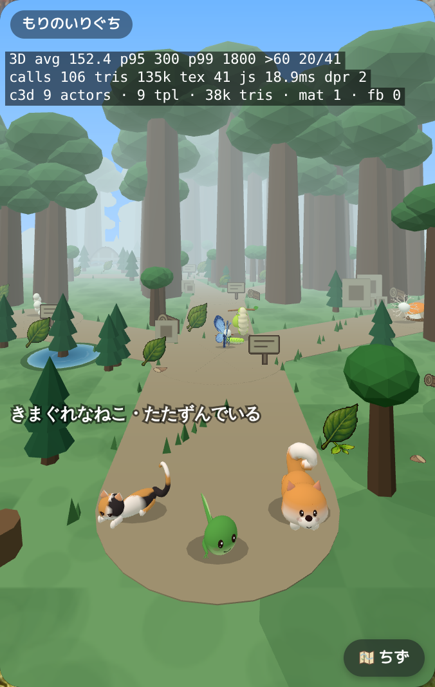

## player-frog-4-back.png

## player-frog-4-front.png

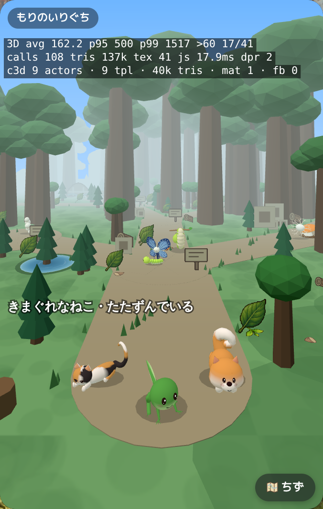

## player-frog-5-back.png

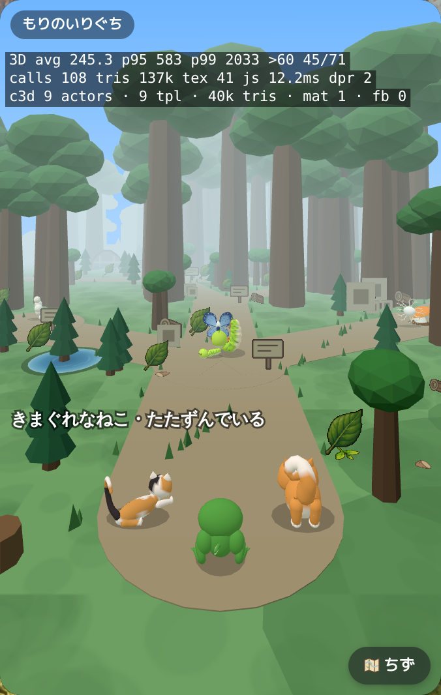

## player-frog-5-front.png

## player-frog-6-back.png

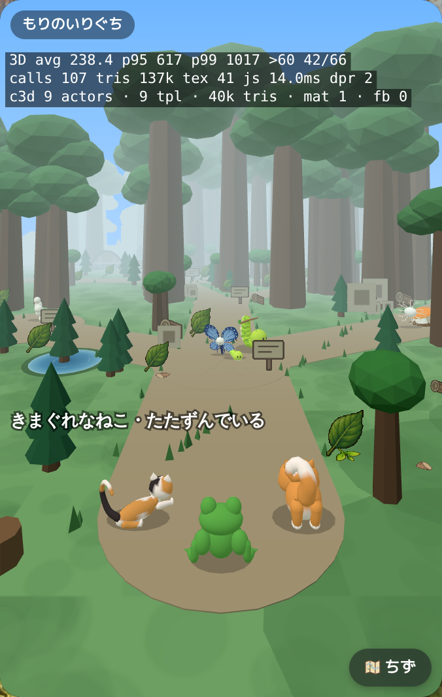

## player-frog-6-front.png

## player-frog-7-back.png

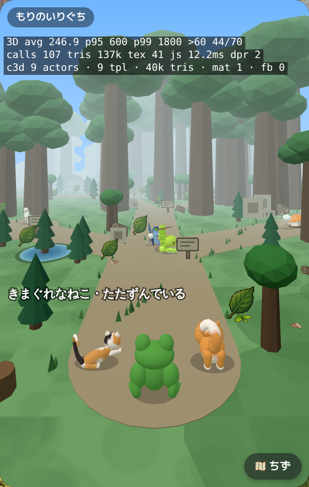

## player-frog-7-front.png

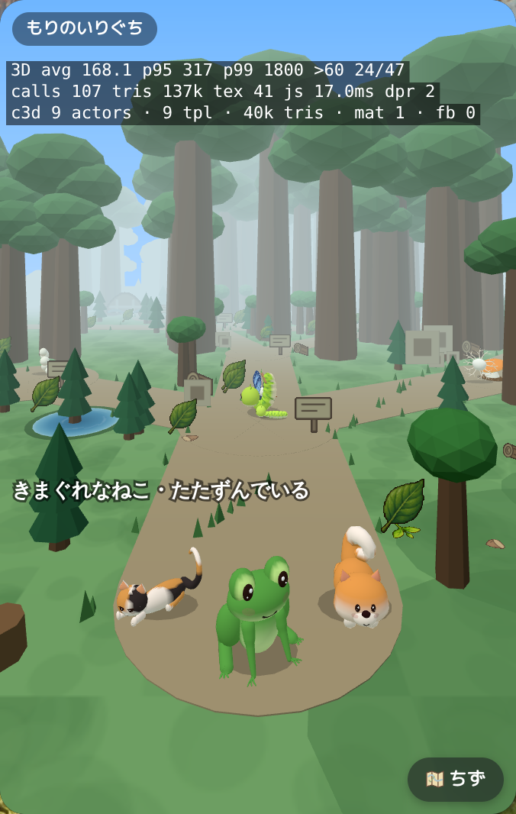

## player-frog-8-back.png

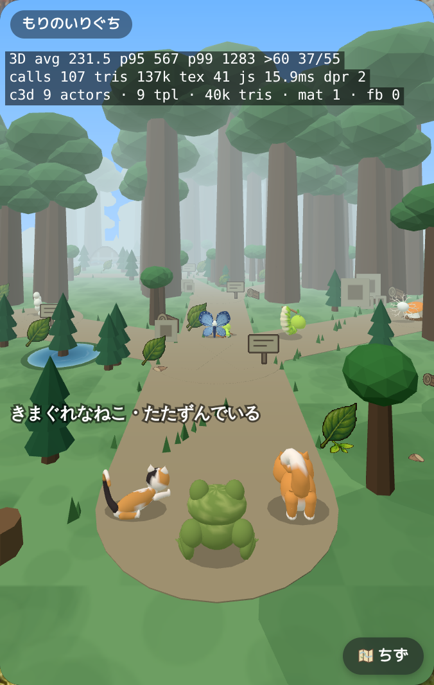

## player-frog-8-front.png

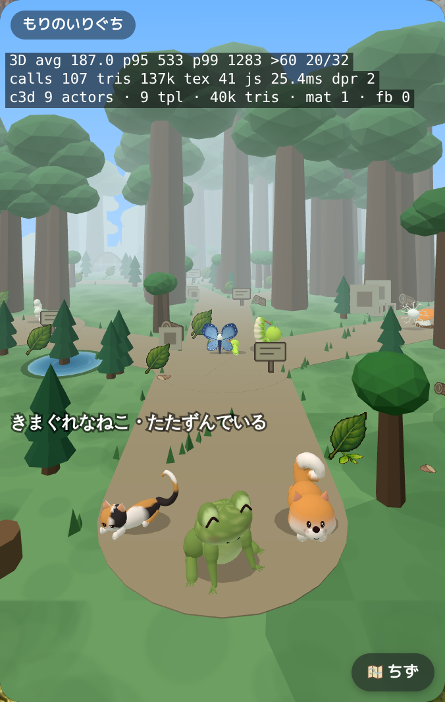
