# integration-starfish — ae9c9ffe20ef945ddc8eed0f4a882d807ba92c4f

PENDING_VISUAL_REVIEW — export success is not image approval. Chromium/SwiftShader is not Human/iPhone acceptance.

[All original selected evidence](raw-evidence.zip) · [SHA256 manifest](manifest.json)

## starfish-2-motion.jpg

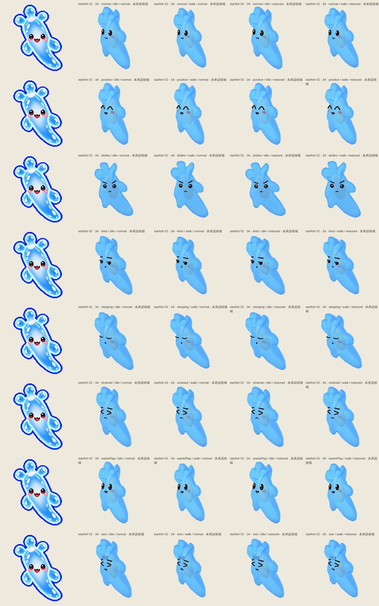

## starfish-3-motion.jpg

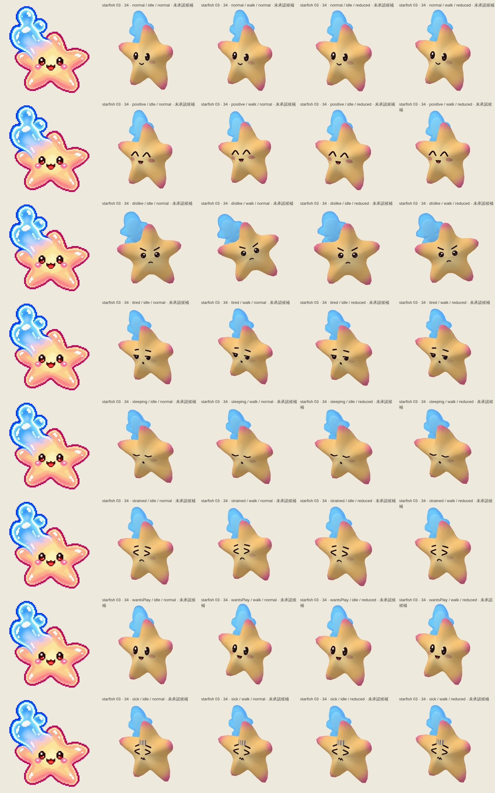

## starfish-5-motion.jpg

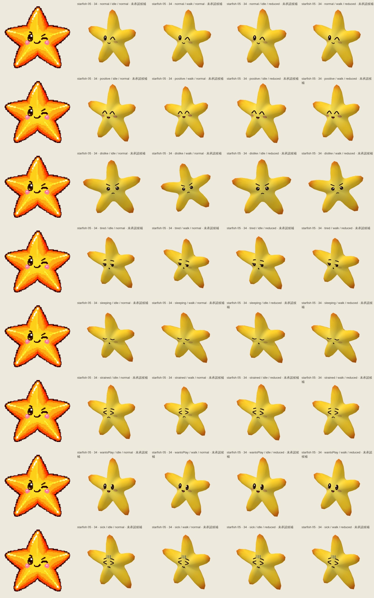

## starfish-6-motion.jpg

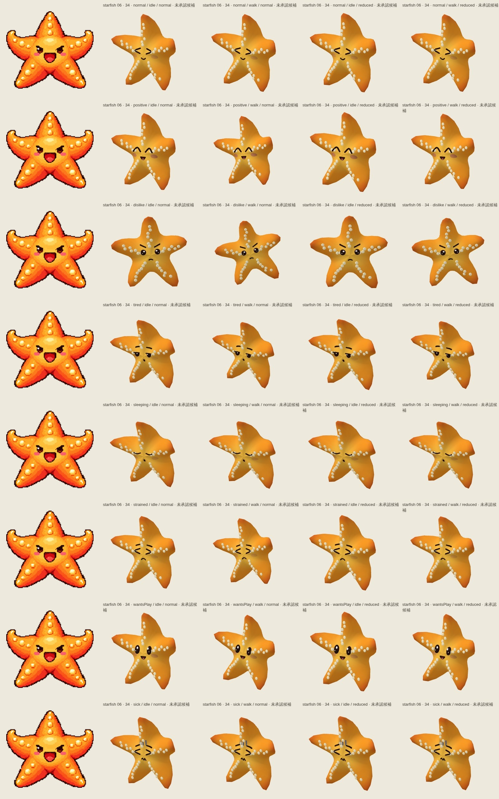

## starfish-7-motion.jpg

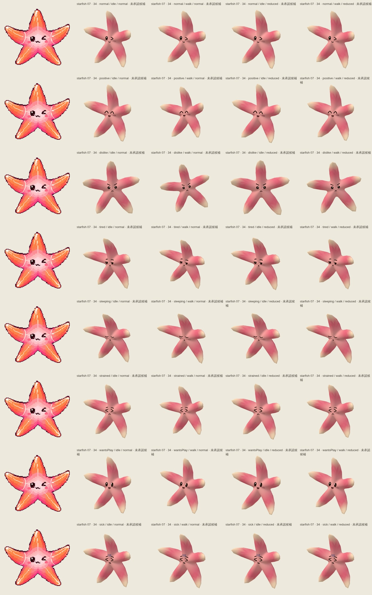

## player-starfish-1-back.png

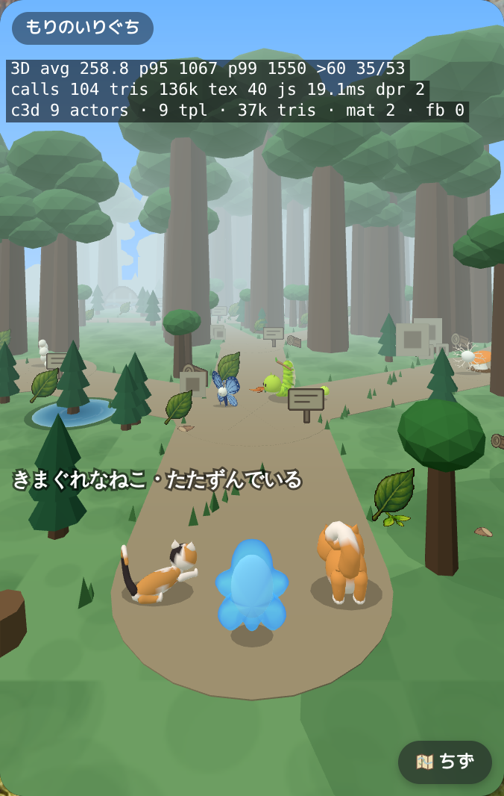

## player-starfish-1-front.png

## player-starfish-2-back.png

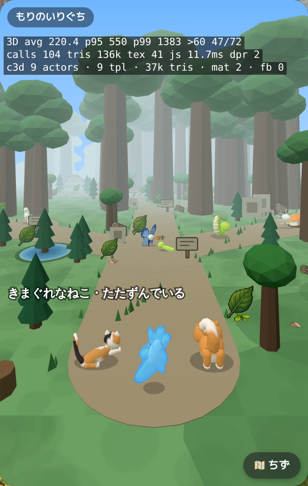

## player-starfish-2-front.png

## player-starfish-3-back.png

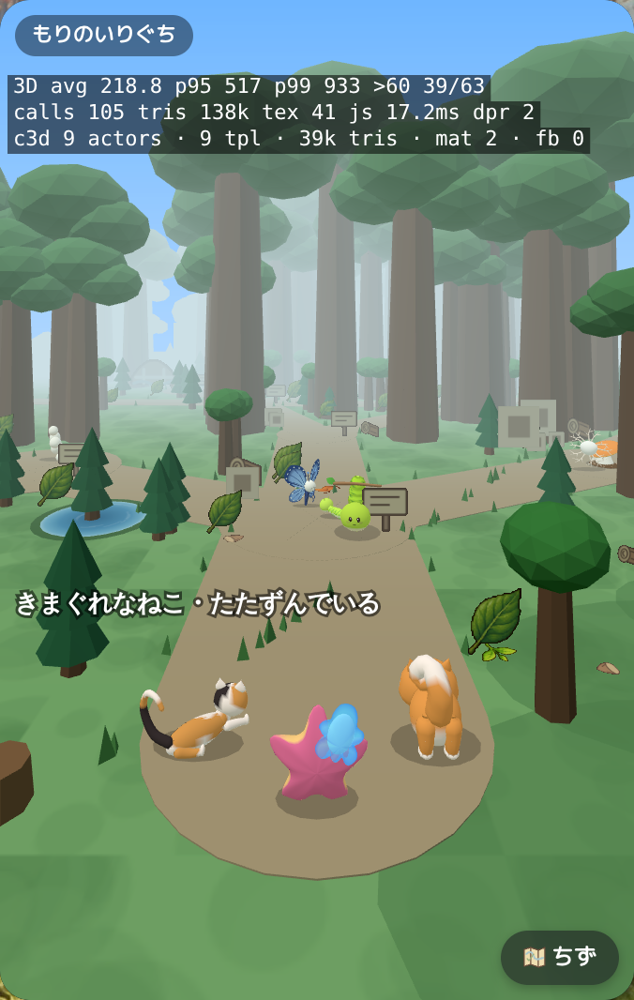

## player-starfish-3-front.png

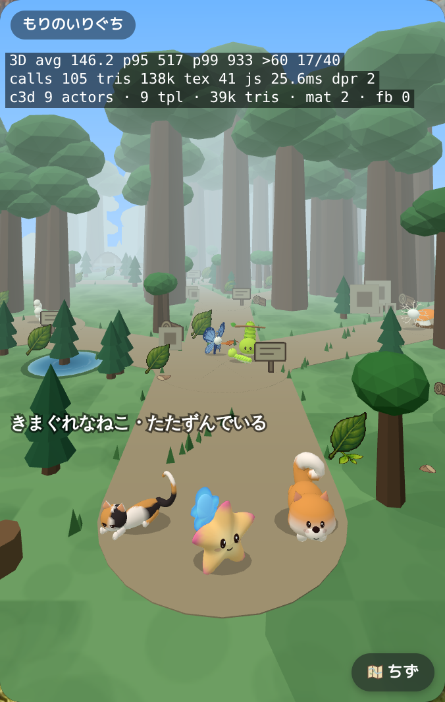

## player-starfish-4-back.png

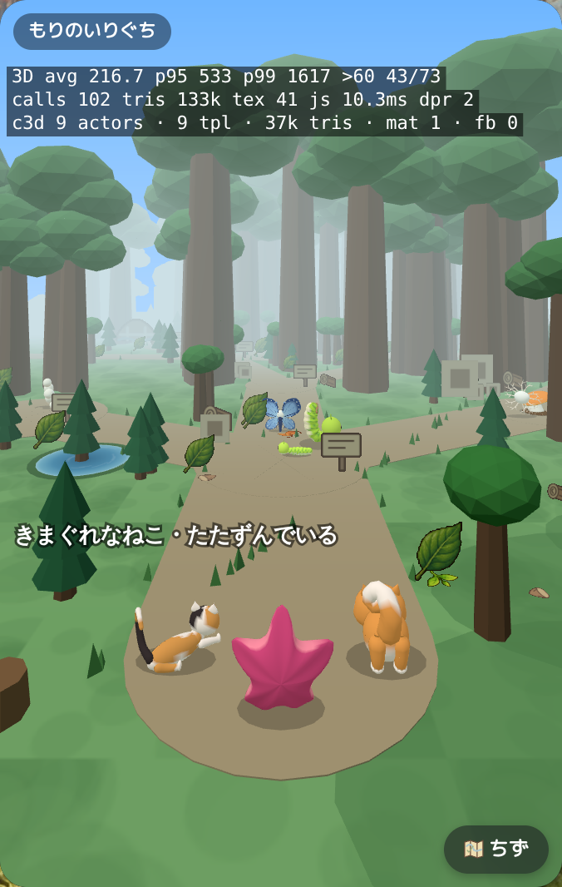

## player-starfish-4-front.png

## player-starfish-5-back.png

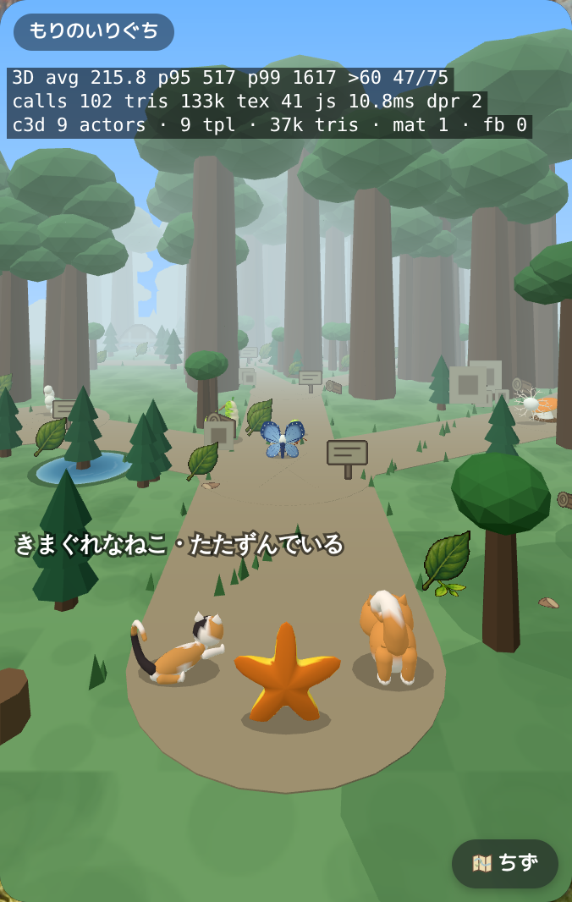

## player-starfish-5-front.png

## player-starfish-6-back.png

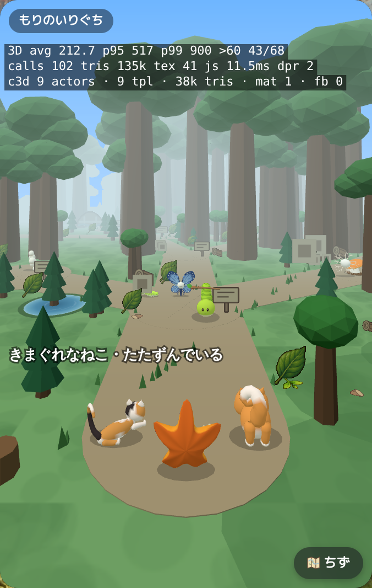

## player-starfish-6-front.png

## player-starfish-7-back.png

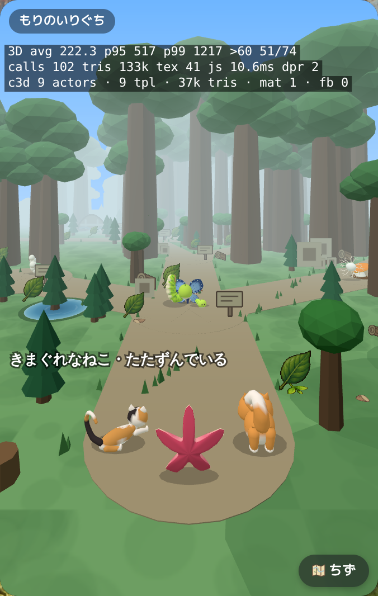

## player-starfish-7-front.png

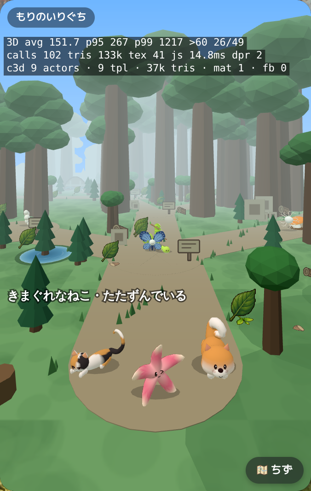

## player-starfish-8-back.png

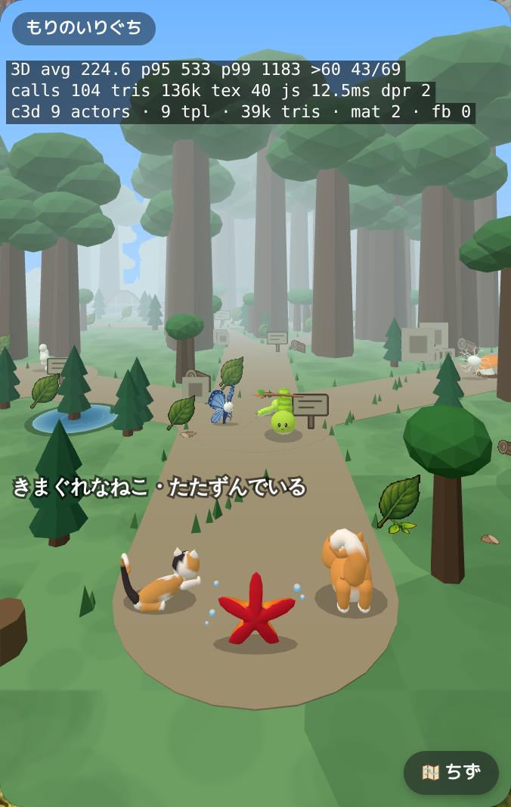

## player-starfish-8-front.png

