# integration-turtle — ae9c9ffe20ef945ddc8eed0f4a882d807ba92c4f

PENDING_VISUAL_REVIEW — export success is not image approval. Chromium/SwiftShader is not Human/iPhone acceptance.

[All original selected evidence](raw-evidence.zip) · [SHA256 manifest](manifest.json)

## turtle-1-motion.jpg

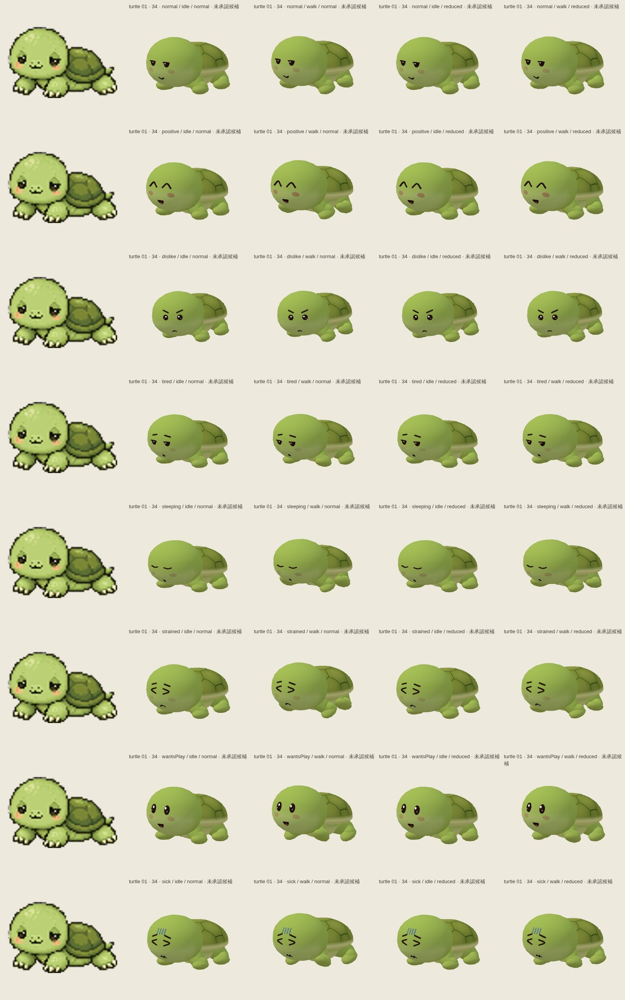

## turtle-2-motion.jpg

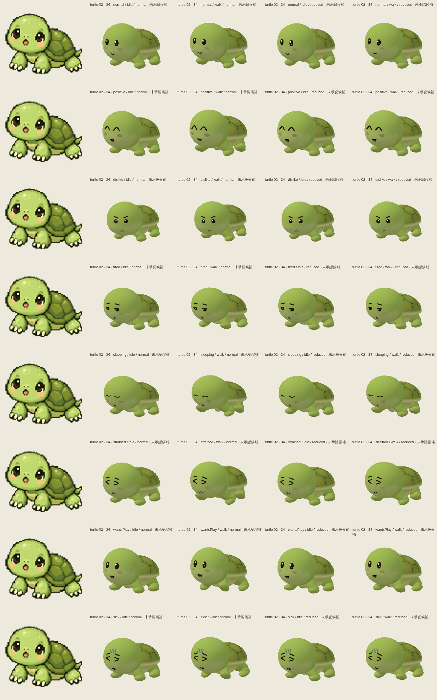

## turtle-4-motion.jpg

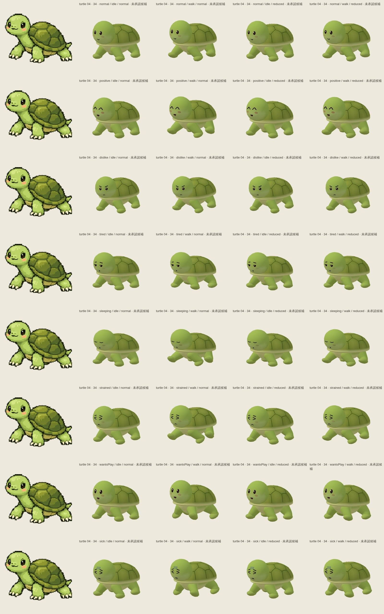

## turtle-5-motion.jpg

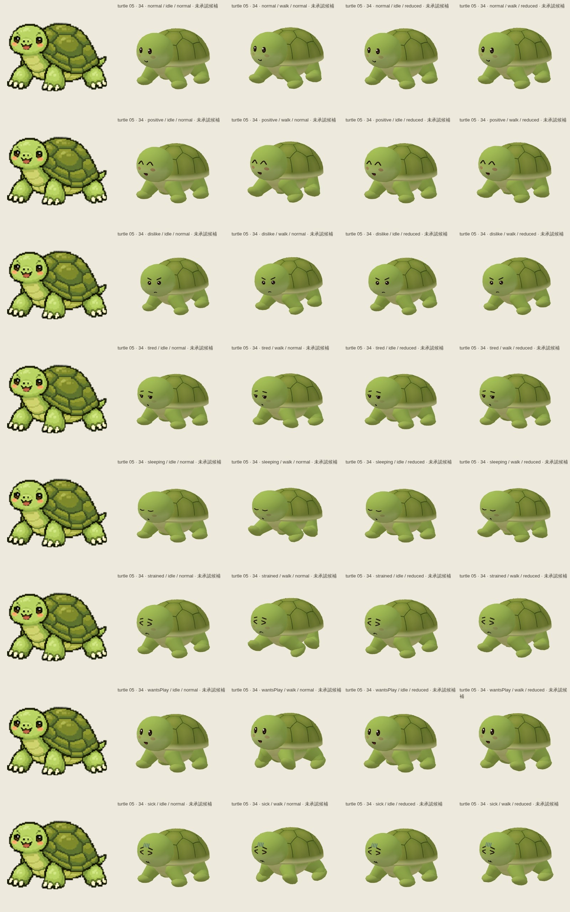

## turtle-6-motion.jpg

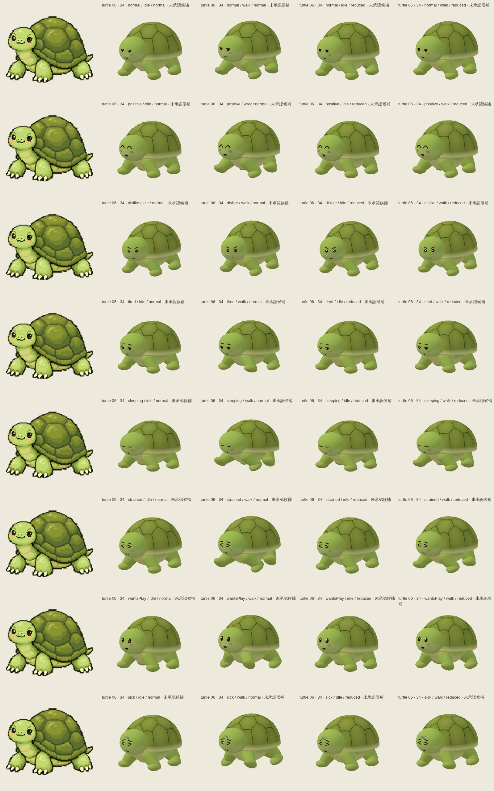

## turtle-7-motion.jpg

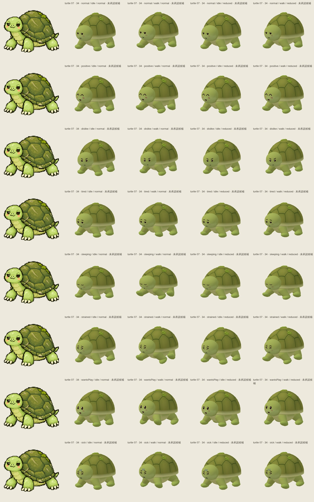

## turtle-8-motion.jpg

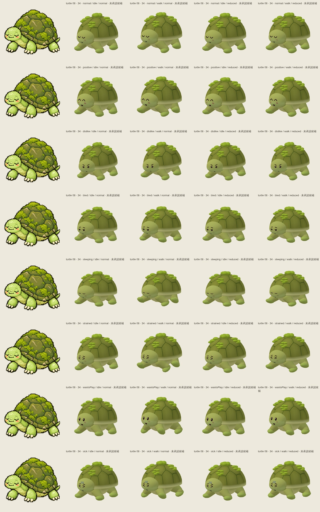

## player-turtle-1-back.png

## player-turtle-1-front.png

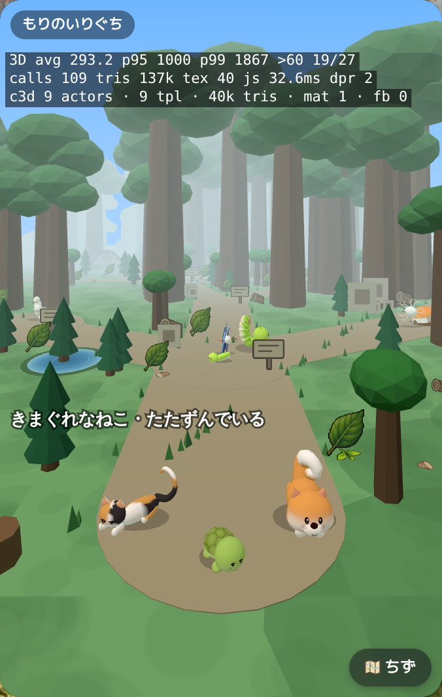

## player-turtle-2-back.png

## player-turtle-2-front.png

## player-turtle-3-back.png

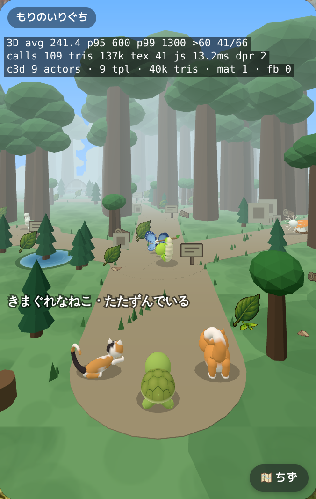

## player-turtle-3-front.png

## player-turtle-4-back.png

## player-turtle-4-front.png

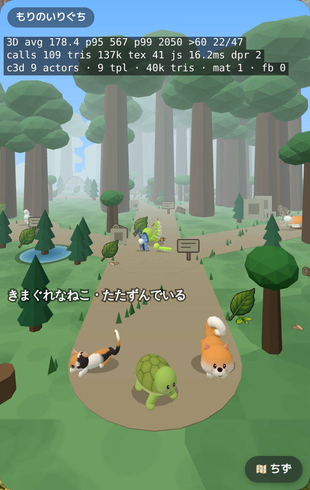

## player-turtle-5-back.png

## player-turtle-5-front.png

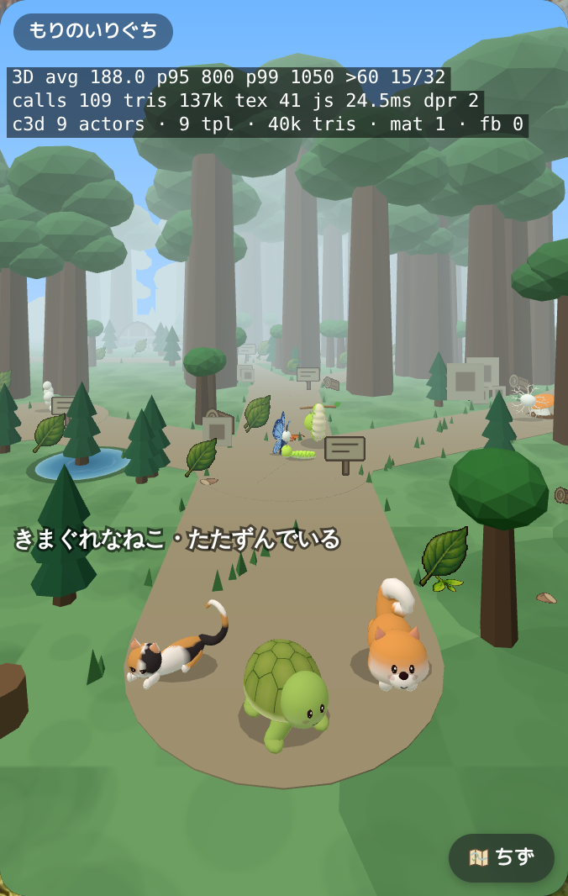

## player-turtle-6-back.png

## player-turtle-6-front.png

## player-turtle-7-back.png

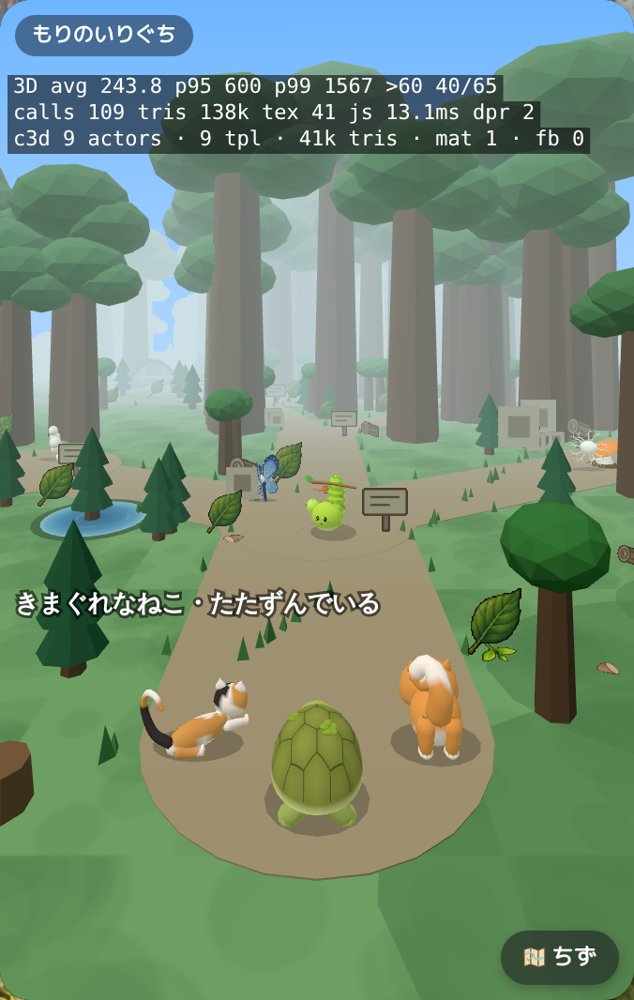

## player-turtle-7-front.png

## player-turtle-8-back.png

## player-turtle-8-front.png

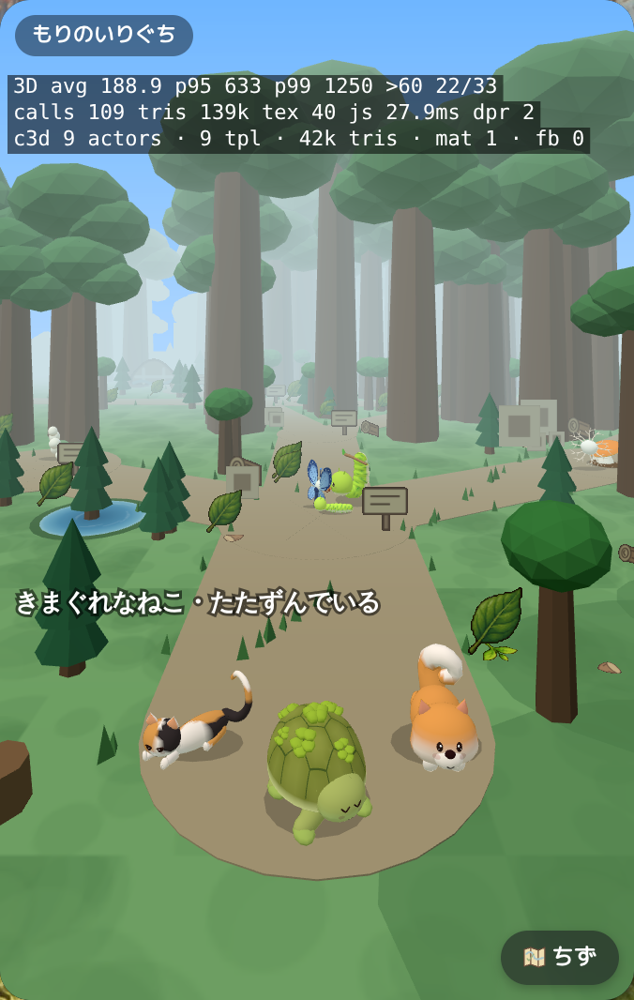
