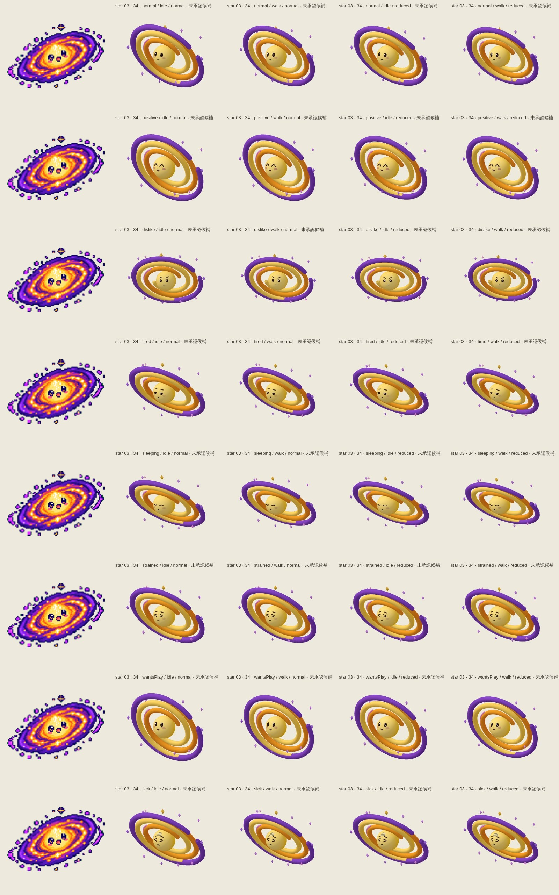
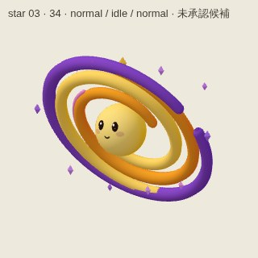
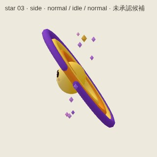
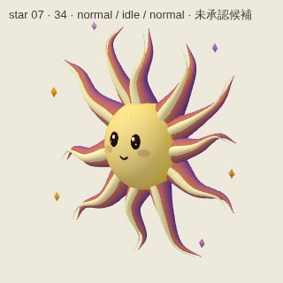
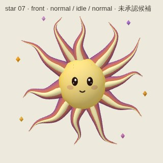
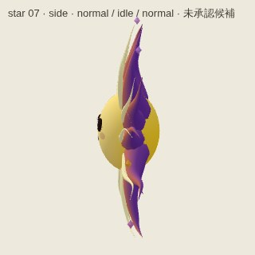
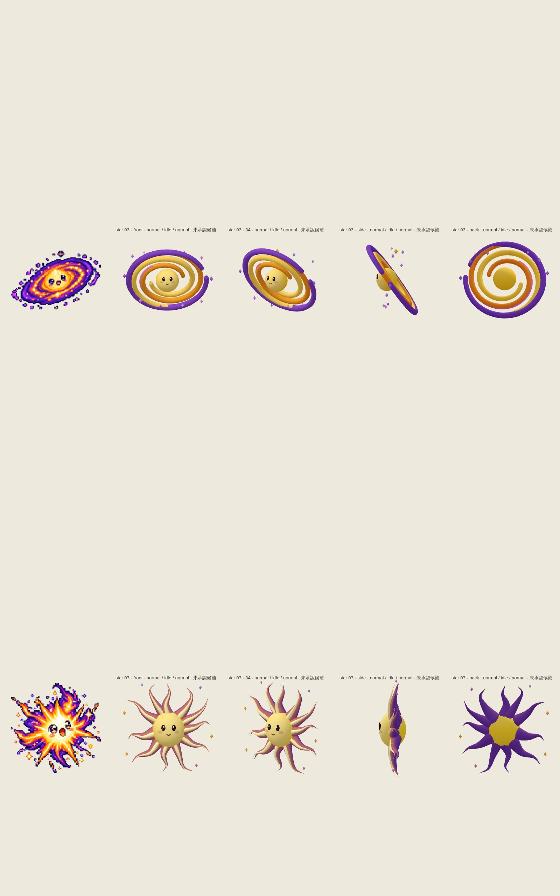

# star-wave — bc9103327e133c8a6bd4b18661c2000c7d5f2c4c

PENDING_VISUAL_REVIEW — export success is not image approval. Chromium/SwiftShader is not Human/iPhone acceptance.

[All original selected images](raw-evidence.zip) · [SHA256 manifest](manifest.json)

## star-3-motion.jpg

## star-7-motion.jpg

## star-3-34.jpg

## star-3-back.jpg

## star-3-front.jpg

## star-3-side.jpg

## star-7-34.jpg

## star-7-back.jpg

## star-7-front.jpg

## star-7-side.jpg

## star-stages.jpg

