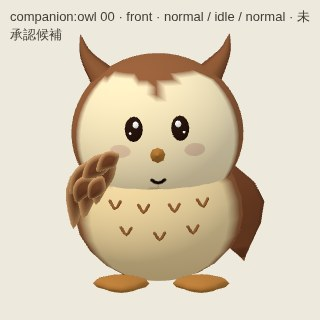
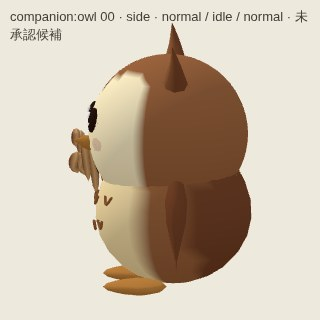
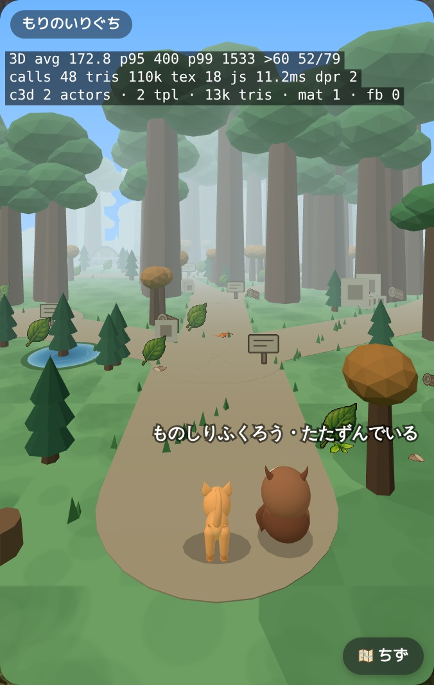
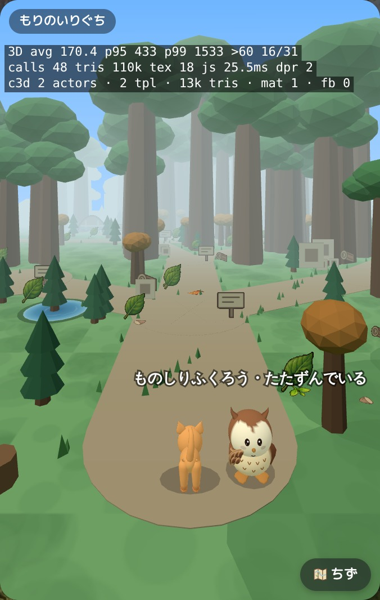
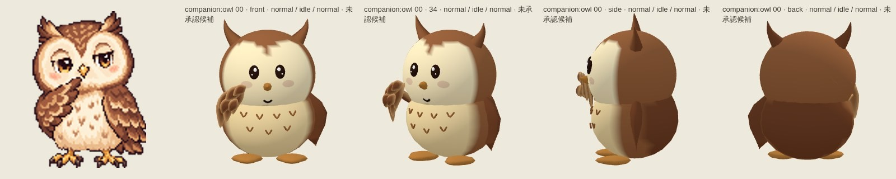
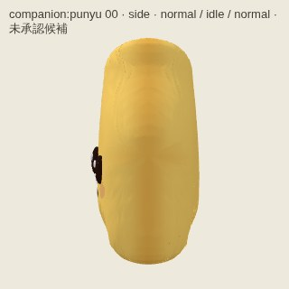
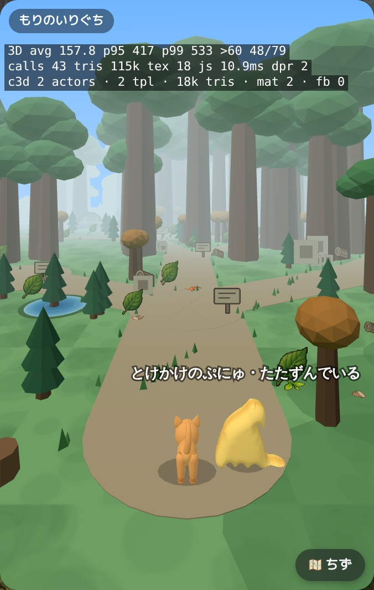
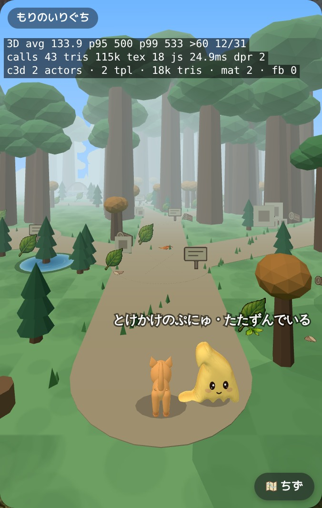
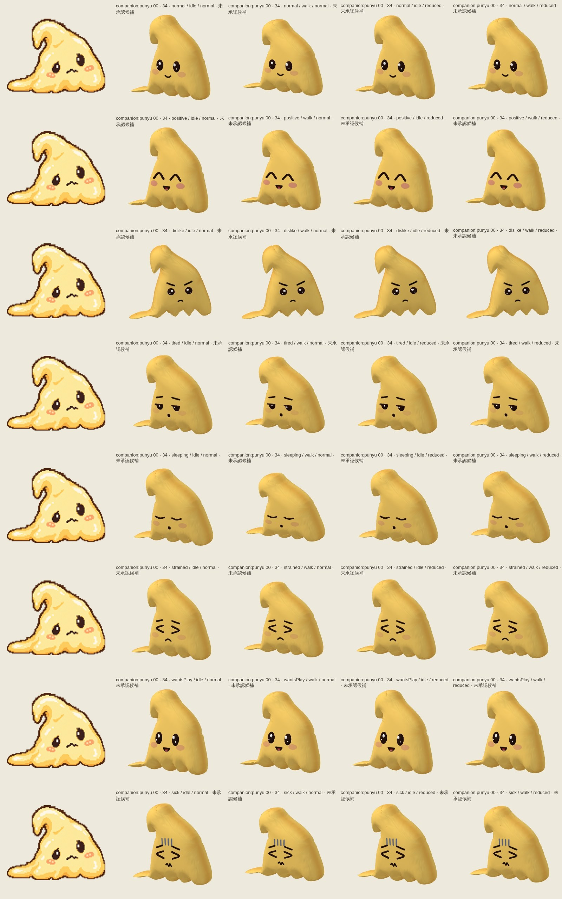

# owl-punyu — d59597d1d48dd43d40d03948f25c927198bf10f3

PENDING_VISUAL_REVIEW — export success is not image approval. Chromium/SwiftShader is not Human/iPhone acceptance.

[All original selected images](raw-evidence.zip) · [SHA256 manifest](manifest.json)

## companion-owl-0-34.jpg

## companion-owl-0-back.jpg

## companion-owl-0-front.jpg

## companion-owl-0-side.jpg

## companion-owl-distance-back.jpg

## companion-owl-distance-front.jpg

## companion-owl-motion.jpg

## companion-owl-views.jpg

## companion-punyu-0-34.jpg

## companion-punyu-0-back.jpg

## companion-punyu-0-front.jpg

## companion-punyu-0-side.jpg

## companion-punyu-distance-back.jpg

## companion-punyu-distance-front.jpg

## companion-punyu-motion.jpg

## companion-punyu-views.jpg

