# clock-parrot — dc652144365d7adeed28d3de3bd29d1e33cccd31

PENDING_VISUAL_REVIEW — export success is not image approval. Chromium/SwiftShader is not Human/iPhone acceptance.

[All original selected images](raw-evidence.zip) · [SHA256 manifest](manifest.json)

## companion-clock-0-34.jpg

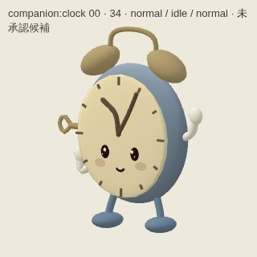

## companion-clock-0-back.jpg

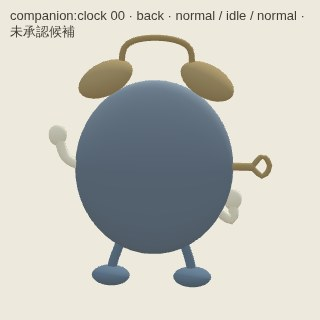

## companion-clock-0-front.jpg

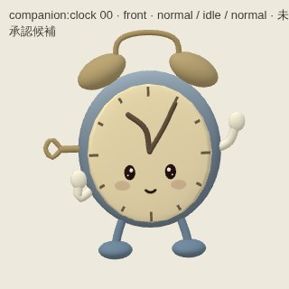

## companion-clock-0-side.jpg

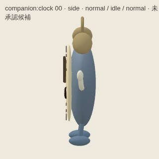

## companion-clock-distance-back.jpg

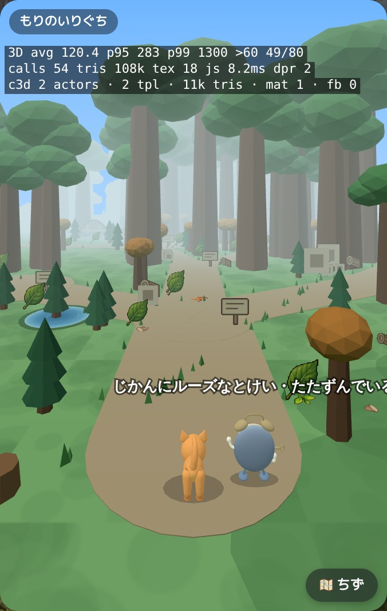

## companion-clock-distance-front.jpg

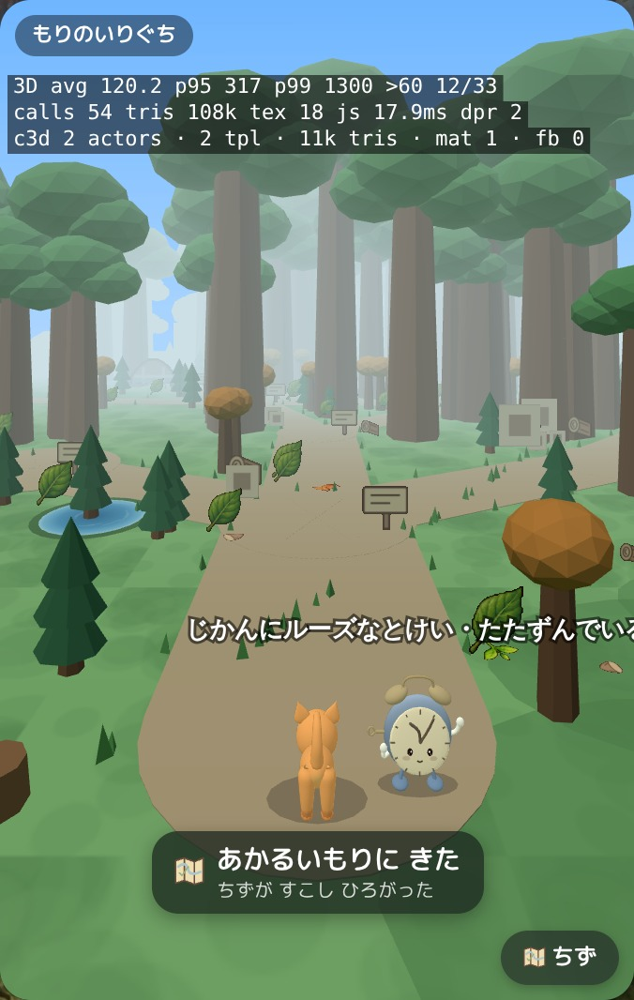

## companion-clock-motion.jpg

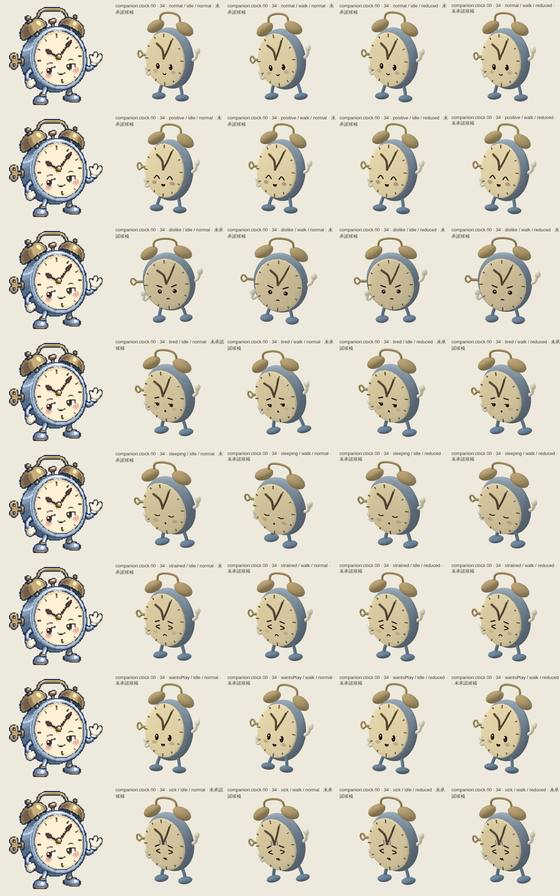

## companion-clock-views.jpg

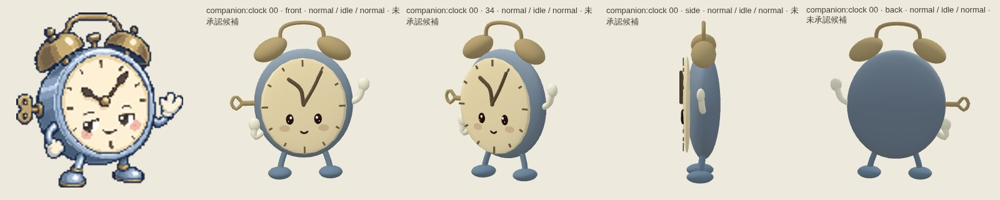

## companion-parrot-0-34.jpg

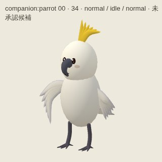

## companion-parrot-0-back.jpg

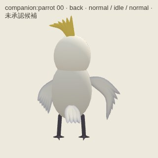

## companion-parrot-0-front.jpg

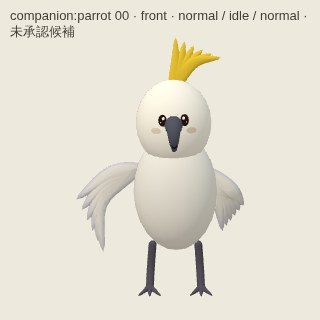

## companion-parrot-0-side.jpg

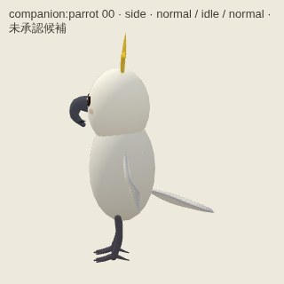

## companion-parrot-distance-back.jpg

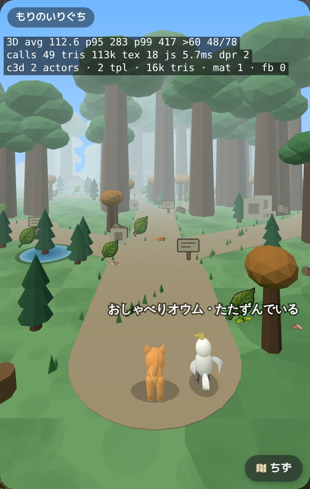

## companion-parrot-distance-front.jpg

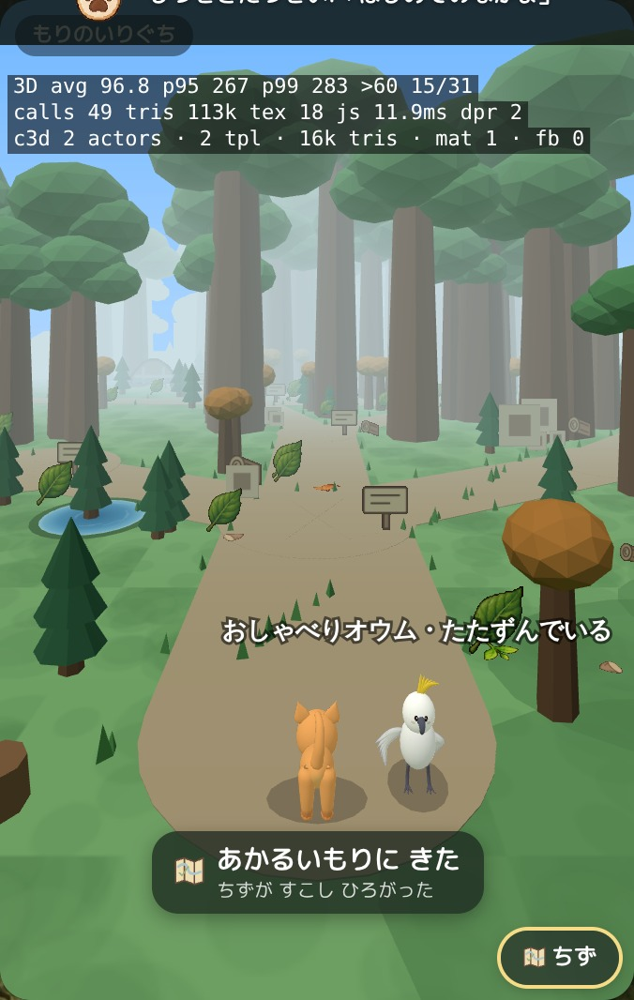

## companion-parrot-motion.jpg

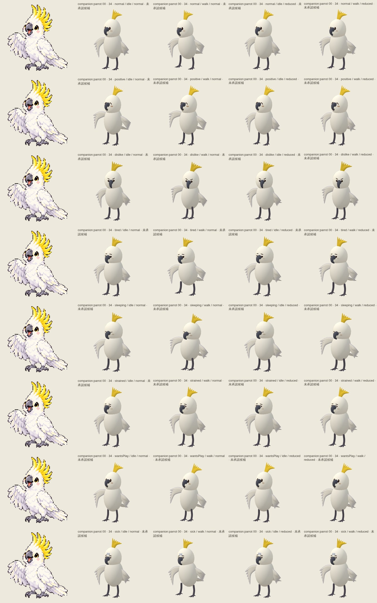

## companion-parrot-views.jpg

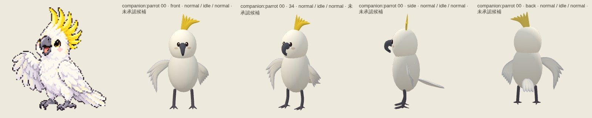
