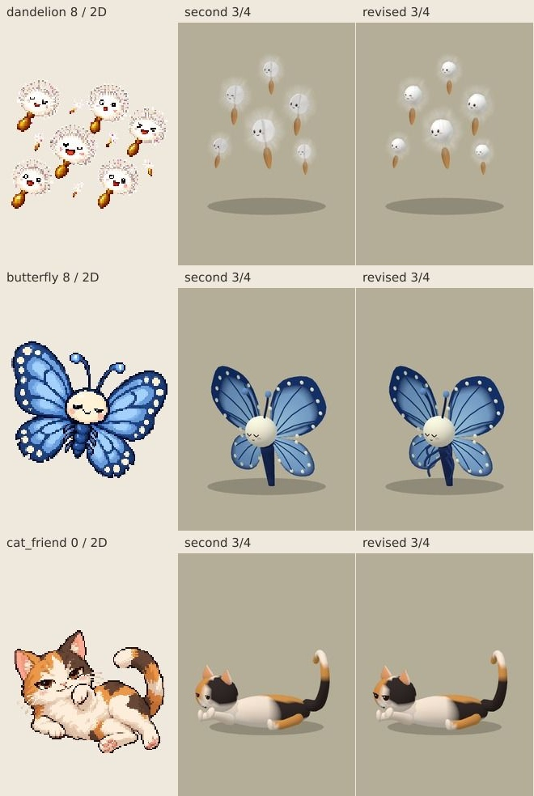

# Character 3D — Human QA 第3回の限定修正

**Human QA未承認。Draft・未mergeを維持。Ready化／full rolloutなし。**

1. [修正版QA gallery・132画像](character-3d-quality3-2026-10-03/index.html)
2. [iPhone Meguru Character 3D](https://rawcdn.githack.com/Naoto214/naotocchi/cf7b787d1ca422a358216ff36c6c29d06a571dd4/index.html?meguru3d=1&char3d=1&perf=1)
3. [同条件2D](https://rawcdn.githack.com/Naoto214/naotocchi/cf7b787d1ca422a358216ff36c6c29d06a571dd4/index.html?meguru3d=1&perf=1)
4. [2D原画／第2修正版／第3修正版の代表比較](character-3d-quality3-2026-10-03/representative-comparison.jpg)
5. [performance before / after](character-3d-quality3-2026-10-03/index.html#performance)

## 正本・範囲

- 開始時fresh remote／比較基準：`31fe18f1dd6e5aa4ca85f49fa7c363a5f32ac54f`。
- 修正コード：`cf7b787d1ca422a358216ff36c6c29d06a571dd4`、tree `a70017e91114baf78968c8c09d7d628812cea5e5`。
- 2D原画：既存 `assets/characters/dandelion/08.png`、`butterfly/08.png`、`companions/cat_friend.png`。既存PNG変更なし。
- 第2修正版7モジュールを今回QAの `previous/` に保存。vendor importの相対位置だけ補正。前回資料やClaude初版は変更しない。
- この3点の外へ造形・仕様追加を広げない。species専用modelや独自actor stateは追加しない。

## 実施した修正

| 対象 | 今回の修正 | 維持したもの |
|---|---|---|
| dandelion 08 | 種への軸を細く、淡いクリーム色・opacity 0.22に。わずかに曲げ、硬い直線感を弱める。交差halo面が中心に作る筋を弱めるため内側2リングのalphaを0へ | 外側3リングの濃度、haloの頂点位置・外形・共有密度texture、6個体の顔・配置・種、mesh/triangle数 |
| butterfly 08 | 原画の胸・腹の近くで曲がる3対の短い脚を、丸いsweepで既存body meshへ統合。根元は胴体内部へ重ねる | 頭・胴・触角、左右の前後翅の頂点・模様・羽脈・動き、draw用mesh数 |
| cat_friend | eyeSize 0.25→0.33、横幅profile 1.25、目尻の緩い傾き0.08。既存droopの半目・まぶた・highlightを利用し、geometry／atlas双方に同じspecies profileを渡す | 寝姿・体型・三毛模様・大きな尾・鼻口、canonical emotionと既存の表情選択 |

猫の調整はnormalを丸目へ置換しない。各canonical emotionは元の意味・shape選択を保ち、顔profileは3Dの表現上の比率へ適用する。profileなしのspeciesは既存の目の形状をそのまま使う。

独立レビューで蝶の後脚の根元に微小な隙間を検出。実際の脚の最初の断面中心を取り出し、旧body geometryへのraycastで根元が内部にあることをテスト。旧位置でRED、修正後GREENを確認し、同じレビュー担当が指摘解消を再確認した。

## 保護・全pilot回帰

- runtime.mjs／animate.mjs／canonical emotion体系／Motion layer／actor state／fallback／cleanup／save/schemaに変更なし。
- index.html／meguru.js／meguru-3d.mjs／Home／World Art Direction／既存PNGに変更なし。
- 全28対象のgeometry・eye geometryを第2修正版と照合。対象外25対象は一致。猫のbody geometryも一致。全対象のmesh数は一致。
- 蝶は単体4,236→5,172 triangles（+936）、mesh 7→7。綿毛は5,864→5,864、mesh 12→12。猫は4,182→4,182、mesh 12→12。これらはtemplate値で、Worldの実draw callsとは区別する。
- [geometry監査](character-3d-quality3-2026-10-03/audit/geometry-regression.json)。同条件4方向の対象外25対象はピクセル単位で一致。5表情×idle／walkの対象外24 stage・48組も一致。変更のある画像は今回3対象のみ。[画像差分監査](character-3d-quality3-2026-10-03/audit/visual-regression.json)。

## 比較条件

second＝第2修正版、revised＝第3修正版。4方向比較は同一カメラ・照明・固定時刻。猫の顔close-upは元画像と前後3Dの頭部を切り出し、同じ枠に収める（crop座標はmanifest保存）。通常Meguru距離は同じsave生成条件・カメラ・昼晴れ・単独player・仲間/住人なし。拡大画像だけで合否を判断しない。

## 検証結果

| 検証 | 最終コードcf7b787の結果 |
|---|---|
| Runtime CI / full npm test | 成功。TAP **2917 PASS / 0 FAIL** + Relationship **80 PASS / 0 FAIL**。 [Runtime run](https://github.com/Naoto214/naotocchi/actions/runs/37167013312) |
| Quality専用・mutation・画像・Meguru・性能 | evidence／regression／human-qa-packageすべて成功。[Quality run](https://github.com/Naoto214/naotocchi/actions/runs/37167010916) |
| Home CI | 成功。[Home run](https://github.com/Naoto214/naotocchi/actions/runs/37167013283) |

最終CI：専用 **54 PASS / 0 FAIL**。既存remove-it **13/13 RED**、quality **11/11 RED**、quality2 **7/7 RED**、今回 **6/6 RED**（軸opacity、内部halo筋、脚の存在、脚の接続、目profile、目サイズ）。各mutationで原本復元。source.txtで最終code SHA/treeとclean statusを記録。

保存commit `bca3ca2467ce0493b2a6782a26c3f46c8a93ada3` は132画像・計測資料のみ。全画像decode成功。package-manifestのsourceは最終code cf7b787と一致。原画＋前後4方向28対象、5表情×idle／locomotion26 stage、全26 stage Meguru front/back、今回3対象のclose-up・飛行・単独通常距離を収録。猫顔のcropも目視確認済み。

Meguru全26 stageでrequested stage＝exact spec、live 3Dを確認。player 120/120 frame描画、2D切替でlive 0、再度3Dで7体へ復帰。しばだけ故障注入時はそのactorだけfallbackし、猫とplayerとWorldの3Dを維持。cityでlive 0、forest復帰時live 7＝scene内holder 7でghostなし。[生データ](character-3d-quality3-2026-10-03/meguru/meguru-qa.json)。reduced motion、Expression、save/schema、asset integrityは専用／full testで再確認。

[全検証の記録](character-3d-quality3-2026-10-03/audit/verification.json)。最終資料追加後もproduction codeはcf7b787と同一。未実施事項をGREENにしない。

## Performance before / after

第2修正版31fe18fと今回cf7b787を同一CI・Chromium / SwiftShaderで各条件8秒、1標本ずつ計測。Node v22.23.3、Playwright 1.62.1。前回QA保存値の別runではなく、今回同条件で前後を再測定した値。

| actors | Character tris 前→後 | World calls 前→後 | presenter CPU avg ms 前→後 | JS heap MB 前→後 | 今回live / fallback |
|---|---|---|---|---|---|
| 1 | 4,062 → 4,062 | 40 → 41 | 0.788 → 0.615 | 19.3 → 19.3 | 1 / 0 |
| 5 | 19,144 → 19,144 | 92 → 85 | 2.202 → 2.226 | 20.5 → 19.3 | 5 / 0 |
| 27 | 103,595 → 106,403 | 250 → 236 | 4.249 → 4.844 | 23.1 → 23.1 | 27 / 0 |

27体のtrianglesは+2,808（約2.7%）、蝶3体×936の追加に一致。Character mesh数は255→255、綿毛・猫のtriangle数は不変。CPU平均は4.249→4.844 ms（約14%増）、heapは23.1→23.1 MB。CPU/heapは1標本の揺らぎを含み、改善・劣化の確定値とはしない。World callsは移動中の可視物によって変わるため、250→236を今回の最適化成果とは扱わない。

27体の平均frame時間は163.83→160.57 ms、p95は400.1→550 ms。ソフトウェアGPU上で実用frame rateを保証する結果ではない。**iPhone性能合格ではない。** 1/5/27とも要求live数一致・fallback 0・page error 0。

[前回再測定JSON](character-3d-quality3-2026-10-03/measurements/perf-previous.json)／[今回JSON](character-3d-quality3-2026-10-03/measurements/perf-revised.json)。両JSONに同条件2Dも保存。

追加stress：綿毛25体＋しば・猫2体で27 live／fallback 0。Character tris 155,068、World calls 501、CPU avg 2.731 ms、heap 26.0 MB、平均frame 204.54 ms、p95 483.3 ms。綿毛geometryは前回と同数だが、透過面が密集する負荷は残る。[stress JSON](character-3d-quality3-2026-10-03/measurements/perf-puffs.json)。

通常距離比較はカメラ・save生成条件・昼晴れ・単独actorを揃えた別run撮影。Worldの装飾位置や経過時間による差は残るため、画面中のperf overlayを厳密な前後比較に使わず、上表の計測JSONを用いる。

## Preview host確認

rawcdn.githack.comの固定code SHAの3D／同条件2Dリンクを2026-10-04 UTCにブラウザーで開き、HTML UIを確認。初回にexternal content noticeの「Open the page」が出る場合がある。別hostのため普段のsaveは自動引継ぎされず、saveがなければたまごから開始する。これはiPhone実機やWebGL速度の合格確認ではない。

## Human QAで残る確認

- 綿毛：通常距離で内部軸・交差面の筋が目立たず、外周が柔らかく見えるか。薄い透過面と低polygon coreによる陰影は残るので、全角度で完全な均質白とはしない。
- 蝶：脚が通常距離でも読め、昆虫の怖さに寄らず、羽と身体の可愛らしいバランスが保たれているか。脚は既存bodyのflutterに追従し、独立した脚motionは追加していない。
- 猫：少し大きい半目が子猫らしさや怒り顔へ寄らず、原画の艶やかさ・余裕を表せているか。
- iPhone Safariでの速度・熱・memory・27体の操作感は未確認。Chromium/SwiftShaderの値を実機合格へ読み替えない。
- 他lane統合後のWorldとの視覚的接続は別QA。mainや他laneを取り込まない。

## 他lane read-only監査

main `0b0a6b30e8e098472b2fa965604f4901874942e3`、#368はmechanical conflictなし。#367はindex.html、#369/#371/Terrainはindex.html・meguru-3d.mjs・meguru.js・package.jsonに競合。Terrainは `704faac1e62690d9c4dff5e862a0d8d424cefff9` へ進んでいるため最新を監査した。

[merge-treeの記録](character-3d-quality3-2026-10-03/audit/conflicts.json)。機械的な競合の有無とsemantic integrationを区別する。Worldのbillboard基準player visibility、地面高・接触・scene交換時の責務は統合時の確認事項であり、今回mergeしていない。
