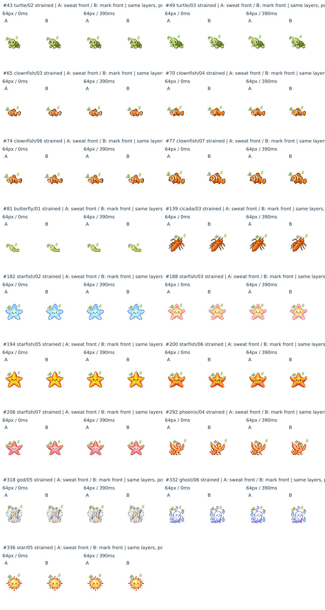

# 状態マークを汗の前に置く描画順の正式採用

2026-09-25、ユーザーがA/B結果とBを承認。対象はPR278のz-orderだけ。通常育成表情編全体の完成判定は保留のまま。

## 決定と最小差分

**本体 → 汗 → 状態マーク**。状態マークはresolverが選んだ現在の代表表示（状態・一時反応）、汗は独立した病気併存の補助情報として扱う。代表表示を医学的重症度と同一視しない。睡眠・生命状態・一時反応等の既存の選択順はそのまま。

- `pet-expression.css`：accent z-indexを1から4へ変更。汗のz-index3は変更しない。
- `index.html`：そのCSSだけのキャッシュ識別子を更新。他の配信参照は変更しない。
- 位置・サイズ・色・形・アニメーション・SVG・resolver・全キャラクターPNGは変更0。
- 旧17境界への個別位置修正0、画像修正／再生成0。犬03、ウスバカゲロウ07/08、空腹マーク、なおと、なかま／こいびとは未着手。
- `.character-visual`はposition:relativeだが独自stacking contextを作らないため、マーク4が兄弟の汗3より前に描画される。主役全体の移動・反応filterは両者を一緒に包むため内部順を逆転しない。

## 採用根拠（ユーザー承認済みA/B）

既存346候補だけを64/80/104px、0/390/1300/1690ms＋静止で比較した5,190対。

|指標|A：汗が前|B：マークが前|
|---|---:|---:|
|明確な実不具合|0|0|
|境界例|17|0|
|状態マーク判読困難（境界含む）|17|0|
|病気併存の判読困難|0|0|
|逆転による新規問題|—|0|

前回の3境界から14組を同じ346候補内で再分類した結果が17。全体2480表情への新規監査ではない。汗とマークが交差するだけでは不具合扱いせず、雲や矢印の残る形で意味が明瞭なら許容。Bで片側汗がほぼ隠れても、もう一方の汗が読める例を含む。

旧17は全てstrained：カメ02/03、カクレクマノミ03/04/06/07、チョウ01、セミ03、ヒトデ02/03/05/06/07、フェニックス04、かみさま05、おばけ06、ほし05。ID43/49/65/70/74/77/81/139/182/188/194/200/206/292/318/332/336。小さい灰色ギザギザの屈曲をBが保持する。個別位置調整を行う根拠にはしない。

**制約：** A/Bおよび今回の画像照合は、実PNG・SVG・CSSを用いたオフライン合成。実機／ブラウザ撮影ではない。影・境界ラスタは近似であり、4位相は連続全時刻を保証しない。今回のゼロ判定を全端末・全表示条件へ拡張しない。

## 基準

- remote parent：`a0dac0d3c454f7097370d4c5d784be5beb8697e2`
- parent tree：`362f712ad48b7a9d39a79c805f8ea60cd5dafe18`
- 実main：`742a40611be472ac89c348ea8d025bc8153147ec`。PRの古いbase.shaと区別、取込みなし。
- PR278 Draft/open/未マージ。既存競合を解消せず、この作業だけを保存する。
- 開始時CI：Actions0/check-runs0/statuses0、combined pending。
- 古い作業領域にGit alternates参照切れがあるため、別チェックアウトにGitHub保存済み3596ファイルをblob照合して復元。構成treeがparent treeと完全一致。ローカルsnapshot履歴はremoteへpushしない。

## Fresh検証

- 新規描画順テスト：変更前はmark1 < sweat3で意図通りFAIL、変更後PASS。既存testファイルへ1件追加。
- 関連テスト：`pet-expression-test` / `pet-expression-integration-test` / `care-status-integration-test` / `emotion-state-test` / `asset-versions-test`、890/890 PASS（43,568.743246ms、exit0）。
- runtime：既存35観測probeをfresh実行。保存済みJSONと全項目一致、同時マーク最大1。病気＋病気表示／睡眠／危険／いのち低下／喜び／不機嫌／いやだ、および一時normalで汗保持を確認。睡眠＋危険等の調停も不変。
- 346候補：現在CSSからbody0／sweat3／mark4の順を取得して合成。5190組のbody/mark/sweatレイヤーhashが承認済み比較時と全一致。346枚の全比較パネル（各15対）のRGBA画素も承認済みBを含むパネルと完全一致。履歴Aを比較欄として残すだけで、ランタイムはB。
- 旧17：個別位置変更なしで、fresh合成の17組を主担当が再実見。ギザギザと反対側汗が認識でき、Bの境界0を保持。全346への新しい視覚的分類監査は行わず、承認済みBとの等価性を証明した。
- 非変更：既存キャラPNG2781枚全てbaseline Gitblob一致（通常297＋active2480＋legacy4）。全3596既存ファイルを照合し、変更はCSS1値・対応cache1参照・新テスト・正本追記・過去QAの案内追記のみ。resolver／SVG／汗CSS／配置・ゲーム数値等の別機能不変。
- 独立レビュー：描画祖先・適用CSS・差分・テストを別担当が確認。重大／重要指摘0。source-levelテストでありブラウザcomputed-styleの保証ではないことも記録。

証拠：[346照合結果](expression-zorder-20260925-verification.json)、[35runtime観測](expression-zorder-20260925-runtime.json)、[独立レビュー](expression-zorder-20260925-review.md)。承認済みA/B資料のSHA256と今回の実行スクリプトSHA256は照合JSONへ保存。

## 全体テストの初回失敗と切り分け

初回 `npm test` は smoke/dialogue/visual QA が成功し、Node 1,839件中1,838成功・1失敗（491,125.450803ms、exit1）。失敗は変更していない `tests/quick-mode-test.cjs:57` の `solving dodge counts`（期待 `✔ 1／20`、実際 `✔ 0／20`）。失敗結果を隠さず保存する。

このテストのharnessはJavaScriptを読み、今回変更したCSS・HTMLを読まない。対象JS・quickテスト・harnessは基準blobから変更0。ゲーム選択・障害物が乱数を使い、隣の既存テストにもdodge系の自動操作失敗を許容するコメントがある。既存の乱数依存による不安定さが疑われるが、同じ乱数条件で初回失敗を再現できたとは主張しない。

変更前の同一treeから作った独立worktreeでquickテスト10/10 PASS（518.778ms）、変更後でも10/10 PASS（523.105ms）。無関係なゲーム／テストへ修正は加えず、全体を一度だけ再実行して確認する。

全体再実行 `npm test`：smoke/dialogue/visual QA成功、Node **1,839/1,839 PASS、fail0、skip0、exit0**（467,571.53515ms）。初回の失敗と両単独実行を含めた[実行ログ](expression-zorder-20260925-tests.log.gz)を保存。全体の成功は再実行の結果であり、初回も成功したとは扱わない。

最終 `git diff --check` と staged差分検査PASS。既存3,596ファイルの再照合でも変更5ファイルのみ、キャラPNG2,781枚不変。関連890件・runtime35観測・既存346候補/5,190対の等価性を満たすため、承認されたz-order変更の保存条件を満たす。

## 保存の扱い

この変更・回帰テスト・QA証拠を1コミットでPR278のhead branchへ保存する。commit自身のHEAD/treeと保存後CIは循環参照を避けてPR本文の保存receiptへ記録し、実main、Draft/open/未マージを再確認する。CI0件／pendingを成功とは扱わない。通常育成表情全体の完成判定や他の保留修正は今回確定しない。
