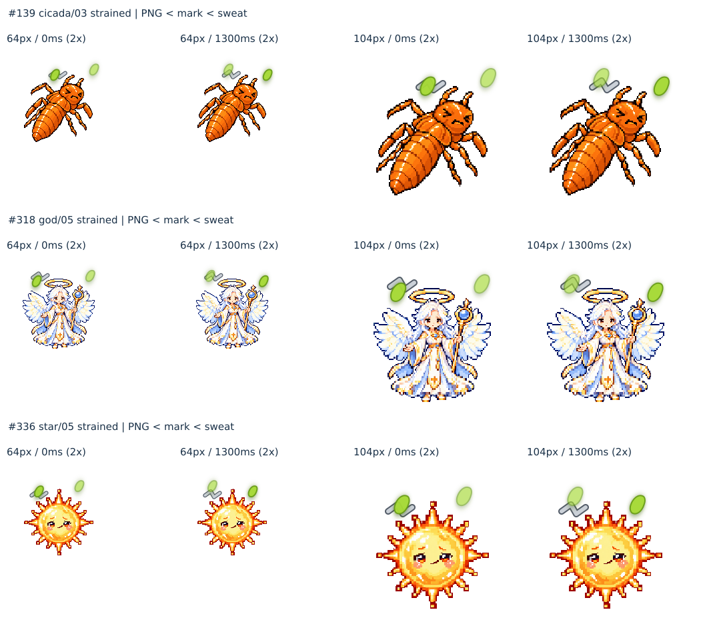

# 最終監査の限定追加確認・修正前裁定（2026-09-24）

**実装・画像修正前で停止。新しい全体監査ではない。完成扱いは依然保留。**

ユーザーが2026-09-24に指定した既報の犬03、ウスバカゲロウ07/08、汗×マーク346候補、空腹マーク31系統だけを整理する。2,480表情の新観点による全面再監査、画像修正/再生成、新しいアイコン生成、配置/z-order/ゲーム数値の変更は0。なおと、なかま、こいびと制作、mainマージは行わない。

## 基準と確認範囲

- 最新GitHub PR278 HEAD: `81e9fafd896f8cb3a8d01d589beb15a9d49e5a09`。
- tree: `1e4171faffde16a0d26bc9edc5a97e3d0139ebac`。
- 実main ref: `c7705d8dbbc8e91b5493526df3a74355fb53ab5b`。PRの古いbase.shaとは区別し、取り込みなし。
- PR278 Draft=true / open / merged=false。既存競合の解消なし。
- 基準HEADのCIはActions0/check-runs0/statuses0、combined pending。新たな成功とは扱わない。
- local HEADは `2e84a52937a135ab59b890abe369f8a07525c9a0`（以前のAPI保存と同tree・異なる履歴）。今回の開始時に全3,582追跡ファイルのGitblobを照合、差分0。インデックスから独立再構成したtreeもremoteと一致。失われた別作業領域へのGit alternate参照は、検証済み現存バイトからローカルobjectを復元して解消した。ゲームファイルの変更ではない。
- 元画像・既存表情を含む追跡ファイルのhash照合は非変更確認であり、意味の再監査ではない。

## A. 汗と状態マークの現在仕様

**本体 → 状態マーク → 汗**の順に描画する。画像はz-index:auto、マークは1、汗のbefore/afterは3。`.character-visual`は通常新しいstacking contextを作らない。具体的出典と35観測は [runtime](final-audit-followup-20260924-runtime.md)、[probe結果](final-audit-followup-20260924-runtime-probe.json)。

状態マークは一度に1種類。複数のSVG path、2本矢印、Zzzは1つの状態記号の構成部品。再描画では前のマークを置換し、積み重ねない。別のホームメーター・メッセージ・care alertは、この主役に付く表情マーク数とは別。

|条件|主役の状態マーク|汗|
|---|---|---|
|睡眠＋危険|睡眠のみ|isSickなら有り|
|空腹＋睡眠|睡眠のみ|isSickなら有り|
|危険＋いのち低下|危険のみ|isSickなら有り|
|病気のみ|病気|有り|
|病気＋life warning|いのち低下|有り|
|病気＋health低下だけ|病気を優先|有り|
|病気＋空腹/疲労/かまって相当値|病気（または上位の睡眠/生命状態）|有り。空腹/疲労/かまってマークとの通常併存はない|
|病気＋じゃれる成功/食事afterglow|喜び|有り|
|病気＋じゃれすぎ拒否|不機嫌|有り|
|病気＋食べすぎ拒否|いやだ・つらい|有り|
|病気＋食事/起床の一時normal反応|なし（通常元画像）|有り|

汗は病気PNGへ焼き込まれた画像ではなく、`isSick`＋表示条件によるCSS別レイヤー。実際の病気個体への食事ボタンから、normal＋汗→happy＋汗→sick＋汗を標準/低減モーション両方で確認。メニュー・ストーリー等の非表示条件も限定probeで確認。

346件は**汗×1種類の状態マークだけ**の幾何学的交差候補。状態マーク×状態マークは含まない。対象6状態はhappy/strained/sulky/weak/critical/sleeping。既報数は64px340、80px336、104px326、サイズ別のべ1002、重複除外346組/27系統105段階。normalにはマークがなく、sickは元の検査対象だったためこの346とは別。全機能の無制限な同時表示監査には拡張しない。

## B. 346候補の二次目視

|判定|件数|
|---|---:|
|ユーザーの基準で明確な実不具合候補|0|
|修正不要（双方の意味を読める）|343|
|境界例・ユーザー判断保留（不具合確定ではない）|3|
|静止モードで修正不要|346|

全346組について、64/80/104px×4位相（0/390/1300/1690ms）と静止モードを合成して担当3名が分担実見。動作時4,152枠＋静止時1,038枠。動作時87シート、静止時29シート。左右1.3秒差、opacity .65〜1、縁、影、現在のz-orderを反映。静止時は現CSS通りrotateなし・移動なし・opacity .85。

実ブラウザのローカルページ表示がセキュリティ制限されたため、これらは**オフライン再現合成であり、実機/ブラウザ撮影ではない**。CSS角丸形状・縁・影を再現したが、ブラウザごとの境界ラスタや影のぼかしは完全一致を保証しない。4位相は連続アニメーションの全時刻ではない。背景・実際の端末倍率・最大同伴配置の検査へ範囲を広げていない。静止一覧の一部端のマークは資料枠で切れるため、本番のclipping不良として数えず、余白のある個別動作時合成を併せて見た。

この制約下で「全実機で不具合0」とは主張しない。前回の「交差があるから表示配置の修正が必要」という強い読みは、このユーザー基準による追加確認で撤回する。**346件一括修正の根拠はない。**

|番号|系統・段階|表情|気になる点|判定|
|---|---|---|---|---|
|139|セミ03|strained（いやだ・つらい）|左の汗が短い銀色ギザギザの中央を隠す位相がある。主に64pxの0/390ms。線の端は残り、後の位相で読める|境界例|
|318|かみさま05|strained|同上。顔や輪は隠れず、より大きい表示では識別しやすい|境界例|
|336|ほし05|strained|同上。小さい緑＋銀の飾りとして一体に見える可能性はあるが、別状態記号への明確な誤認までは確認できない|境界例|

3境界例と対照2例（猫03 critical/sleeping）を別担当が独立再確認。3例は判断保留、対照2例は修正不要とした。[独立所見](final-audit-followup-20260924-independent-borderline.md)。根拠のない新z-orderや位置修正は提案としても確定していない。

軽微な接触、自然な近接、輪郭の一部が隠れても矢印/Z/雲/輝き/汗の意味を認識できる場合、顔が保たれて密集が明確な支障にならない場合は修正不要。猫03 critical/sleepingはこの実例。分類は見た目に基づき、交差pixel数で自動判定していない。

全件: [一覧](final-audit-followup-20260924-visual.md) / [機械可読記録](final-audit-followup-20260924-visual.json)。担当別の実見シート記録はvisual-a/b/c.md。合成入力/生成資料hashはcomposite-manifest.json、合成プログラムと全画像は別添の確認資料一式。

## C. 空腹マークの現状と案

31系統とも現在値を実装と正本で確認。8系統は専用の分岐、23系統は魚defaultの分岐。ただし分岐がdefaultでも、表示選択の過去の意図とは区別する。

- 個別8：人系3＝ご飯、犬/カメ＝皿、カエル/ハエトリグサ＝虫、カクレクマノミ＝餌粒。維持。
- 魚の選択記録あり：猫（承認済み基準）、ペンギン（制作QA）、サケ（正本/計画）。維持案。魚の主食設定とは断定しない。
- ヤドカリ：当時計画/QAにdefaultの継承と明記。食性に合うと検討済みという記録ではない。
- 残る19：この限定調査で参照できた現在の正本/QAに個別食物意図を確認できない。未取得の全会話を否定するものではない。
- 当時のGitHubコミット3件でペンギン/サケ/ヤドカリの記録も照合。

全31系統の現在値・設定・推奨カテゴリ・マーク・共用・専用価値・理由・出典は [候補表](final-audit-followup-20260924-hunger.md) と [JSON](final-audit-followup-20260924-hunger.json)。これは採用済み仕様ではない。

基本案は既存5種を使い、葉/植物の汁、植物の養分、必要なら抽象養分や菌類の基質を少数共用にする。8〜9程度の意味カテゴリ、葉と汁を別図形にすれば9〜10程度。特殊系を普通の食事の比喩として皿/米飯/粒で表せば専用絵はさらに減らせる。1系統1専用SVGや1段階ごとのPNG生成は不要。

世界樹、キノコ、おばけ、かみさま、ほし、ぬいぐるみ、？？？、りゅう、フェニックスの食性は勝手に確定しない。unknown04の頭上2球を食性判断のために目/感覚器へ分類しない。幼虫/成虫など段階別マークは選択肢に留め、今回新しい段階演出システムとして導入しない。現在の8個別系統に、変更必須といえる明白なキャラ設定矛盾はこの資料から確認できない。

## D. ユーザーが確定した個別修正方針（未実行）

|対象|今後の最小修正|保持|
|---|---|---|
|dog03 wantsPlay（1枚）|ユーザー指定の左前脚を通常元画像の上げた位置・形へ戻す|現在の良い顔・遊びたい感情、その他の身体構造|
|antlion07 strained/hungry/tired/weak/critical（既報5枚）|濃く太い連続線を、通常元画像の淡い軌跡・粒子・空中を漂う軽さへ戻す|現在の顔と身体。未指摘の他5表情は変更しない|
|antlion08 全10表情（既報10枚）|通常元画像の細い枝状構造・粒子・繊細さへ戻す。太い茶色の枝へしない|現在の表情、不要な身体・構造変更なし|

この16枚は今後の修正対象の裁定記録であり、今回の修正数は0。画像再生成/局所修正も0。ウスバカゲロウへの個別裁定を「感情に不要な差は一切禁止」という全2,480表情の新ルールにしない。状態別に粒子や軌跡を変える演出は将来機能として分離する。

前回のヒトデ08の小泡等、この指示に含まれない残件を新たに再監査/修正/承認扱いにはしていない。完成判定の解除を今回の追加確認だけで宣言しない。

## 検証・停止点

- 35観測の限定runtime probeをfresh実行してexit0。ゲーム全体テストの再実行は今回していない。前回1,838 PASSを新HEADのfresh結果として扱わない。
- 346個別判定の重複/欠損0、番号1〜346一致、31空腹行の系統重複0、候補数と一覧が一致。
- 更新はQA記録と証拠のみ。既存追跡ファイル/全キャラPNG/ゲーム実装を変更しない。最終git diff --cached --checkは成功。基準3,582追跡ファイル（キャラPNG2,781枚を含む）はhash完全一致。新規QA14ファイルだけを追加。
- 内容提示後に停止。ユーザーが最終対象・z-order・空腹体系を確認するまで画像修正/配置変更/アイコン生成を開始しない。
