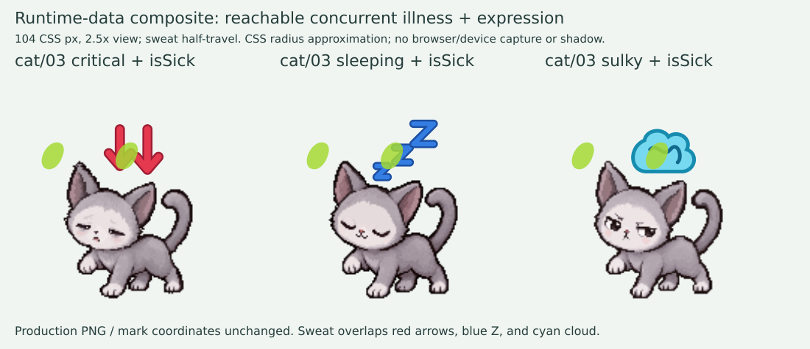

# 最終横断監査 — runtime / mapping / test blind spots

監査日: 2026-09-23。対象 GitHub HEAD `a2eb319893caca94467f474e2bf17a152d67d0fc`、照合済み local tree `d0399d249c82dd74159fdd8ac592e0d1bd405204`。本担当は実装・画像・配置・ゲーム数値を変更していない。naoto、仲間、恋人への表情追加も行っていない。

**判定: 接続・状態到達の完全性は PASS。ただし完成判定は NOT GREEN。病気と別表情が併存する正規状態で、汗と表情マークの重なりを既存チェックが見落としている。空腹マークの個別意図にも確認待ちが残る。**

## 1. 独立母集団と検証結果

表情側の登録リストを正本にせず、ゲーム本体 `script.js:427–435` の `ALL_LINES` と `SPECIES[line].stages` を runtime harness から抽出。ディスクの `assets/characters/*/01.png` と `08.png` を持つディレクトリ群とも照合した。31系統・248段階で一致、ディスクとの差分0。

この31系統はゲームコードの `NORMAL_LINES` だけではない。コード上は通常22＋レア8＋ren1。今回の「通常31系統」は author/social actors 以外の対象全31系統という監査範囲として解釈した。

|独立検証|結果|
|---|---:|
|production master / ディスク対象系統|31 / 31、差分0|
|masterの段階数|248|
|専用10表情のassetFor → 実ファイル → SVG非空|2480 / 2480|
|normal → 原画、normal → マークなし、全段階sweat定義|248 / 248|
|実runtime描画の状態・画像パス照合|2728 / 2728、差分0|
|production SVGを独立raster化した非空・顔相対左右/上下|2480 / 2480、違反0|
|SVG描画内容が104×104 viewBoxを越える組|1050 / 2480（後述、直ちに切れとは判定しない）|
|focused existing tests|918 PASS / 0 FAIL|

2728 = 248×(normal＋専用10状態)。normal/空腹/病気/疲労/不機嫌/弱り/危険/かまって/睡眠は実care値から導出。happy/strainedはproductionのsemantic speech経路から発火。画像パスと `dataset.expression` の双方を照合した。各248段階をゲーム上で自然成長させた試験ではなく、段階に対応する正規年齢をfixtureに投入した描画到達試験である。個別の実世話ボタン・afterglow・寿命/画面中断はfocused testsが補完する。

## 2. 専用10状態の正式ID・意味

正式な意味と色の基準は `docs/qa/emotion-visual-approved-baseline-20260915.md:9–26`。normalは11枚目の専用PNGではなく原画である。

|ID|正式な状態・反応|意味 / 主な到達条件|別レイヤーマーク|
|---|---|---|---|
|happy|喜び|じゃれる、検証済み食事/治癒後の一時喜び|金色キラキラ|
|strained|いやだ・つらい|食べすぎ、不要な薬への一時拒否|銀色ギザギザ、顔左上|
|hungry|空腹|hunger≤50、より上位の状態がない|黄色食物と思考泡|
|sick|病気|isSick、いのち警告/危険より下位|黄緑の横線、汗はCSS別層|
|tired|疲労|energy≤50、上位の状態がない|紫の大小丸|
|sulky|不機嫌|低happiness、またはじゃれすぎ拒否|水色もやもや雲|
|weak|いのち低下・強い健康低下|deathMeter≥60、またはhealth≤25。ただしcriticalでない|ピンク下矢印|
|critical|いのちの危険|dying、deathMeter≥80、health≤0、またはhealth<20かつlowHealthStreak>0|赤い太い下矢印|
|wantsPlay|かまって|happinessがmild(26–50)かつじゃれる利用可|オレンジ放射線、顔真上|
|sleeping|睡眠|isSleepingかつhome表情表示可|青Zzz|

閾値の所在は `care-status.js:29–70`。不死のときlife信号をnoneにする既存仕様も同所にある。表情モジュール自体はゲーム閾値を持たない。

二段階の優先順を混同しない。

1. `emotion-state.js:25–39`: 非playable/睡眠→normal、life critical、life warning、病気、強い健康低下、強い疲労、軽い疲労、強い空腹、軽い空腹、強い不機嫌、軽いごきげん低下＋petAvailable→wantsPlay、同＋利用不可→unhappy、normal。
2. `pet-expression.js:355–364`: blocked→normal、sleeping、critical、明示一時reaction、persistentの順。unhappyをsulkyへ変換。したがって寝ている危険個体の表情はsleeping。criticalはhappyより優先する。睡眠とhomeブロックによるnormal/sleepingは仕様上の分岐で、欠落ではない。

`reactionFor` (`pet-expression.js:344–352`) はplay_with→happy、play_with_annoyed→sulky、overfeed/medicine_wrong→strained、feed/medicine_cure/sleep/wake→normal。食事や治癒のhappyは `script.js:3787–3804` の既存afterglow検証を通った時だけ表示。one-shot recordは `script.js:3727–3768` にあり、新しい人生/系統/段階/期限/不可視/睡眠/criticalで失効する。

## 3. assetFor / normal / load error / 保存と対象隔離

- `pet-expression.js:274–328,367–370`: 全31×8が登録済み。cat06 happy/sleepingだけ採用版 `-v3`、それ以外は通常の状態名パス。未登録asset/未知expressionは元asset。`Object.hasOwn` によりprototype名を表情として拾わない。
- `script.js:11262–11282`: home主役だけで表情を選択。配置計算はnormal原画を基準とする。社会人物の描画・図鑑用rendererに一律でassetForを適用していない。
- `script.js:11231–11245,11315–11343`: expression失敗→原画を再試行→原画も失敗ならemoji。失敗候補はfailedCastAssetsへ記録して再描画時に再選択しない。fallback時も状態マークは残る。原画失敗まで含めたfocused testは `tests/pet-expression-integration-test.cjs:248–265`。ネットワーク切断を用いた実ブラウザ404試験は本担当ではしていない。
- マークは `.pet-expression-accent` の静的SVG (`pet-expression.js:332–342,373–389`)。汗は `care-attention.css:37–46` の2 pseudo-elements。PNGにマークを焼き込む実装はない。PNG内容そのものの目視は別担当。
- expressionの一時状態はclosure変数でsaveオブジェクトに追加されない。focused testsでsave等値、26仲間の位置/描画、partner/companion発話非干渉、reduced-motion等を確認した。
- `tools/cat-expression-preview.cjs:56–91`: real gameの最初のloaderより前にchild windowのlocalStorageをMap-backed adapterへ置換。親のsaveにアクセスせず、URLのform/presetはallowlist。248のformがあり、happy/strainedは実ボタンで表示する設計。通常indexはこのpreviewを読み込まない。隔離テストの内容は `tests/cat-expression-preview-test.cjs:28–122` で確認。今回のfocused918にはpreview testは含まれず、親の全体npm testで別途実行する。Safari等におけるproperty置換・本番saveの実ブラウザ再検証は未実施。

## 4. 完成判定を妨げる汗×別状態マークの盲点

### 実際の到達

汗条件は `script.js:3599–3605` の `state.isSick`。`expression === 'sick'` ではない。`tools/check-expression-placement.cjs:21` はsick以外をcontinueし、汗対マークはsickかつsize104だけで検査する。同時状態を考慮しないため「issues0」でも本不具合が残る。

cat03の実runtimeで次の6状態すべてが `isSick=true / data-care-illness=true` と併存することを確認した。

|状態|到達方法|
|---|---|
|critical|deathMeter80|
|weak|deathMeter60|
|sleeping|isSleeping true|
|happy|実playWithBtn click|
|sulky|affectionStreak3で実playWithBtn click|
|strained|hunger80で実feedBtn click|

hungry/tired/wantsPlayは病気より優先順位が低く、これらを返すsemantic反応もないため、現在の通常runtimeでisSickと併存する検査対象から除外。normalはfeed等の一時反応で併存可能だがSVGマークなし。sick＋汗は従来チェックの対象。この6状態の選び方に未分類の専用状態はない。

### 独立再計測

全248段階×併存可能6状態=1488組を検査。104 logical px、2倍raster、alpha>16。最初に18°回転・全7px移動を含む保守矩形で**448組**を候補抽出。続いてCSS outer border-radius (`65% 35% 60% 40%` をoverlap規則の1.05で正規化) をSVGに再構成し、0/25/50/75/100%の5時点と、さらに全7pxを0.5px刻みでsweepしたmaskで計測した。どちらも**326組、26系統102段階**でマークと汗本体が重なった。

追加依頼により64px/80pxも同じCSS形状再構成で検査した。clamp後の汗寸法とtravelをサイズごとに計算し、0.5px刻みの移動と最後の端数移動位置を合成したswept maskを使用。各サイズで248×6=1488組、合計4464 state-size組を検査した。

|状態|64px|80px|104px|
|---|---:|---:|---:|
|happy|84|87|87|
|strained|44|42|41|
|sulky|45|46|42|
|weak|59|58|56|
|critical|57|54|50|
|sleeping|51|49|50|
|合計|340|336|326|
|対象系統数|26|27|26|
|対象段階数|102|102|102|

全サイズを足した交差数は1002 state-size組。ただしサイズ間重複を除くと**346 stage-state組、27系統105段階**であり、1002枚のPNG不良という意味ではない。PNG自体への変更要求ではなく、動的に同時表示する別レイヤーの衝突である。各サイズの全件はJSONの `sweatSizes`。

104px対象26系統: man, woman, dog, cat, penguin, turtle, frog, salmon, clownfish, butterfly, beetle, stagbeetle, cicada, antlion, hermit_crab, starfish, coral, dandelion, venus_flytrap, mushroom, dragon, phoenix, god, ghost, star, unknown。3サイズの和集合にはrenが加わる。104px全組のstage/stateと重複画素は添付JSONの `sweat.hits`。

**326はブラウザでの確定不具合件数ではない。** CSS形状をSVGへ再構成した近似モデルでの交差件数。shadowを含めず、半透明の色混合・アンチエイリアス・CSS animation位相の差も完全再現ではない。ただし代表のcat03 critical/sleeping/sulkyでは大きな重なりがあり、合成を目視しても赤矢印/青Z/水色雲が汗に覆われる。微少境界だけに依存する問題ではない。



これはproduction PNG/座標の静止合成で、実機撮影ではない。104pxを2.5倍表示、汗は移動中点。表情PNG・ゲーム数値・配置は変更していない。

**要修正対象**: `script.js`の汗とexpression同時表示契約、`pet-expression.js`の同時表示時配置、`tools/check-expression-placement.cjs`の状態組合せ不足。最小案は既存の病気信号・表情優先順・色形を保ち、衝突する組だけに対応するdisplay配置を定義し、6状態＋sickの汗sweepを検査すること。単純に汗を消す変更は既存の病気表示仕様を変えるため、ここでは提案確定/実施しない。今の承認済み配置の変更を伴うので本監査では修正せず停止する。

追加限界: 64/80/104pxの**別状態マーク対汗**まで検査済み。既存checkの64/80px検査はsick PNG対汗であり、今回の問題をカバーしない。production solverは104pxより大きい主役も使い、汗寸法にclampがあるため、今回3サイズの結果を比例拡大で全サイズ合格とは扱えない。修正時は実際のlayoutサイズ・小画面・仲間最大・装備併存で検証する。

## 5. SVG overflow / bounds / 左右 / チェックの独立性

- 全2480についてproduction SVG＋CSSからalpha boundsを独立抽出し、登録face anchor＋実floor shiftに対する中心位置を比較。上/右/左、wantsPlayの中央(<1px)に違反0。既存の固定markCentersを参照していない。ただしこの方向の数値検査は、絵に描かれた顔位置自体の正しさの目視代替ではない。
- 1050組でSVGの内容が104viewBoxを越える。全体のextremeはx=-18〜136、y=-27.5〜89 logical px。`pet-expression.css:11–15` がoverflow:visibleなので、viewBox外=欠けとは断定しない。`ui.css:68–83` の主役周囲も通常は描画を許す。
- 上流の `.screen-frame` には固定home時overflow:clip (`world-scene.css:108`) がある。既存checkは広いオフスクリーンSVGだけをraster化し、実DOMの祖先clip・他人物/装備・画面上端/左右との衝突を測らない。cast-layoutも通常画像bounds/hullを計算対象にしており、表情マークboundsを予約していない。実DOMで切れていないとの全件保証は未成立。
- この環境のPlaywrightはmoduleだけ存在し、Chromium executableが未導入だった。browser launchは失敗。新規browserの導入や公開サイトの変更はせず、ブラウザ由来のboundsスクリーンショットを取得したとは主張しない。
- `tools/check-expression-placement.cjs:9`、`tests/pet-expression-assets-test.cjs:354`、`tests/pet-expression-test.cjs:377`、preview formsは類似する手書き系統一覧を持つ。現在は31全部あることを独立master照合で確認したが、同じ新系統を全リストから漏らすとこれらだけでは検出できない。master集合と登録/ディスク/preview集合の双方向比較を常設する改善余地がある。
- PNGのhash相違・128px・alpha/bounds一致は、顔が正しく10種類に読めることや原画の非顔保持を証明しない。本担当の画像品質合格の根拠として流用していない。

## 6. 空腹マークの個別意図の確認対象

`pet-expression.js:336,379–387` からの実mappingは次のとおり。全段階同じ系統別モチーフ。

|食物マーク|系統数/段階数|対象|
|---|---:|---|
|ごはん茶碗|3 / 24|man, woman, ren|
|フード皿|2 / 16|dog, turtle|
|虫|2 / 16|frog, venus_flytrap|
|小粒|1 / 8|clownfish|
|共通の魚|23 / 184|cat, penguin, salmon, butterfly, beetle, stagbeetle, cicada, antlion, hermit_crab, jellyfish, starfish, coral, dandelion, sakura, mushroom, dragon, phoenix, god, world_tree, ghost, star, plush, unknown|

`docs/qa/emotion-visual-approved-baseline-20260915.md:40` は植物・菌類・無生物系へ魚/葉を機械的割当せず個別意図を決める要求を記録する。少なくとも **dandelion/sakura/mushroom/world_tree/star/plushの6系統48 hungry組**はこの意図確認対象。参照した現specと該当QAには、魚の存在/受理/既存マーク保持の記述はあるが、各系統がなぜ魚を思い浮かべるかという個別意図の決定は確認できなかった。

これは「魚を使ってはならない」とする判定でも、直ちに葉/水などへ差し替える指示でもない。現在の共通魚を意図として採用するのか、設定と照合して判断が必要。god/ghost/unknownの3系統24組も記録確認候補だが、無生物かどうかを本担当が勝手に確定しない。特にunknownの正体不明器官の裁定は維持する。魚23系統184組すべてを一律不良とは数えない。

## 7. 保存した証跡と再現

- `final-cross-audit-20260923-runtime-check.cjs`: read-only再現コード。production母集団/2480接続/2728到達/6併存状態/2480SVG/汗全sweepを実行。
- `final-cross-audit-20260923-runtime-check.json`: exit0の実出力。errors0は接続/到達エラー0を意味し、汗衝突を許容した完成判定ではない。geometry/sweatの結果は別項目として記録。
- `final-cross-audit-20260923-runtime-focused.log`: 実行したfocused testのコマンドと実stdoutの最終集計抜粋。全ログを後から再構成したものではない。
- `final-cross-audit-20260923-runtime-collision.png`: 親担当も目視した代表合成。

再現コマンド（Nodeとsharpが解決できる環境、repo root）:

```sh
node docs/qa/final-cross-audit-20260923-runtime-check.cjs > /tmp/runtime-cross-audit.json
node --test --test-reporter=spec tests/emotion-state-test.cjs tests/pet-expression-test.cjs tests/pet-expression-integration-test.cjs tests/emotion-integration-test.cjs
```

全体npm testは親担当が別途実行。本担当は重複実行していない。画像全数目視、歴史provenance、元画像の基準SHAとの全件同一性はそれぞれの担当報告に委ね、918 PASSから推論していない。
