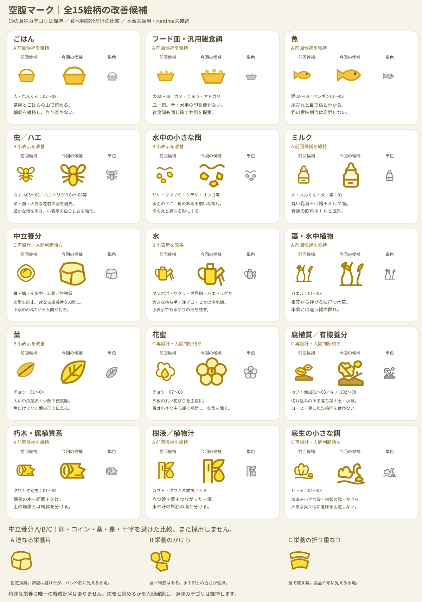

# 空腹マーク候補一覧（日本語版・2026-09-26）

**まだゲームには接続していません。**  
31系統の「何を表すか」はすでに確定済みですが、このページは**アイコンの絵柄を人間が確認するための候補**です。

## 日本語での整理

|表示したい意味|候補の絵|主に使う系統|現状|
|---|---|---|---|
|ごはん|茶碗|人・れんくん|既存を維持|
|フード皿|餌の入った皿|犬・カメ・りゅう等|既存を維持|
|魚|魚|猫・ペンギン|既存を維持|
|虫／ハエ|虫|カエル・ハエトリグサ等|既存虫を共用候補|
|水中の小さな餌|小さな餌粒|サケ・クマノミ・クラゲ等|クマノミ既存粒を共用候補|
|ミルク|ミルクボトル|人・犬・猫の乳幼期|新規候補|
|中立養分|光る栄養粒|種・蛹・変態中・幻想系|新規候補|
|水|じょうろ|植物体|新規候補|
|藻・水中植物|水草|オタマジャクシ期|新規候補|
|葉|葉っぱ|チョウ幼虫|新規候補|
|花蜜|花|チョウ成虫|新規候補|
|腐植質・有機養分|落ち葉＋土／有機物|カブト幼虫・キノコ等|共用候補|
|朽木|木の断面|クワガタ幼虫|新規候補|
|樹液・植物汁|木の幹＋葉＋しずく|カブト・クワガタ・セミ|共用候補|
|底生の小さな餌|海底の小さな殻状餌＋粒|ヒトデ04〜08|新規候補|

## 分かりやすさ優先で直した点

- **英語名を主表示から外し、日本語を大きく表示**。
- 「中立養分」は抽象的な輪ではなく、**光る栄養粒**として見える方向へ変更。
- 「水」は水滴だけにせず、汗と混同しないよう**じょうろ**。
- 「有機養分」は土だけでなく**落ち葉＋有機物**を足し、キノコにもカブト幼虫にも使いやすくした。
- 「樹液・植物汁」は**木の幹＋葉＋しずく**で意味を明確化。
- 「底生の小さな餌」は貝専用に見えすぎないよう、海底線＋殻状餌＋粒で抽象化。
- 内部IDは実装確認用に小さく残すだけで、プレイヤー向け表記ではない。

## まだ決めていないこと

- 腐植質とキノコの有機養分を本当に同じSVGにするか。
- 樹液と植物汁を同じSVGにするか。
- ハエを既存虫SVGのまま共用するか。
- 底生小餌を専用SVGにするか。
- 実際の色・線幅・Home表示サイズでの最終見え方。

これらは一覧を人間確認してから決める。
