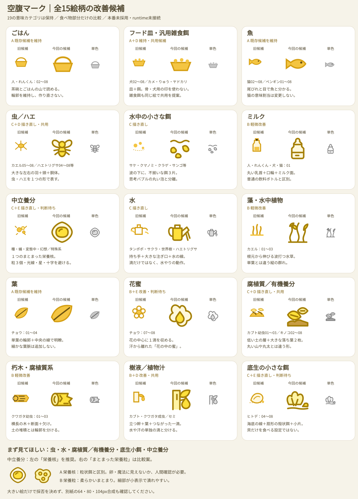
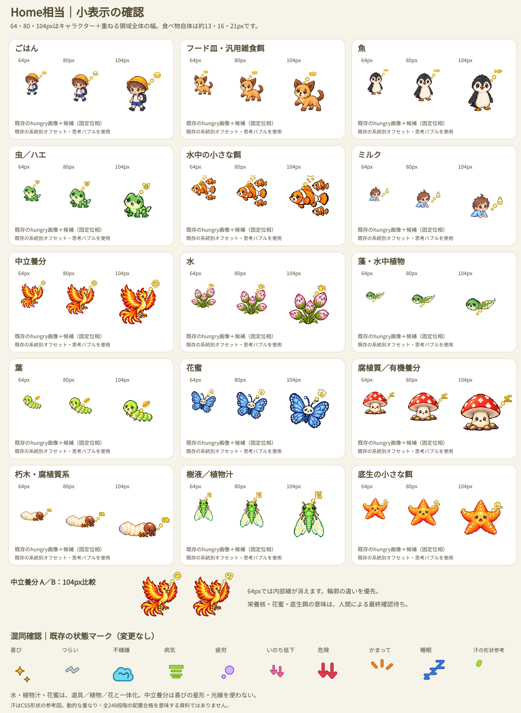
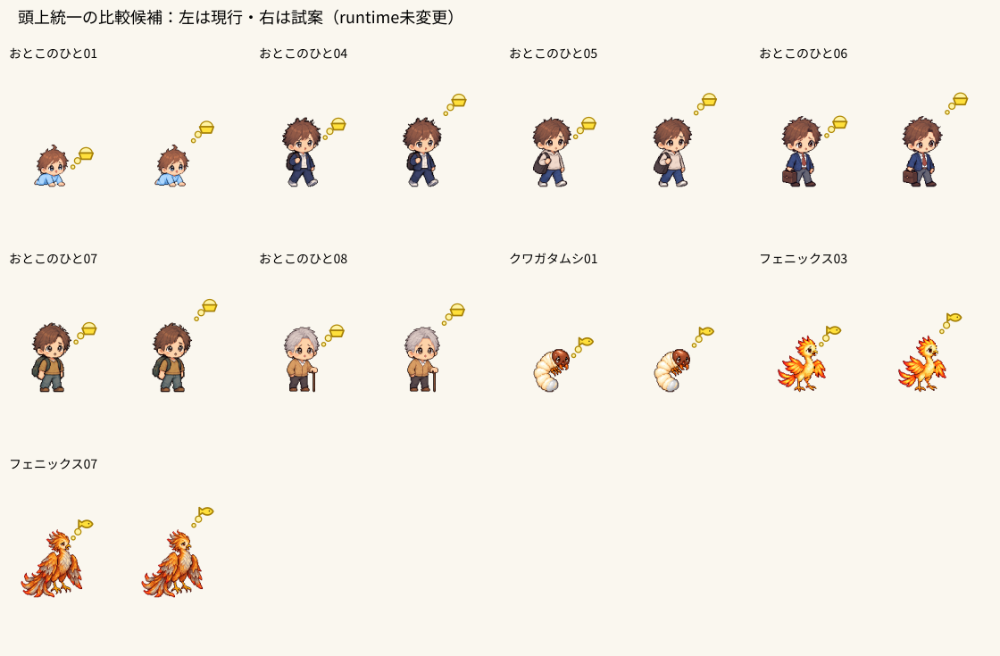

## 2026-09-26 人間決定：15絵柄の設計確定・本番未接続

中立養分は **A「光の核＋途切れた環」**、底生の小さな餌は **A「二枚貝＋巻貝＋小片＋海底線」** を正式採用候補として人間決定。他13絵柄も直近改善候補を維持し、絵柄のA/B/C再設計は終了。以下の旧「人間判断待ち」は比較当時の履歴として残す。runtimeへは未接続。

[9段階の位置A/B比較（64／80／104px）](hunger-position-nine-comparison-20260926.html)。位置は人間確認待ち。9段階は確定バグではない。現在の実装から248段階を再計算し、顔中心より3単位超下の起点0件、旧数値との差0件、元画像alpha bounds 248/248一致。静止合成の範囲で明確な低位置不具合0件を維持するが、全端末・全アニメーション・HUD衝突の保証ではない。

### 位置比較の推奨

|系統・段階|成長名|食事|A 現行offset|B 候補offset|推奨・理由|
|---|---|---|---|---|---|
|おとこのひと 01|あかちゃん|ミルク|[8, 41.5]|[8, 7.6]|B：Aは頬・口元に近く食べさせる表示にも見える。Bは小さな頭の斜め上にまとまり、64pxでも思考の起点を分けやすい。|
|おとこのひと 04|少年|ごはん|[11, 3.5]|[11, -27.4]|A：Aでも顔の斜め上へつながる。Bは約31単位上がり、特に104pxで食べ物と頭の距離が広がる。|
|おとこのひと 05|若者|ごはん|[11.5, 2.5]|[11.5, -28.2]|A：Aは顔からの連続性を保つ。Bは髪から最小丸まで空きが増え、64pxでも浮いた印象が強い。|
|おとこのひと 06|大人|ごはん|[13, 1]|[13, -29]|A：Aは顔横だが自然に思い浮かべている。Bでは身体枠より上へ出る量が増え、距離を広げる利点が小さい。|
|おとこのひと 07|落ちついた大人|ごはん|[12, 2.5]|[12, -27.4]|A：Aで顔や髪を隠さず判読できる。Bは最小丸から頭までの空白が目立ち、統一目的だけで上げない。|
|おとこのひと 08|おじいさん|ごはん|[9, 5.5]|[9, -21.7]|A：Aは頭の斜め上と読める。Bは白髪の頭から離れた独立表示に近づき、現状のつながりが自然。|
|クワガタムシ 01|うまれたての幼虫|朽木・腐植質系|[9, 20]|[9, 6.8]|B：Aも成立するが、Bの上げ幅は13.2単位と小さく、頭の斜め上へ整理できる。64pxで頭を隠さずつながりも残る。|
|フェニックス 03|若い火の鳥|中立養分A|[6, 5.5]|[6, -11.1]|A：Aはくちばし・冠羽の斜め上。Bは空白が増え、承認済み中立養分Aが独立した光として浮きやすい。|
|フェニックス 07|年を重ねた火の鳥|中立養分A|[8.5, -9.5]|[8.5, -25.8]|A：Aは冠羽を避けた斜め上。Bは高く離れ、特に104pxで思考バブルと頭の距離が目立つ。|

今回の推奨はA維持7段階／B頭上寄せ2段階。保存済みB座標は再設計せずそのまま比較した。絵柄は承認候補で統一し、AとBの差は位置だけ。全54合成を静止レンダリングで確認。実ブラウザHome操作・動的衝突試験は未実施。

### 検証と非変更

- 通常元画像のalpha boundsを248枚からfresh算出、cast-boundsと248/248一致。
- 現行accentForのoffset、assetForのhungry参照、本体下端補正は保存済み248行と一致。
- 9段階×A/B×3サイズ＝54合成。元PNGをそのまま埋め込み、透明領域をトリミングしない。
- `node --test tests/hunger-profile-test.cjs` と `git diff --check` を今回fresh実行。実施結果は保存時の最終報告と併記。
- 今回は比較HTML追加とこの決定記録のみ。runtime、offset、resolver、CSS、本番SVG接続、表情PNG、通常基準画像は変更0。
- ヒトデ基準反映／30表情／08小泡、犬03、ウスバカゲロウ15表情、承認済み名称同期、quick-mode初回FAIL、fresh全体テスト、確認Site、セーブ互換、hash確認、最終GREENは継続残件。なおとは未着手。
- 開始HEAD `2ca79006a50cfaa6e2b146c6713f2dc65143235e`、tree `704c072feb4a1826ebf6b6a75f6c9aaf978145e0`。人間確認前に本番接続・位置実装へ進まない。

---

# 空腹マーク候補・追加改善版（2026-09-26）

## 追加の人間確認：中立養分・底生小餌だけの再比較

前回の中立養分A/B/C・底生小餌は未採用です。新しい人間指示により、**中立養分は神秘的な生命エネルギー、底生小餌は具体的な複数の底生餌**をテーマに、各3案だけを追加比較しました。

[最新の2カテゴリA/B/C・54合成・状態マーク比較](hunger-two-category-comparison-20260926.html)

- 中立養分：A＝光の核と開いた環（第一候補）、B＝集まる柔らかな光（第二候補）、C＝生命の芽のような光（炎・魔法属性の連想が強く非推奨）。Aにも惑星、Bにも花の連想が残り、人間判断待ち。
- 底生小餌：A＝二枚貝主体＋巻貝＋小片（第一候補）、B＝巻貝主体＋二枚貝＋小片、C＝同程度の小餌の集合（64pxで潰れやすく非推奨）。全案に海底線。貝専食という設定にはしないが、A/Bが貝中心に見える余地は残る。
- サクラ01・ちょう05・フェニックス05／ヒトデ04・06・08を64／80／104pxで確認。合計54合成。下端補正・現行offset・思考バブルを保持。食べ物本体は約13〜21px相当。
- 他13絵柄、従来一覧SVG／PNG、位置監査9候補・248段階資料は**変更0**。一覧を勝手に新案へ置換せず、新HTML1件に比較をまとめた。
- 本番未採用・runtime未接続。意味割当・resolver・配置・CSS・汗・z-order・表情PNG・通常基準画像は変更0。
- 意味resolverテスト、SVG解析、埋め込み元PNG照合、開始HEADとの差分限定、git diff --checkをfresh検証。全体テスト・実機動作・全アニメーション位相のQAは今回未実施。quick-mode初回FAILも未解消追跡を維持。
- 開始HEAD `938ac35f3a29b7cb326767d20a11ba0328653ce9`、tree `496ea8550374bf92573faf094f6a3eacb5775da9`。今回開始時の実main `6fd3c9e8fc1206aa0c4e85fe3c632cc11b7ff84f` は取り込まない。

以下は前回までの15絵柄レビュー記録です。今回の2カテゴリの判断は上記の新比較を参照してください。他13絵柄と残件の扱いは維持します。

**人間確認待ち。本番未採用・runtime未接続。** 31系統248段階の意味割当を維持したまま、候補15絵柄の見た目と比較資料を改善しました。

特に **中立養分A/B/C・葉・花蜜・腐植質／有機養分・底生小餌** と、位置監査の比較を確認してください。

- [全15絵柄：前回→今回・単色比較SVG](hunger-icon-candidates-20260926.svg)
- [Home64／80／104px：下端補正ありSVG](hunger-icon-candidates-20260926-small.svg)
- [位置監査の結果・対象一覧](hunger-mark-position-review-20260926.md)
- [全248段階・9段階の現行／配置試案](hunger-mark-position-review-20260926.html)

## 全件の最終候補判定

前回比 **維持7・軽微改善4・再設計4**。19意味カテゴリ→15絵柄の提案は維持。中立養分のみ3案を比較するため、資料には計17デザインを収録します。A/B/Cのいずれか1つを選んだ場合に必要なSVGは15種類です。意味カテゴリを統合したり、fallbackを追加したりしていません。

|カテゴリ|判定|前回の問題／維持理由|今回の対応|
|---|---|---|---|
|ごはん|維持|茶碗とごはんの輪郭が明瞭|細部を増やさない|
|フード皿・雑食餌|維持・共用|骨や犬用の印がなく汎用的|犬・カメ・りゅう・ヤドカリで共用候補|
|魚|維持|尾びれと目で識別できる|猫の意味割当も維持|
|虫／ハエ|軽微改善・共用|小表示の体が細かい|頭・羽・胴を大きく、縞を省く|
|水中小餌|軽微改善|泡に見える余地|水面＋角のある不揃いな餌片。水面は環境の記号で食性の限定ではない|
|ミルク|維持|乳首・口輪のシルエットが有効|通常ボトルとの差を保つ|
|中立養分|再設計・人間判断|卵に見えた|卵型を廃止し、連なる栄養片／かけら／層の3案|
|水|軽微改善|小表示で水が出る形が弱い|持ち手と注ぎ口、2本の注水線を強調|
|藻・水中植物|維持|縦に揺れる水草と単葉が区別できる|意味・形を維持|
|葉|軽微改善|葉脈がなく判読しにくい|太い中央葉脈＋少数の左右枝葉脈|
|花蜜|再設計・人間判断|大きな滴が卵に見えた|5枚の花びらを主役にし、蜜は中心で小さく補助|
|腐植質／有機養分|再設計・共用|楕円＋中央線がコーヒー豆に見えた|切れ込みのある落ち葉・低い土層・小枝。豆の楕円を使わない|
|朽木|維持|横長の木・断面・欠けで識別できる|腐植質とは分離|
|樹液／植物汁|維持・共用|幹・葉・つながった滴が有効|単独の汗滴にしない|
|底生小餌|再設計・人間判断|貝だけに見える|海底線＋小さい殻・虫状餌・かけら。貝専食の意味を持たせない|

## 中立養分のA/B/C比較

|案|狙い|弱点と判断点|
|---|---|---|
|A：連なる栄養片（暫定推奨）|独立した丸粒ではなく1つのまとまり。卵・コイン・薬・十字・星形を避ける|パンや石のようにも見える。栄養／エネルギーを自然に感じるか未確定|
|B：栄養のかけら|不均一な小片でやわらかい食事感|水中小餌に近いため、両者の区別ではAに劣る|
|C：栄養の折り重なり|丸粒も核も使わず、満たす層のイメージ|食品や布に見える余地。栄養の意味は説明なしでは弱い|

卵型を外しただけで「誰でも栄養と理解する」とは主張しません。いずれも薬・病気・魔法攻撃・怒り・炎の記号を採用していませんが、最終的な連想は人間確認が必要です。Aの推奨は他の餌との形の違いを優先した暫定評価です。全案再検討も可能です。

## Home相当の縮小確認

15絵柄×3サイズ＝45合成、中立養分A/B/C×3サイズ＝9合成、計54合成。キャラクターと重ねるSVG全体を64／80／104pxとし、食べ物の比較領域は約13／16／21px相当。形状の実占有幅はその内側です。

**前回資料の訂正：画像の下端補正が不足していました。** 今回はHomeの `artOffsetY` を本体画像に適用。位置変更で見栄えを整えたのではなく、実装と同じ座標関係へ資料を修正しました。詳細は位置監査資料に記録しています。

- 64px：葉脈を足した葉、花を主役にした花蜜は、前回より主要モチーフを読める形になった。ただし蜜の中心や葉の細部までの識別を保証しない。
- 80／104px：じょうろ・虫の羽と頭・水面の不揃い餌・腐葉土と木・底生の複数餌の違いが見える。土の小枝などは補助情報。
- 中立養分は卵型を外したが、64pxで「栄養」と直感できるかは未確定。候補の大図だけで採否を決めない。
- 思考バブルの丸と餌片を形で区別。水中小餌と中立養分Bは似やすいため、Bの弱点として明示。
- 花蜜は花の外形、水は道具、植物汁は幹・葉が主になるため、単独の汗滴とは区別する。喜びの星、つらいの折れ線等の既存状態マークを栄養記号へ流用しない。
- 画像・マークのアニメーションは静止位相で比較。全位相やHUDとの衝突合格は宣言しない。

## 19の意味カテゴリと15絵柄の対応案

この表は候補資料だけの対応案です。`hungerCategoryFor`／`accentFor`への接続・意味変更はしていません。中立養分は未設定fallbackではなく、明示的なカテゴリです。

|確定済みの意味カテゴリ（日本語）|内部ID（補助）|提案する絵柄|
|---|---|---|
|ごはん|rice|茶碗|
|フード皿|food_bowl|餌皿|
|汎用雑食餌|omnivore_food|同じ餌皿|
|魚|fish|魚|
|虫|insect|羽つきの虫|
|ハエ|fly|同じ羽つきの虫|
|水中の小さな餌|aquatic_small_prey|水面＋不揃いな餌片|
|ミルク|milk|哺乳瓶|
|中立養分|neutral_nutrition|連なる栄養片A（B/Cも比較）|
|水|water|水を注ぐじょうろ|
|藻・水中植物|algae_aquatic_plant|水草|
|葉|leaf|単葉|
|花蜜|nectar|花＋中心の蜜|
|腐植質|humus|落ち葉＋低い土層|
|有機養分|organic_nutrients|同じ落ち葉＋低い土層|
|朽木・腐植質系|decaying_wood_humus|欠けた木＋断面|
|樹液|tree_sap|幹・葉・汁|
|植物汁|plant_sap|同じ幹・葉・汁|
|底生の小さな餌|benthic_small_prey|海底＋殻状餌＋小片|

### 共用／分離の比較

|論点|推奨|比較した別案／理由|
|---|---|---|
|虫とハエ|意味は別のまま1絵柄共用|ハエ専用の大きな複眼は64pxでは読めず、部品が増える。必要なら承認後に分離判断。現案は大きな羽で両方を表せる|
|汎用雑食餌とフード皿|1絵柄共用|専用の盛り合わせは詳細が潰れる。皿に骨・肉・犬用ロゴはなく、犬・カメ・りゅう・ヤドカリで使いやすい。新しい食性設定は追加しない|
|腐植質と有機養分|**意味は別、SVGだけ共用**|意味カテゴリまで統合しない。2SVGにしても土・葉の差は小表示で弱い。キノコを朽木専食にしない|
|カブトとクワガタ幼虫|**同じ画風の2SVG**|A：完全に別画風は不要。B：木＋腐植の1絵柄は複雑で成長食の差も薄れる。C：落ち葉の低い堆積／横長の木という2輪郭を推奨|
|樹液と植物汁|意味は別、1絵柄共用|幹は「植物由来」の代表モチーフ。汁の採り方を生態学的に同一化する意味ではない。2枚作っても小表示では差が弱い|
|水中小餌と底生小餌|分離|水面の下に浮く不揃いの粒／海底に置かれた餌。成長による違いに意味がある|
|中立養分と水中小餌|分離|前者は連なるまとまり、後者は独立した餌片。両方を丸3個にしない|
|水・植物汁・花蜜|分離|注水の道具／幹と葉／花をそれぞれ主体とし、独立した滴だけにしない|
|水草と葉|分離|縦の群れ／単葉という大きな輪郭差を保つ|

底生餌の貝殻状モチーフは、海底の小さな餌を読ませる代表形であり、ヒトデ＝貝専食を意味しません。水中餌の波も「水面付近でしか食べない」という設定ではありません。

## 位置監査の要点

31系統248段階を、現行のhungry PNG・現行の食べ物・現行のoffsetで確認しました。

- 補正込みの静止合成で、明確に腹・体の下から出る例：0件。
- 前回の補正なし資料で低く見えた数値候補：30段階。ゲーム本体修正対象として扱わない。
- 顔横に近く、頭上統一を比較する候補：9段階（男01・04〜08、クワガタ01、フェニックス03・07）。
- 残り239段階は現位置維持の案。新しい厳格な上端条件で一括調整しない。
- 9段階の候補offsetは資料のみ。汗・HUD・吹き出し・全位相は未検証のため、本番へそのまま採用しない。

## 人間確認で止める点

1. 中立養分A/B/Cの選択、または再検討。
2. 葉・花蜜・腐葉土・底生小餌が意図した意味で読めるか。
3. 虫・水・水中小餌が64pxでも許容できるか。
4. 9段階の頭上統一案を次工程の配置検証へ進めるか。
5. 19意味カテゴリ→15絵柄の共用案を維持してよいか。

## 基準・検証・非変更

開始remote HEAD：`a0db7ca0042d3f29b5c4f34f651b4c2c5b9aac99`
開始tree：`b1c08c5f6fe469b0c35d01b650b4cbbf49b3d43b`
実main：`d4a95949638d9fec9ce762b436577d156dae254a`
PR #278／`feat/cat-expression-pilot-20260915`：Draft・open・未マージ。ローカル開始時clean、remoteとtree一致。

今回の変更は候補資料5ファイル＋位置監査4ファイルのみ。runtime、accentFor、hungerCategoryFor、配置、CSS、汗、z-order、表情PNG、基準画像、ゲーム数値、セーブ処理は変更0。fresh検証：SVG2件解析／描画一致、54合成の埋め込み元PNG一致、248段階・31系統・19カテゴリおよび0／30／9件の数値再計算、候補資料9ファイル限定、git diff --checkはPASS。意味resolverテストは2/2 PASS。全体テストは今回未実行で最終GREENは宣言しません。新HEADのCI件数は保存後に取得して報告します。

## 未完了事項を保持

既存[実装前チェックリスト](growth-hunger-expression-implementation-checklist-20260926.md)は変更していません。以下も消しません。

- ヒトデ新01〜03の**正式採用判断は維持**。実基準画像反映と30表情再制作は別工程。04〜08の50表情は維持。03は一身体・一顔、顔は星型側、青い部分に顔を足さない。
- ヒトデ08小泡、犬03 wantsPlay左前脚、ウスバカゲロウ07の5表情・08の10表情は未修正。
- 既存正本同期、fresh全体テスト、確認Site、最終hash非変更確認、セーブ互換確認は後工程。
- quick-mode初回FAIL（`tests/quick-mode-test.cjs:57`、`solving dodge counts`、期待✔1／20・実際✔0／20）は未解消追跡中。単独成功から解消／既知flakyとしない。
- サクラ・世界樹・？？？・ヒトデの確定名称、クラゲ／サンゴの画像現状維持、キノコの既存分類、31系統の意味割当を維持。
- 本体→汗→状態マーク、8段階×10表情、別レイヤー、resolver優先順位・配置は変更しない。
- なおと・なかま・こいびと・他機能は作業しない。PR278 Draft／open／未マージのまま停止。
