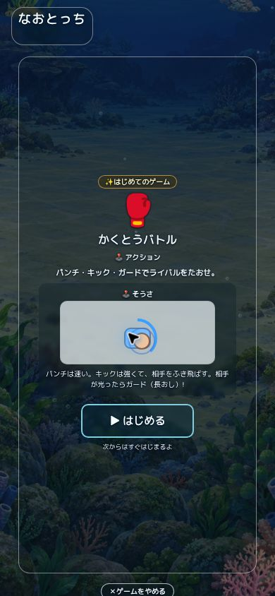
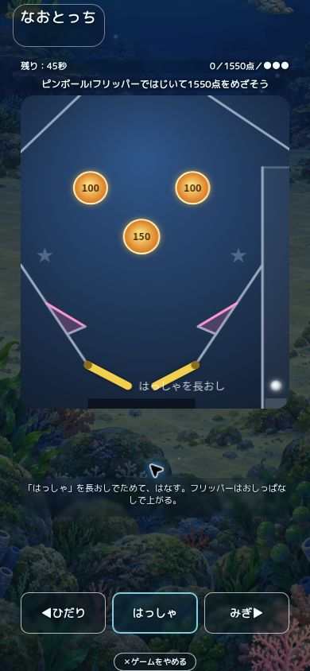
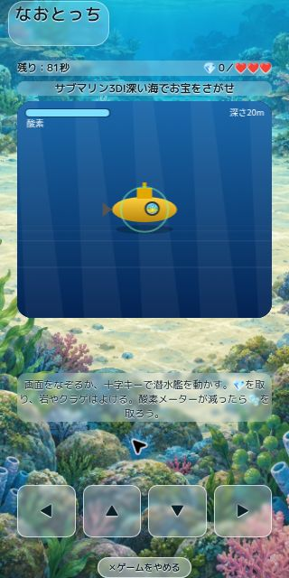
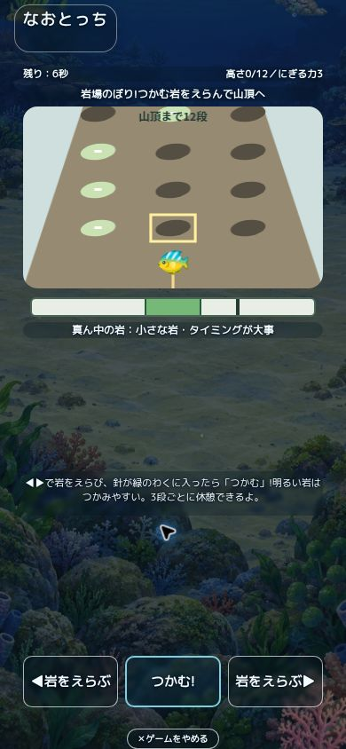
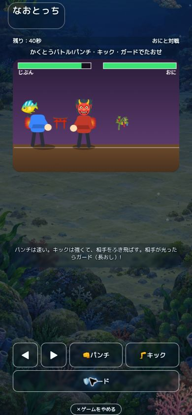
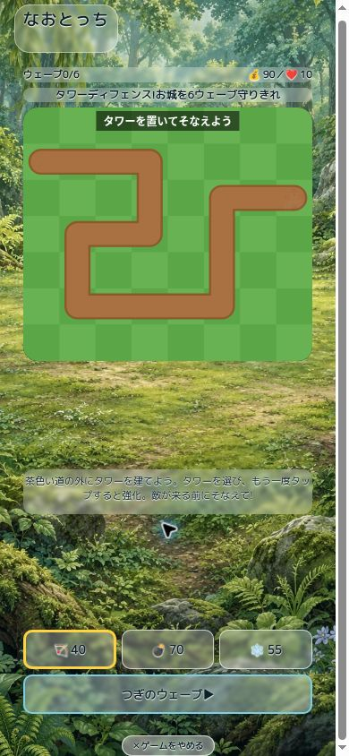
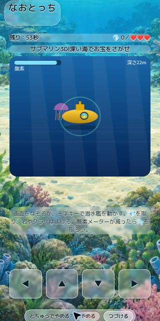

# ミニゲーム中も世界の中で遊べる表示

2026-09-11。PR #239の追加指示「マージできるようにして。ゲーム中も海の中でやっているように背景を映し、ボタンの透明度にも気を配る」に対応。

再開元は `d02dcbd931972af984e5f4883806cec2eb317d60`、最新mainは `d2a350aa4f83fb7aac36c19accb7e8179fc4e393`。保存準備時に両方を再取得し、一致を確認。他open PRは旧#92のみ、#239は競合なし。ユーザーの指示はマージ可能化までで、マージ・公開は行わない。

## 変更

- ゲーム中の画面全体を覆っていた約96%不透明の白い面を透明にし、現在の地域・時間・季節・天気の世界背景を表示。
- 通常の操作ボタン・見出し・得点・説明は28%の面、開始・発射などは38%。中断確認は昼42%・夜40%、終了する操作は52%。文字とアイコンは不透明のまま、輪郭と細い文字の縁取りで読みやすさを補う。
- 夜・深海・星空は暗いガラスと明るい文字。昼は明るいガラスと濃い文字。初回案内にも同じ配色を適用。指の操作例のCanvasだけは読み取りのため70%の明るい下地を残す。
- 選択中の黄色い枠、押下・長押しの反応、使えないボタンの点線、正誤フィードバックの色を維持。ボタンの寸法やCanvasの入力座標を変えない。
- ゲーム固有の盤面・コマ・Canvasの描画と、開始・終了・保存処理は変更しない。ゲーム中の世界アニメーション停止も維持し、背景は静かに見える。

実行時変更は `world-scene.css` と `index.html` の読込トークンのみ。

## 検証

- 着手前・変更後の `npm test` はともに272成功、失敗0。smoke・会話・QAルート検査、13地域×4時間×4季節×4天気の832組のモデル検証を含む。[最終ログ](immersive-minigame-tests-2026-09-11.txt)。
- Chromeの実画面でピンボール・岩場のぼり・格闘バトル・サブマリン3D・タワーディフェンスの5種を確認。海の昼夜、森の昼、390×844と320×640を使用。7枚の画像を保存。
- 初回案内、開始、操作ボタン、中断確認、続行、ホームへの復帰を確認。復帰後は世界アニメーション停止が解除されることを確認。
- 通常ボタン28%、主要操作38%、画面全体の背景は透明、文字のopacityは1を実測。タワー選択は黄色の3px枠を維持。岩場の端まで選択すると方向ボタンがdisabledとなり、28%の面・不透明文字・点線を維持することを実測。
- [DOM計測](immersive-minigame-browser-2026-09-11.json)と[最終CSS・HTML・画像のSHA256](immersive-minigame-hashes-2026-09-11.json)を保存。計測は採取時の状態で、スクリーンショットと同一フレームの保証はない。
- `npm run bump`、`git diff --check` 成功。最終HEADと、そのHEADに対するGitHub CIの実状態はPR本文で確認する。

## 独立レビュー

読取専用レビューで2件を発見し修正した。

1. 岩場の選択説明 `.mg-climb-choice` に濃い文字が残り、夜の背景に埋もれる。実画面で透明背景・`rgb(48,77,58)`を再現。28%の暗い面・`rgb(243,251,255)`・暗い文字の縁取りへ変更し実測確認。
2. 格闘のガードボタンは旧IDセレクターが優先され、不透明な色が残る。通常と長押しの配色を限定して上書き。通常時は実画面で28%・明るい文字を確認。

再レビューは指摘2件とも解消、新たな指摘なし。物理iPhoneのSafari、VoiceOver、実測FPS、全100ゲームの実画面、長押し中の全中間フレーム、全背景画素のコントラスト比は未検証。確認用ブラウザーの拡張機能に由来するログと、一部の操作待ち時間超過を経験したため、ブラウザーログ全体がエラー0とは報告しない。

## 画面

| 夜の案内 | 夜のプレイ | 小さい画面・昼 |
| --- | --- | --- |
|  |  |  |

| 岩場の説明 | ガードボタン | 森の選択ボタン |
| --- | --- | --- |
|  |  |  |

