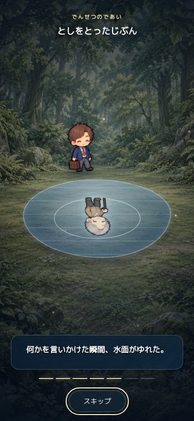
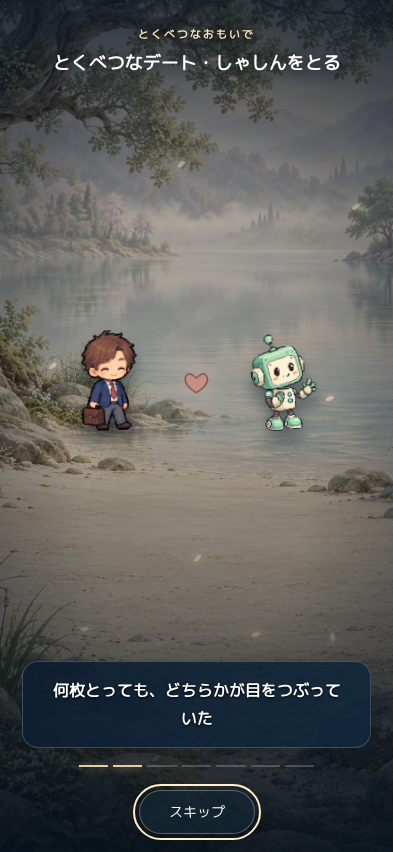
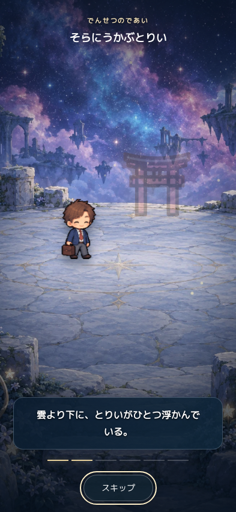
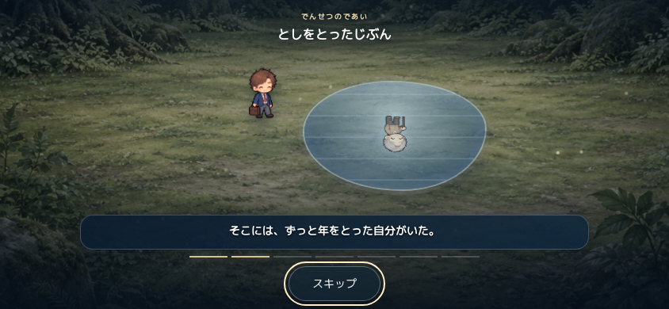
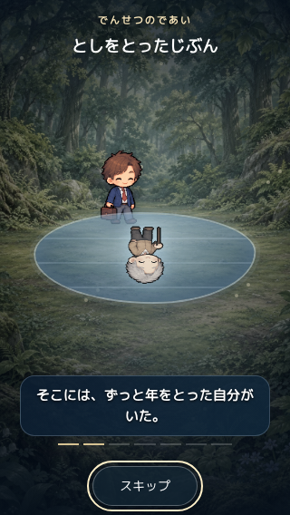

# 全画面ムービーと水面の出会い

基準main: `300d2aeeb93e61b6b2ff586e7a4ee83ab897c89b`。ブランチ: `feature/immersive-movies-20260914`。

## 変更

- 通常／特別デート、結婚記念日、5種類の伝説を共通の全画面ムービーへ接続。
- 既存の世界の背景画を使用。背景の接近、光、雨／星／泡などの動きと、字幕ごとのキャラの動作を追加。
- 字幕と操作部を固定し、スキップ／終了は44px以上。ホームの親要素の幅やスクロール位置に制限されないよう、ムービー中だけbody直下へ移動する。
- 「としをとったじぶん」の鏡を撤去。同じ種族の⑧を森の水たまりに反射させ、波紋、消失、別物語では現在の姿への復帰を字幕に同期する。
- 階段の伝説には3段の階段を描く。出現ID、抽選、報酬、恋愛関係、実個体の年齢・姿は変更しない。
- 全画面中の背景操作を止め、閉じる／別画面への切り替えで解除。動きを減らす設定ではアニメーションを停止して物語だけ進める。
- タイトル・字幕の絵文字を除去し、選択中の文字フォントを引き継ぐ。

## 確認

`npm test` の起動・会話・QAセーブ検査と417テストが成功。ムービー用5テストは変更前の失敗を確認したうえで、老年期の絵／両物語の波紋と復帰／スキップ後のタイマー取消／別画面への切り替え／字幕の文字を検証した。

Chromiumの実DOMで14パターンを確認した。393×852、320×568、844×390、1280×800。5種類の伝説、通常デート（星・雨）、特別デート、金婚式、深海、動きを減らす設定を含む。

- 映像がビューポートの端から端まで覆う。
- タイトル・字幕・キャラが画面内に収まり、キャラと文字、字幕とボタンの重なりがない。
- 背景のtransformが時間とともに変わる。動きを減らす設定では実行中の映像アニメーションが0。
- 字幕が表示され、登場キャラの画像が読み込める。
- 全ムービーが終了し、ホームの入力状態を復元する。ブラウザの未処理例外は0。

結果: [browser-results.json](browser-results.json)。JSの順序付き時計で字幕を進め、CSSアニメーションは実時間で表示して確認。物理iPhone・Safariでの実機動作やFPS測定は未実施。

独立した読み取り専用レビューで、終了・再生し直し・画面切り替え・inert復元・キーボード操作・保存データ・報酬を点検。重大／重要な未解決指摘なし。

再実行:

```sh
npm test
python3 -m http.server 8773 --bind 127.0.0.1
# 別ターミナルから。playwrightとChromiumが必要。
NODE_PATH="$CODEX_PRIMARY_RUNTIME_NODE_MODULES" CHROMIUM_PATH=/tmp/chromium node tests/movie-browser.cjs
```

通常のローカル環境ではインストール先に合わせて `NODE_PATH` と `CHROMIUM_PATH` を指定する。サーバーURLは `MOVIE_TEST_URL`、確認画像の出力先は `MOVIE_TEST_OUTPUT` で変更できる。

## 画面例

水面の波紋:



特別デート:



空のとりい:



横向き:



動きを減らす設定:


