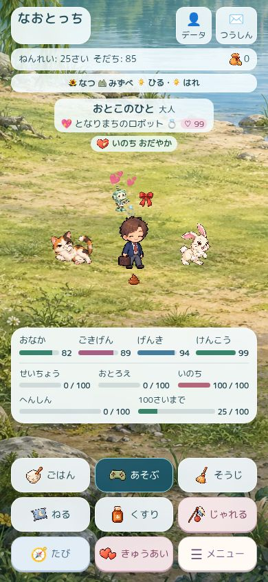
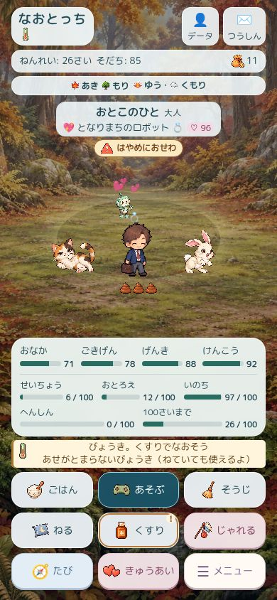
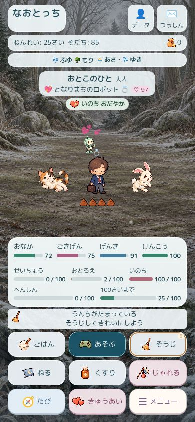

# 世界一体型ホームの実装・検証 — 2026-09-11

**最新状態:** この記録と下の6枚の画像は、ユーザーの「上下・名前・バッジももっと透ける半透明に」という追加指示の前の検証。現在は半透明調整の途中。[最新の引き継ぎと未完了箇所](immersive-world-handoff-2026-09-11.md) を先に読む。完成扱いしない。

## 基準と分担

実装基準は main `d2a350aa4f83fb7aac36c19accb7e8179fc4e393`（#238）。着手時とPR準備時に実際のmainとopen PRを確認。どちらもmainは同じSHA、open PRは旧#92のみだった。#234–#238の本文、既存チェックポイント、地域・配置・表示の検証記録を確認した。Claude側の#237の保存v5・シール・メニュー排他・性能改善、#238のiOS入力修正を取り込んだmain上で作業した。旧#92は統合していない。

監査・設計: [設計記録](../superpowers/specs/2026-09-11-immersive-world.md)、[作業計画](../superpowers/plans/2026-09-11-immersive-world.md)。このPRは未マージ・未公開。統合・CIの最新状態はPRを参照する。

## 完成形と構造

海で先に枠なしの試作を作り、390×844と320×640でキャラ・仲間・恋人・装備・吹き出し・全操作を確認してから地域登録表を展開した。

- 背景 → 奥の環境 → 光/空気 → 前景 → 既存キャラ → 会話 → HUD/操作。世界の絵と環境素材は操作・読み上げ対象外。
- 本体と液晶の枠・大きな塗り・疑似装飾を廃止。既存IDはゲームの接続点として残す。
- `world-scene.js` は表示専用。地域・気候・植生・季節画像を登録表で宣言し、共通の描画と動きを使う。ゲーム状態・保存・天候選択を書き換えない。
- 環境DOMは地域/時間/季節/天気/軽量段階/reduced-motionが変わるまで再生成しない。普通の状態更新で泡や植物を作り直さない。
- 非表示・メニュー・ミニゲーム・デート・物語で環境を停止。ミニゲーム開始と物語の開始/終了にも即時反映。設定画面で時間/天候を変えた時点で世界が更新される。
- 動作はCSSで、背景用の常時JavaScriptタイマーを追加しない。粒子は通常16/軽量9/さらに軽量5、reduced-motionでは0。最軽量時には光線・ぼかしも抑える。
- キャラの位置と会話反応は既存solver/モーションを使い続ける。海/深海は6秒の漂い、地上は植物と同じ8秒の風、星空は静止。揺れは既存の左右6px・上方1pxの許容範囲内。16pxの共有ジャンプ余白と20pxのうんち領域を維持。

## 地域と環境

| 地域 | 空間 | 季節・天候の見せ方 |
| --- | --- | --- |
| おうち | 庭、家、遠い集落、木の前景 | 春の花、秋の暖色、冬の裸枝と霜の専用絵 |
| とかい | 石畳、町家、運河 | 春の桜、夏の葉、秋の暖色、冬の専用絵 |
| いなか | 畑、草地、遠山 | 花/草、秋色、冬の枯れ草と薄い残雪 |
| もり | 林冠、奥の木々、地面、シダ | 紅葉/落葉後の専用絵、木漏れ日、葉や花、雨/雪 |
| やま | 岩場、道、遠い峰 | 高山の空気、冬の枯れ草と残雪、地域の降水 |
| ゆきぐに | 雪原、針葉樹、雪山 | 常設の雪地形と時間/降水の変化 |
| うみ | 水面、岩礁、砂地、海藻、サンゴ、小魚、クラゲ | 雨/雪は水面の光量低下、季節は水色。雨粒/雪を水中に出さない |
| しんかい | 深い岩、堆積地、発光する生物 | 地上の天候・時刻から照明を独立。水面光や雪なし |
| みずべ | 遠岸、水面、手前の岸、柳、草 | キャラは岸側。水面に波紋、雨、冬の裸枝と開いた水面 |
| ジャングル | 大きな葉、木、脇の滝、地面 | 常緑・湿気・雨。雪指定は冷えた空気として解釈し積雪なし |
| さばく | 砂地、砂丘、岩 | 暖色の光、砂の粒子。雪指定でも積雪なし |
| ほしぞらのていりゅうじょ | 空中の石の広場、星空 | 恒常的な夜。地上の雨/雪なし |
| きおくのみずうみ | 淡い水面、霧、岸と木 | 水面の揺れ、春秋、冬の裸枝と開いた水面 |

32枚のWebP（景色22、環境小物10、合計約9.93MB）。一度に全地域を読み込まず、今いる場所の絵/小物だけを参照する。生成プロンプト・参照関係・出力ハッシュは [素材記録](../../assets/world/provenance.json)。既存のキャラ画像とゲーム画像は変更していない。

## UIと旧保存の扱い

半透明のHUDと操作、明るい文字面、意味を持つ色を組み合わせた。ラベル・数値・ゲージ・危険マーク・文章・推奨ボタンを併用し、色だけに頼らない。恋人のなかよし度も表示する。

既存の `screenThemeId/screenPatternId` はメーター、`deviceThemeId/devicePatternId` はボタンへ弱く反映。単色・グラデーション・柄の位置を保持し、世界の景色を上書きしない。表示名は「メーター」「ボタン」へ変更。解禁条件や保存IDを削除・移行していない。天気/時間に勝手に置き換えていない。

命の表示は通常/注意/警告/危険。既存 `care-status.js` の判定を優先し、命ゲージが十分でも健康0等の危険を拾う。危険は穏やかな光の輪と「いそいでおせわ」、具体的な案内と推奨操作で示す。卵・死亡後・無敵には死亡警告を出さない。

## 検証の方法と結果

- 基準main: `npm test` 262件成功。
- 新しいモデル/統合テスト: 地域13×時間4×季節4×天気4 = 832組の整合、現在の環境/保存選択/ゲーム効果の保持、通常更新時のDOM維持、メニュー/可視性/reduced-motion/軽量段階、健康危険・回復・明示操作の変化、恋人の数値、ゲーム/物語停止、設定中の即時更新。
- 既存のsmoke、会話、QA生成、ゲーム・成長・経済・オフライン・旧保存・メニュー・シール・iOS入力・キャラ配置/反応を含む全テストを最終実行。最終ローカル実行は272件成功。CIはPR本文に記録。
- 実ブラウザーで全13地域のホームを読み込み、390×844の配置を計測。キャラ同士/会話の重なり、枠外、横はみ出しなし。海は昼/夜/朝雨/雪指定、森は紅葉夕方と冬の朝雪、水辺は春雨、ジャングルは冬の雪指定も確認。
- 320×640、恋人と26人の仲間と装備がある海: 9操作とも画面内（最下段下端636.84px）、約48.5px高。文書は651px（下の余白に11pxスクロール）。文字拡大では切り詰めず759pxの縦スクロール、横はみ出し/キャラ重なりなし。
- 旧せいざ/レインボー + チェック/れんが: 実際に選択されたclass、グラデーション、柄の位置を確認。せいざでも健康 `rgb(55,131,107)`、元気 `rgb(70,125,157)` の読める意味色を維持。
- じゃれる/きゅうあい: 実ボタンを押し、会話・変化表示・なかよし度の更新を確認。じゃれるの4秒観察9サンプルは配置失敗0。
- デート「ゆうやけをみる」は32秒・37サンプルで失敗0、4つの会話と完了を確認。デート中は海藻も停止し、閉じるとホームと環境動作へ復帰。ライツアウトの開始/操作説明/中断/復帰も確認。
- 水辺の雨は実際の計算スタイルで1×14px。海中と熱帯の雪指定では雨/雪の粒子なし。
- QAの矩形判定はPNGの透明余白の重なりまで失敗にしていたため、実際の画像のalpha hullと描画位置による保守的な判定を追加。旧矩形結果も `actorFrameOverlap` として保存し、透明余白の結果を隠していない。
- 独立コードレビューの指摘（ゲーム開始時の停止、物語停止、設定中の環境更新、旧せいざの色、グラデーション/柄位置、雨の寸法）を再現して修正。追加の冬の葉/都会の秋色も修正した。

これはクラウドブラウザーでの画面/操作検証であり、物理iPhoneのSafari、VoiceOver、低電力端末の実測FPS、100種類すべてのゲームの今回の実画面検証ではない。832組はモデル検証であり、832枚のスクリーンショット検証ではない。これらを確認済みと扱わない。

- 画像欠損: 背景と環境小物を読込失敗にした状態で、操作9つ/数値/横幅を保持。小物の壊れた画像アイコンは隠し、操作は継続できた。卵と768×1000の満員配置も確認。
- 実測の要点は [23シーンのブラウザー記録](immersive-world-browser-2026-09-11.json)。すべて配置判定成功。使用する全ての景色・小物の実ファイルと生成記録のSHA256も照合。

## 実画面

| 海の昼 | 海の夜 | 海の危険 |
| --- | --- | --- |
|  |  |  |

| 水辺 | 森の紅葉 | 森の冬 |
| --- | --- | --- |
|  |  |  |
