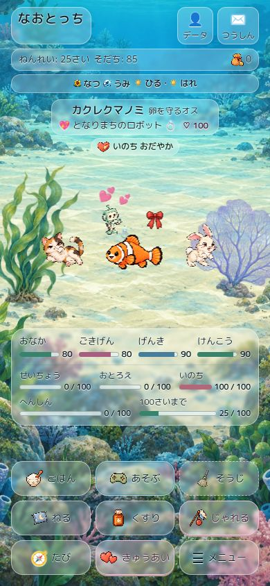
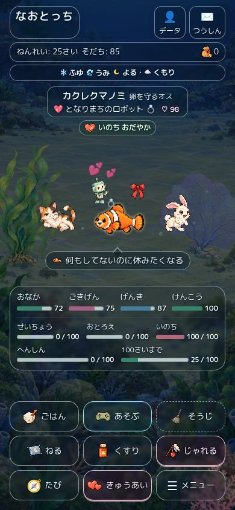
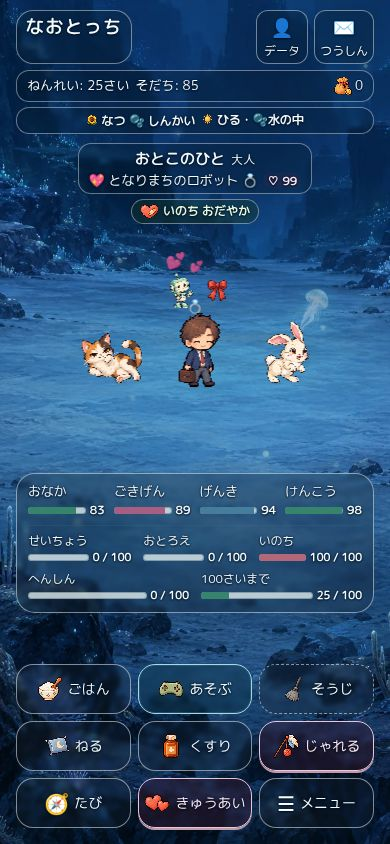
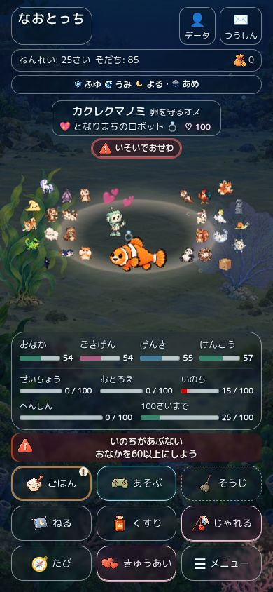
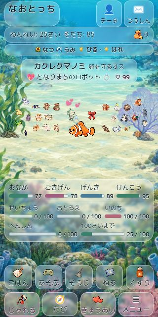
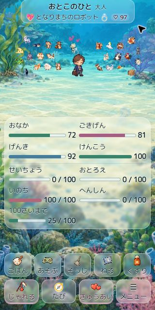

# 世界一体型ホーム：透明度をさらに上げる

2026-09-11。ユーザーの「もっと半透明に。見えづらくならない限界まで」に対応。
再開元は `46ce3f092f7d587ad06a4a84e8347a523d45f75b`。最新mainは `d2a350aa4f83fb7aac36c19accb7e8179fc4e393`、他のopen PRは旧#92のみ。PR #239はDraft・未マージ・未公開を維持する。

## 選定と変更

夜で32%の明るい面を試すと、小さい濃色文字が読みづらくなった。夜・深海・星空は暗い面と明るい文字へ切り替える。昼・森で24%と16%を比較し、16%では枝・岩・草と細かい文字の区別が弱くなるため、通常24%、名前・メーター28%を採用した。これは実画面比較による選定で、すべての背景画素のコントラスト比を認証したものではない。

| 表示面 | 前回の不透明度 | 今回 |
| --- | --- | --- |
| 上部情報・通常ボタン | 60%（テーマ合成61.6%） | 24%（テーマ合成25.52%） |
| 名前・メーター | 60–61.6% | 28%（メーター合成29.44%） |
| 吹き出し | 68% | 昼42%・夜40% |
| 通常の命表示 | 64% | 38% |
| 注意／警告／危険 | 66／70／74% | 42／46／52% |
| 背景ぼかし | 3px | 2px |

文字・数値・アイコン・ゲージ本体のopacityは維持。文字だけに細い明暗の縁取りを加え、背景全体を白くする面積を減らした。旧テーマ色は2%だけ合成し、柄と画像も控えめに残す。文字サイズ・余白・ボタンの大きさ・ゲーム処理・保存・気候モデル・素材は変更していない。実装は `world-scene.css` とその読込トークンのみ。

## 検証

[実測とハッシュ](immersive-world-clear-browser-2026-09-11.json)に16シーンを保存。すべて `layoutChecksPass: true`、採取した通知の内部はみ出しなし。最終計測はすべて同じ最終CSSトークン。スクリーンショット19枚は今回の配色・透明度で撮影した。最初の夜の撮影後の差分は、ホームに影響しないゲーム画面の文字色修正のみ。

- 海昼夜・危険、森紅葉／冬、みずべ、深海、星空、砂漠。
- 旧せいざ／レインボーと5バッジ、病気・睡眠を含むバッジ満員。
- 320×640・仲間26人＋恋人＋装備：全9操作の下端638.23px、文書高652px。
- 320×640・文字拡大：文書高760px。危険時790px。実際に下へスクロールし、どちらも最下段625.94pxで全9操作へ到達。
- お別れ：案内とメーターが重ならず、下へスクロールして新しい卵の操作にも到達（下端833.53px／844px）。
- 夜からミニゲームの案内・開始・中断確認・ホーム復帰を実操作。ゲーム案内・見出し・操作説明・タイマーは濃い文字、復帰後は夜用の明るい文字に戻る。

最終 `npm test` は **272成功・失敗0・skip0・cancel0**。先頭のsmoke・会話・QAルート検査、832組のモデル検証を含む。[実行ログ](immersive-world-clear-tests-2026-09-11.txt)。`npm run bump` と `git diff --check` も成功。

## 独立レビュー

読取専用レビュアーが、夜用の明るい文字色が白いミニゲーム／初回案内に継承される問題を指摘。実画面で `rgb(243,251,255)` を再現した。既存の白いゲーム／代替画面ルール2か所で文字色を `#0b2028` に戻し、実画面の案内・見出し・操作説明・タイマーが `rgb(11,32,40)` になることを確認した。ホームの配色には影響しない。

再レビューは **承認、未解決Critical／Important／Minorなし**。レビュアーの対象12テストと差分検査も成功。ブラウザー検証と最終272テストは親が実施した。

## 画面

| 海・昼 | 海・夜 | 深海 |
| --- | --- | --- |
|  |  |  |

| 危険 | 320×640・満員 | 拡大・下部 |
| --- | --- | --- |
|  |  |  |

以前の60%の面と14枚の画像は[前回QA](immersive-world-glass-2026-09-11.md)に履歴として保持。今回の画像は別のパスに保存し、旧記録のハッシュと対応を壊していない。

物理iPhoneのSafari・VoiceOver・実測FPS・ブラウザー200%拡大・全100ゲームの実画面検証は未実施。最終HEAD・tree・そのHEADのCIは [PR #239](https://github.com/Naoto214/naotocchi/pull/239) 本文を参照。ユーザーの確認なくマージ・公開しない。
