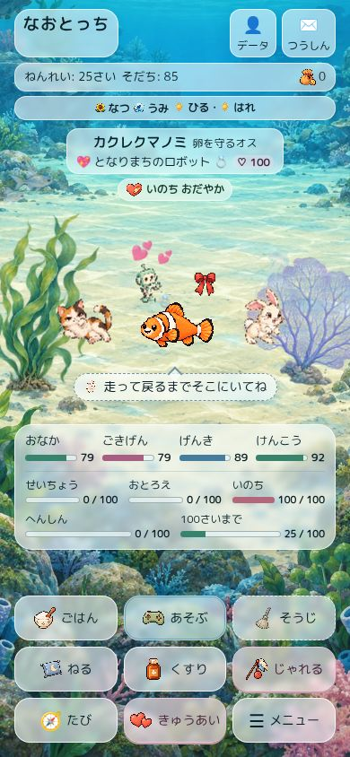
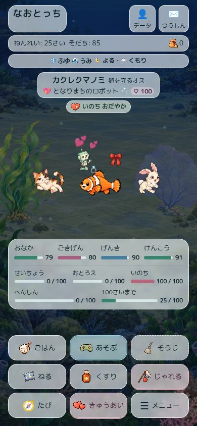
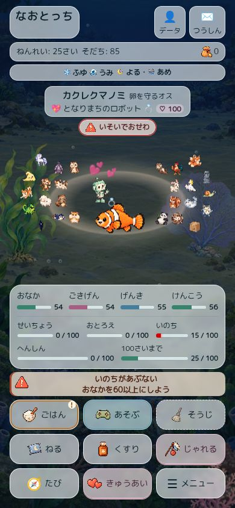
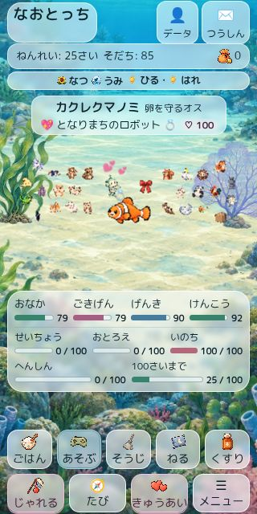
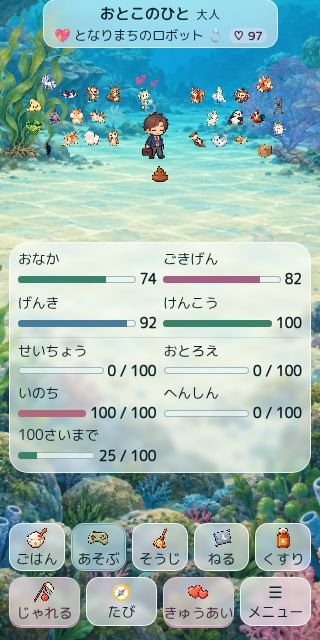
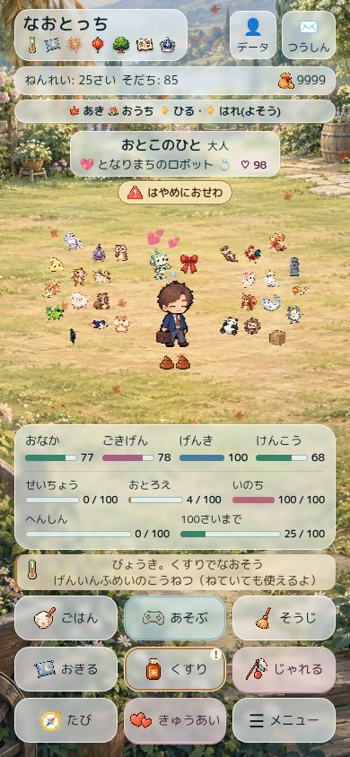

# 世界一体型ホーム：半透明UIの仕上げ

2026-09-11。PR #239の保存HEAD `a581d220dbddc8895cd47b13ea1b614fb386d0c7` から再開。
着手時・PR更新準備時のmainは `d2a350aa4f83fb7aac36c19accb7e8179fc4e393`、他のopen PRは旧#92のみ。#234–#238の本文、引き継ぎ、設計、計画、チェックポイント、既存QAを確認した。保存HEADのRuntime #337は成功していた。

## 修正

- `#travelBtn` / `#menuBtn` の旧ID指定が共通ボタン指定より優先されていた。世界モード内で背景・文字色・枠・影を明示し、通常ボタンと同じ半透明へ統一。
- 通知のルールを change → warning/loss/mixed → critical の順にそろえ、criticalを上書きしていたtone指定と、強すぎるchangeの`:not()`を整理。実画面の危険通知はalpha .74、濃い文字色を維持。
- 通知の2行は18.2px×2＋上下余白4pxを必要とする。従来39pxではscrollHeight 40pxになったため、`calc(2.8em + 4px)`へ修正。文字拡大は14px、実測43.19pxで2行が収まる。
- 高さ700px以下では名前欄の上下余白を1pxずつ減らし、追加borderの高さを吸収。320×640の通常満員配置で最下段下端640.23pxを638.23pxへ収めた。
- 独立レビューで見つかった、ホーム下部の「♾️のせかい」「あたらしいたまご」とお別れボタンも半透明へ統一。背景面だけを透かし、文字のopacityは1。
- お別れ案内がメーターに重なることを実画面で確認。世界モードでは通常の縦配置へ戻した。案内・メーター・通知・操作の矩形交差を既存QAへ追加し、重なりなしを確認。

ゲーム処理・保存形式・地域モデル・素材32枚・キャラクター・反応処理は変更していない。実行時変更はCSSとその読込トークン。QAには文字拡大の危険状態・お別れの合成セーブと、読込CSSの版の記録を追加した。

## 画面と計測

[13シーンの記録と各面の計算スタイル](immersive-world-glass-browser-2026-09-11.json)。すべて配置判定成功、採取した通知の内部はみ出し0。幅の指定はiframeの外寸で、Chromeの通常スクロールバーがある場合は内容幅が15px狭くなる。物理iPhoneの幅計測ではない。

| 条件 | 結果 |
| --- | --- |
| 海の昼／夜、みずべの春雨、森の紅葉／冬 | 390×844、横はみ出し・キャラ重なりなし。文字・数値・ゲージを判読し、背景の透けを確認 |
| 海の危険、仲間26人＋恋人 | 警告色・案内2行・推奨お世話を表示。雨粒を海中に出さない |
| 旧せいざ／レインボー＋チェック／れんが＋5バッジ | 各テーマを保持。文字・健康・元気などの意味色を確認。追加のクリア後ボタンも半透明 |
| 病気・睡眠・5バッジ＋仲間26人 | バッジの絵を薄くせず、上部の面から景色が透ける。病気通知の2行も収まる |
| 320×640、仲間26人＋恋人＋リボン | 操作高48.5px、全9操作の下端638.23px。文書高652pxで、下余白に12pxのスクロール |
| 320×640、文字拡大・仲間26人＋恋人 | 文書高760px。横はみ出しなし。下にスクロールすると操作下端625.94pxで全操作に届く |
| 320×640、文字拡大＋危険 | 文書高790px。通知高43.19px、内部スクロールなし。下にスクロールして全操作へ到達 |
| お別れ | 案内とメーター・通知・操作の重なりなし。390×844で文書高902px、追加操作まで縦スクロール可能 |

通常面alpha .60、テーマ合成面 .616、意味色 .64–.74、ぼかし3px。文字・数値・ゲージ・表示面の要素opacityは1。バッジ自体は透明背景で、親の半透明面を使う。旧テーマでも健康 `rgb(55,131,107)`、元気 `rgb(70,125,157)` を保持。高コントラスト設定の認証や全背景ピクセルのコントラスト比検査を行ったという意味ではない。

新しい6枚を元のQA画像パスへ差し替え、満員・文字拡大の上下・危険時の文字拡大・バッジ・旧テーマ・お別れを加えた14枚を保存した。各ハッシュはJSONに記録。スクリーンショットはこの仕上げ中に撮影し、後続の修正が影響した小画面・お別れは再撮影した。通常6画面の後続差分は、それらに出ていないクリア後／お別れ面と短画面用の調整のみ。

| 昼 | 夜 | 危険 |
| --- | --- | --- |
|  |  |  |

| 320×640満員 | 文字拡大・下へスクロール | バッジあり |
| --- | --- | --- |
|  |  |  |

## 検証・レビュー

- 最終実行 `npm test`: **272件成功、失敗0、skip0、cancel0**。先頭のsmoke・会話・QAルート検査も成功。[実行ログ](immersive-world-glass-tests-2026-09-11.txt)。832組の地域モデル検証を含む。
- `npm run bump` と `git diff --check` 成功。最終コードのSHA256を計測JSONに保存。
- メニューと旅画面の開閉・ホーム復帰を確認。じゃれる／きゅうあいも押したが、遅延した会話取得だけでは今回の反応を切り分けられず、新しい動作検証の成功件数には加えていない。前回23シーンの反応・デート・ゲーム復帰の記録と今回の自動テストは維持。
- 独立レビューは残った不透明なクリア後／お別れ面を指摘。実画面で再現し修正、追加のお別れ配置変更も再レビューを受け、**未解決指摘0・承認**。[レビュー記録](immersive-world-glass-review-2026-09-11.md)。
- 最終HEAD・tree・そのHEADのCIは [PR #239](https://github.com/Naoto214/naotocchi/pull/239) の本文を正とする。この文書に古いCI成功を新HEADの成功として転記しない。

物理iPhoneのSafari・VoiceOver・実測FPS、ブラウザー200%文字拡大、今回の全100ゲームの実画面検証は未実施。832組はモデル検証であり、832画面の撮影ではない。クラウドブラウザーのスクリーンショット取得が一部タイムアウトした際は、状態を確認して撮影のみ再試行した。成果物に失敗した画像は含めていない。

PRはユーザーの確認用にDraftを維持。未マージ・未公開。
