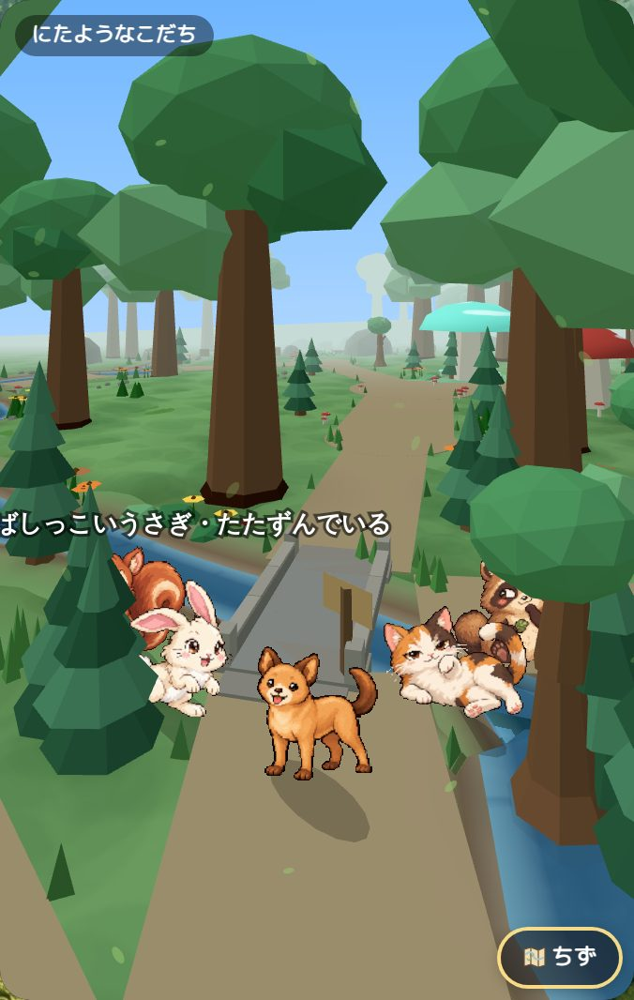
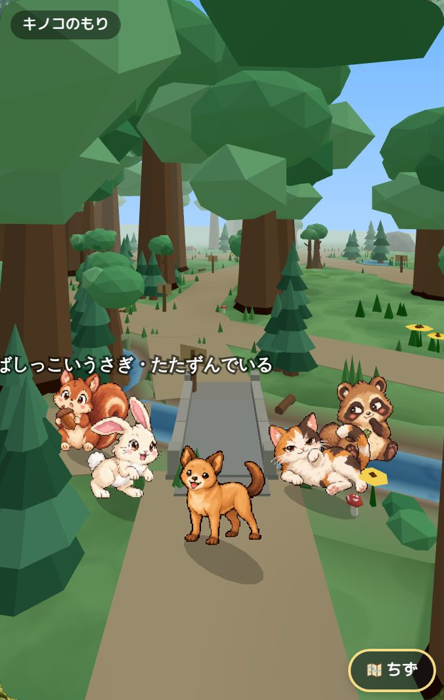
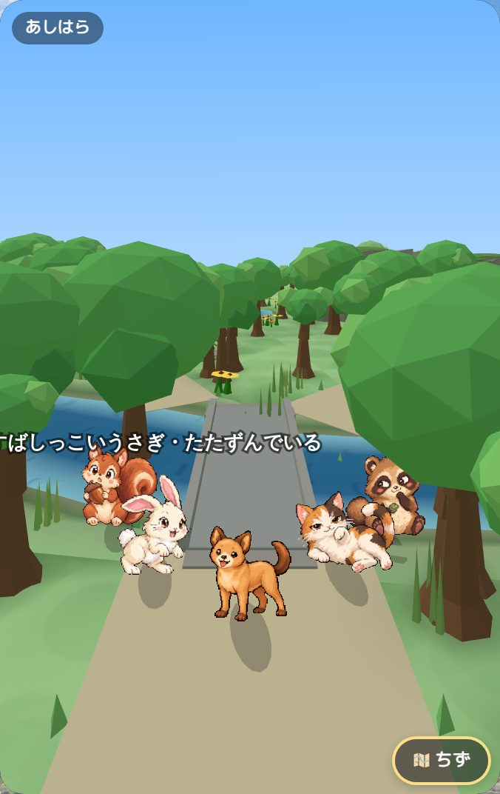
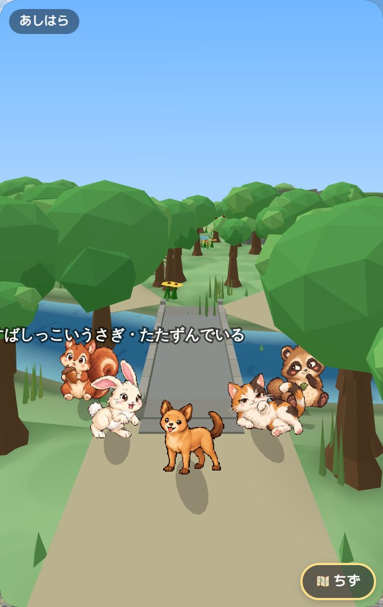
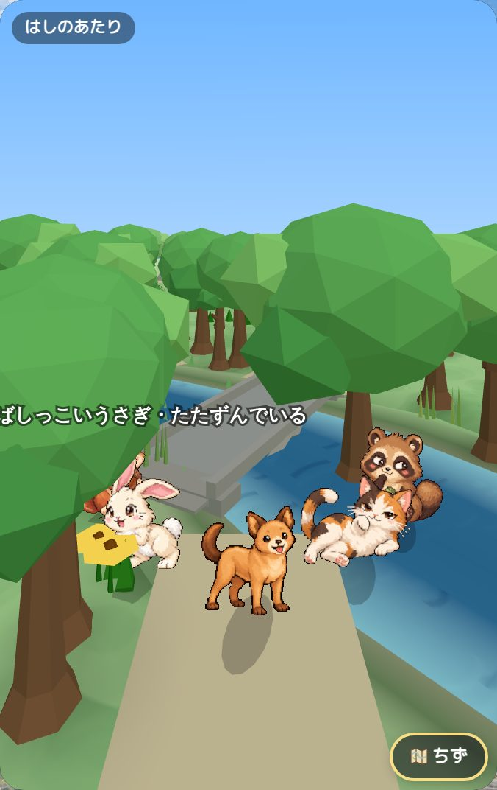
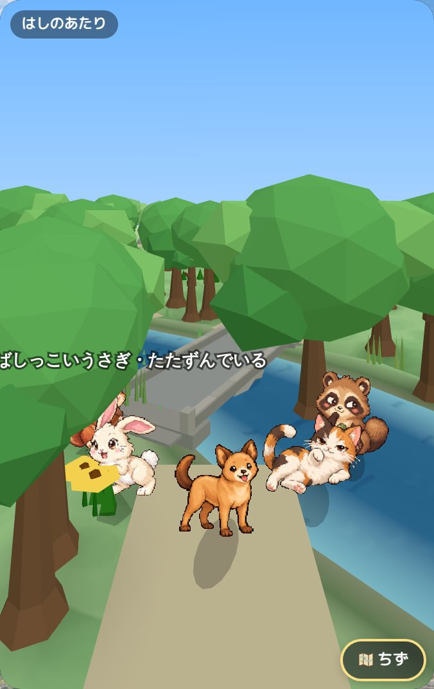

# Stone bridge approach comparison

Before a5e8e83; after95c5850. Same four validated dry-road camera recipes, sunny summer. Frozen frames differ in ambient particle/actor phase; not a frame-time or Human QA approval. Parapet joints and terminal definition improve modestly; broad approach composition remains unfinished.

## forest-bridge-approach-a

| Before | After |
|---|---|
|  |  |

## forest-bridge-approach-b

| Before | After |
|---|---|
|  |  |

## river_lake-bridge-approach-a

| Before | After |
|---|---|
|  |  |

## river_lake-bridge-approach-b

| Before | After |
|---|---|
|  |  |

