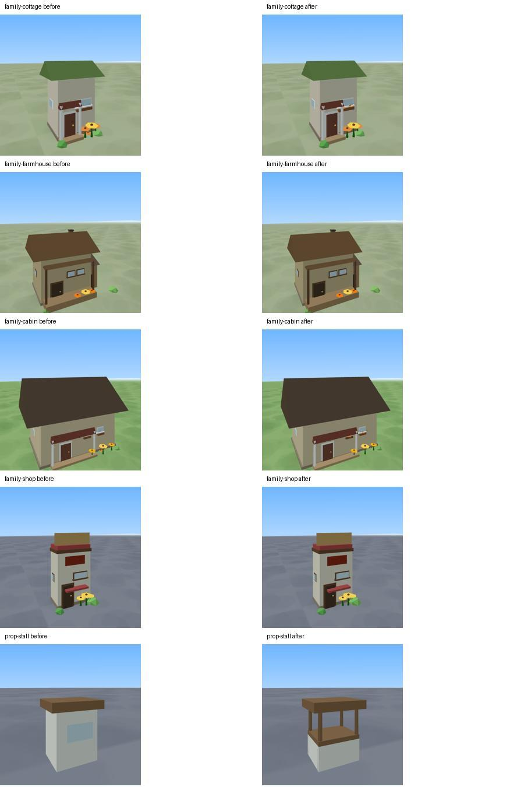

# World Visual Quality checkpoint — 5f24097

World全体は未完成。今回の自動検証checkpointは、iPhone Human QAや最終的な美術品質の承認ではありません。

## 正本・今回の変更

- branch: `feat/meguru-3d-geometry-terrain-v1` / [Draft PR #374](https://github.com/Naoto214/naotocchi/pull/374)
- product: `5f240973eaa7365b069df126db867de4347c2c01`
- product tree: `d9fb9c3f6ec2efab662e91fc15e10d0753fc4ca4`
- BEFORE: `04c2a82db1c06e5d8e45f7f2717990cfc8100a05`（product1cbc27bと同等）
- base: `69a8857bacfa597fa65dcb433536b2f603f26b7d` / tree `a9fbd6c942e372e39f55cccb61b5233d0b01ea43`
- observed main: `0b0a6b30e8e098472b2fa965604f4901874942e3` / tree `aceec6a5ea4a5c94922b60ea90e1b08ea02e42b0`。取り込みなし。

前回の住宅ポーチ・納屋改善について、未確認だったCIのZIP・commit・source SHA256・終了コード・画像を確認し、39d6cc5に保存しました。今回はその続きです。

| Human QAで求められた点 | BEFOREから今回変わった点 | 残る課題 |
|---|---|---|
| 建物・庭の接続 | 花の描画が指定高さを無視していた原因を修正。花壇・窓箱等、7地域196個の花に反映 | 庭と道路の導線、地面の花とデッキの重なりは別問題として継続 |
| 記号・箱に見える小物 | 既存の街の屋台6台を開いたカウンターと支柱へ。屋根と配置は維持 | 車・トラクター等の箱感は残る |
| 性能を保った改善 | 既存geometry/materialを使用。新objectなし。支柱24parts追加 | 実機フレーム時間・allocation等は未計測 |
| 既存の堅牢な基盤 | 全13地域の2D/3D正本・collision・object数を維持 | runtimeの実機問題を解決済みとはしない |

Flower emitterの高さだけを修正し、stem/petal/centreのscale/rotation/material/countは維持。屋台も既存boxpropの範囲です。terrain、grounding、stream/crossing、season、occlusion、adaptive resolution、save/schema、Resident Expression、Character 3Dは変更していません。

## 比較画像・代表場面

[全55組のBEFORE / AFTER](compare.md)（World31＋入口4＋建物/小物20）。同じcamera/position/season/timeのレシピを両側に適用しています。

- [選択した建物・屋台の接写](closeups.jpg)
- [13地域代表](representatives.jpg)
- [home / countryside・forest / jungle・2種類の湖](regional-pairs.jpg)
- [小川・川・橋の比較](water-bridges.jpg)
- [山の夏／冬・同camera](mountain-seasons.jpg)
- [建物familyと小物の全量](compare.md#gallery-after)

山の夏は全面積雪でなく、冬は既存2D正本の季節表現を保っています。3D専用season stateは追加していません。

## 性能・保護

同カメラの描画数。各値は停止撮影時の幾何情報で、frame pacingのbenchmarkではありません。

| 場面 | triangles BEFORE → AFTER | draw calls BEFORE → AFTER |
|---|---:|---:|
| home | 35,272 → 35,272 | 42 → 42 |
| city | 130,188 → 130,476 | 50 → 50 |
| countryside | 119,248 → 119,248 | 54 → 54 |
| forest | 147,752 → 147,752 | 60 → 60 |
| jungle | 172,794 → 172,794 | 62 → 62 |
| river_lake | 112,210 → 112,210 | 43 → 43 |
| memory_lake | 51,204 → 51,204 | 35 → 35 |
| mountain summer | 106,354 → 106,354 | 55 → 55 |
| mountain winter | 104,146 → 104,146 | 54 → 54 |
| snow | 69,408 → 69,408 | 45 → 45 |
| sea | 70,000 → 70,000 | 50 → 50 |
| desert | 90,304 → 90,304 | 41 → 41 |
| deepsea | 73,332 → 73,332 | 36 → 36 |
| star_stop | 65,984 → 65,984 | 30 → 30 |

cityの増分は288triangles（約0.22%）。その他の撮影場面のtrianglesとdraw callsは維持。新material・透明meshは追加せず、変更はscene構築時のWorld部品です。per-frameコード変更はありませんが、実機のinstance更新・allocation・p95/p99/>60msは未測定です。

[13地域保護snapshot](../../meguru-3d-flower-height/protection-after.json)：全2D/3D正本・collision・object数がBEFOREと一致。descriptorはcityのみ12682→12706parts。花のrenderer修正はdescriptorを変えません。静的監査は従来のfloat4/bury18、18validcrossingsを維持しました。

## 検証記録

新規回帰テストは両方RED→GREENを確認。World関連82PASS/0FAIL/exit0。独立レビューはCritical/Important指摘なし。軽微な将来のテスト補強候補は単位記録に残しています。

- ローカルの変更なし `npm test`：**2869＋80 PASS／0 FAIL、exit0**。実行後のsource SHA256一致を確認。
- [CI run37208884653](https://github.com/Naoto214/naotocchi/actions/runs/37208884653)：5jobsすべてsuccess。CI全回帰はNode test concurrency4のpackage pipeline（変更なしnpm testとは別記録）で**2869＋80 PASS／0 FAIL、exit0**。
- 5artifactのZIP SHA256、commit、source SHA256、各終了コードを検証し、生ログ・JSON・画像を保存。
- smoke：13地域、仲間27、errors/consoleErrors/fallback0。最大仲間x/z円形障害物overlapは4.263256414560601e-14。
- corridor：4組8方向、全到着・3D維持・player可視、errors/fallback0。
- visibility：13地域2832ray samples、完全隠れ0、部分隠れ1（mountain）。step1000、yaws0/1.2/-1.2/3.14。実機の画面上の可視性を保証する値ではありません。
- captures：World31＋入口4、建物/小物20のBEFORE/AFTER。すべてactive3D/errors0。山の夏冬はcamera/position/time/weather一致を確認。

元の予備full runはcache-token未更新による失敗が出た開発途中の実行で、Ctrl-C/exit130で中断しました。消さずに保存し、最終source固定のfull runと区別しています。歴史上の17c1bdbのformation463ms FAILも遡及変更しません。閾値緩和なし。

前回VQ2の仲間x/z円形障害物overlap0.002591405357044607、farmhouse runの0.0028149653578708467等も履歴として維持。今回値が小さいことだけで恒久解決とは判定しません。これは地形への埋まりではありません。

## Claude / Astraの履歴

ClaudeのGeometry/Terrain/Runtime基盤からの照明・接地陰影・構図改善は、[以前の31場面比較](../../meguru-3d-visual-quality-v2/compare.md)と[Claude handoff](../../../handoff/meguru-3d-claude-to-astra-2026-10-02.md)に保持しています。今回の55組は04c2a82→5f24097だけを比較し、過去の改善を今回の変更として数えません。

## Commit固定preview

外部previewへの到達はこの実行環境では未確認です。画像と生データはこのGitHub証跡に保存しています。

- [3D + perf](https://rawcdn.githack.com/Naoto214/naotocchi/5f240973eaa7365b069df126db867de4347c2c01/index.html?meguru3d=1&perf=1)
- [normal 3D](https://rawcdn.githack.com/Naoto214/naotocchi/5f240973eaa7365b069df126db867de4347c2c01/index.html?meguru3d=1)
- [2D comparison](https://rawcdn.githack.com/Naoto214/naotocchi/5f240973eaa7365b069df126db867de4347c2c01/index.html?meguru3d=1&m3d2d=1)

## 次工程・Human QA境界

優先は、既存の玄関・road・colliderを使った花/低木とデッキの干渉解消、住宅・庭・道路の一体感。その後building massing、depth/composition、植生cluster、water/bank/bridge、小物、地域識別性を横断的に続けます。今回をWorld全体の完成とはしません。

iPhoneではghost/残像、player disappearance、stutter、p95/p99/>60ms、adaptive resolution、画面上の可視性とperf診断の一致を確認する必要があります。最終的な建物・橋・水の魅力、立体感・構図・地域識別性も未承認です。

PR374 Draft維持。main merge/Ready/production Pages変更なし。save/schema・collision意味論・新season state・Resident Expression・Character 3D変更禁止を継続。
