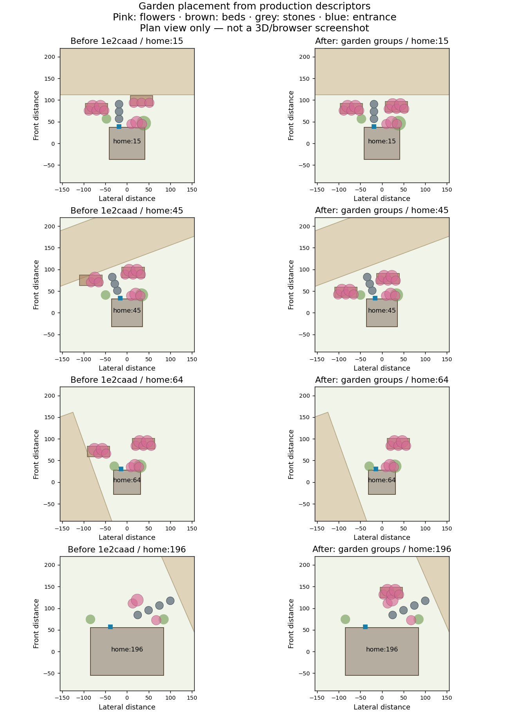

# Home garden planting groups — 2026-10-04

Baseline: `1e2caad68912a1ede263b4fc90ed431706183b5e` (product `704faac`). This is a new product change, not another reconstruction of VQ3 evidence.

Existing beds were accepted one part at a time. Generated home:15 and home:45 each had a bed with only three of its five flowers; home:64 had four. VQ-7 reproduced this before modification (`red.log`). The existing two bed slots per house now try a bounded deterministic relocation of the whole group (maximum distance sqrt(14²+28²), about31.3). The box footprint must fit outside the existing road/spot/obstacle exclusions, and every part must satisfy the existing entrance-route clearance. A rejected candidate rolls back every part it appended. The same five flower descriptors and box geometry are reused. This adds no new bed slots, geometry/material types or per-frame work.

Home garden objects remain14; garden parts160→171. The 17 accepted beds each retain five flowers. Some previously absent beds fit after relocation, while a bed at home:64 is omitted because the full footprint cannot safely fit. This is not a promise to retain every prior bed, or a broad performance optimization. All other 12 regions have identical rendered descriptors, including city/forest/jungle. Canonical2D/world/collision hashes remain identical in all13 regions. Geometry remains float4/bury18, with all18 crossings valid.

## Verification

- Targeted Foundation v2 / Art Direction / Geometry-Terrain / Geometry Audit / Visual Quality / asset integrity:66 PASS,0FAIL (`targeted.log`).
- Independent read-only review: no blocking finding; reviewer noted `beds > 0` alone would allow affected gardens to disappear. Added explicit complete-bed presence assertions for home:15/home:45/home:64; rerun1PASS (`review-regression.log`).
- Full package pipeline is recorded in `full-job.json` and `full.log`, using only Node test concurrency4. Consult its actual exit and tail; a running or incomplete file is not a PASS claim. Source SHA256 values identify the tested worktree even though the job began at the baseline commit.
- Static protection output `protection-after.json` was produced from the modified working tree; its commit field denotes the base checkout, not an assertion that the baseline contains this change. `static-summary.json` records the actual source SHA256.

## Visual evidence and limits

The plan is derived from production descriptors for four matched houses. It shows box/flower integrity, planting placement and entrance stones relative to the nearest canonical road. It is **not a browser screenshot**, lighting/terrain render, complete collision debug view or Human QA. Other nearby scenery is omitted. Input JSON and reproduction scripts are adjacent.

AF_UNIX socket creation remains denied (errno1), so Chromium cannot launch in this runtime. No fresh 3D images, browser smoke/corridor/visibility or measured draw/triangle counts are claimed. The existing same-camera recipes and launch failure from the prior checkpoint remain in `../meguru-3d-visual-quality-v3-recovered/`. World composition/massing beyond this bounded planting-group repair needs those views.

Historical VQ2 evidence is retained unchanged: visibility2832 samples, fully hidden0, partial1mountain, step1000, yaws0/1.2/−1.2/3.14; jungle party circular x/z obstacle overlap0.002591405357044607 (not terrain penetration). Previous 17c1bdb full formation timing failure463ms against <300ms is not erased; isolated PASS did not establish a root cause. No threshold is weakened.

PR#374 stays Draft/open; no main merge/import, Ready, production Pages, save/schema, Character3D or Resident Expression changes. iPhone ghost/afterimage, disappearance, stutter, p95/p99/>60ms and final beauty are still unapproved. World/Art Direction are not complete or production ready.

## Final checkpoint status

The full run did not leave completion/exit metadata. Its process session is unavailable and no runner process remained at resume; termination cause is unknown. Preserve full.log as an incomplete raw log, not a full PASS. Source hashes still match the modified files. Targeted66PASS and reviewer-assertion1PASS remain valid. Fresh full regression and browser validation remain pending.
