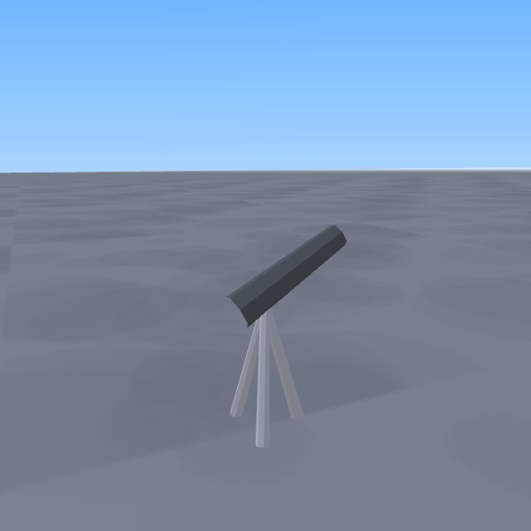

# Telescope declared-material correction

Baseline86daaa0. Saved source69e2684/captures-original.zip gallery-after/prop-telescope.jpg shows the telescope rendered brown despite existing gray barrel and pale-gray tripod colors. The renderer multiplies instance color by its material: raw trunk uses brown, while existing neutralColor selects wtrunk/white wbox. Both telescope taper values (.8/.75) already selected the same trunk mesh (.72 top radius); this fix changes material selection only. No renderer or geometry changes.

21 production telescopes (city1, mountain1, star_stop19),84parts now opt into the existing neutral material. Explicit colors, geometry, transforms, count and placement are unchanged. The meguru.js cache token alone is refreshed. All13region2D/canonical3D/collision/object and part counts match. Removing only the added telescope flags reproduces the exact baseline rendered-descriptor hashes in all13regions; details in protection.json.

VQ-26 RED exit1 for missing neutralColor, then GREEN in the related-suite run. Initial related run:67PASS/1FAIL/exit1 of68. AD-17 failed because sparse checkout excluded the existing docs/qa/meguru-3d-art-direction-v1/compare.html. Restored that exact HEAD file, without modifying it; AD-17 and AD-18 (which also reads it) recheck2PASS/0FAIL/exit0. The original failing log is retained; no claim of a single68PASS run. Existing Node MODULE_TYPELESS_PACKAGE_JSON warnings retained, not addressed by changing package architecture.

Independent read-only review: no Critical/Important/Minor findings. Reviewer confirmed mesh alias identity, white material path and no seasonal recoloring of wtrunk. No fresh unmodified npm test or repeated same-source full run.

## Source-correct target image verification

Product cdd5f3f0d76b1059cdfce24f74195f38ea52fc63 / treef4c733776f09237bf7b350953226cf68b3b06a2a. CI37894253894 browser4jobs succeeded. Captures artifact11600310692 downloaded through the artifact file-reference route; ZIP SHA256a141ba8e6ab8f4b4e142e2acd706bf1752cb9266524c4093918bf9c59561de4a, commit/source hashes/exit0 verified. Beforecf50037 uses the same camera recipe and telescope geometry/colors as86daaa0; existing orchestration runs the baseline harness from the baseline cwd. No renderer source changes between either side. See capture-verification.json.

Both target images actually inspected: pale-gray tripod and dark-gray barrel replace the wood tint; silhouette, support connection and framing retained. Gallery4690triangles/8calls before and after. This closes only the isolated telescope material correction, not all prop shape work or in-game visibility/Human QA. Necessary comparison images and concise verification retained; full new ZIP is not duplicated in Git.

| Before | After |
|---|---|
|  |  |

Broader saved after69e2684 versus current-after logs:68matched names,60same budgets. City2views calls-1; city-market+56triangles; mountain4views-56triangles/calls unchanged. A telescope has4open seven-sided trunk parts=56triangles; these observations are consistent with regrouping/culling after moving instances between existing material batches, but bounds were not instrumented and causality is not proven. Do not claim universal unchanged triangles or performance improvement. Unaffected entrance45+2triangles/+1call remains unexplained. All deltas are retained in budget-comparison.json.

Smoke13regions/corridor8directions issues[]; visibility2832samples/hidden0/partial1/issues[]. Current smoke overlap5.684341886080802e-14; prior0.00599196916066802 remains nonzero/unexplained and is not fixed by this material change. Bridge run37894253911 succeeded; its duplicate originals are not rearchived or claimed newly visually reviewed. Full regression is still in progress at this checkpoint; do not count old2882+80 as validation ofcdd5f3f. Check exact run37894253894 before continuing.

World incomplete; WQ-WHEEL-TREE remains OPEN. No Character3D/Expression/2D/save/collision/season/runtime architecture changes. PR374 Draft/open/unmerged, no Ready/main/Pages changes. Human QA and iPhone performance unapproved.
