# Waterwheel source-correct scene comparison

Run37870051239 / source e0602cc / before cf50037. All8pairs were downloaded, ZIP/source/commit/exit and exact canonical wheel descriptor hashes verified. Different baseline/current hashes prevent the prior source-contamination error. Both sides retain899countryside/831river_lake objects. Product69e2684 unchanged.

All eight pairs were visually inspected. Countryside views1–3 expose the axle and the separate side supports; view0 is partly blocked by a foreground trunk. In river_lake all four views show a pre-existing trunk/wheel overlap. The central support cannot be judged cleanly in these complete scenes; do NOT call the river in-scene appearance gate passed. The isolated gallery supports remain inspected separately.

The nearest river tree is river_lake:68 at (1392.3585151506252,3329.7790468973562), versus wheel river_lake:406 at (1383.2093294812105,3334.449264001967): centres10.2722apart. Its centre lies inside the canonical wheel box; its circle radius24.913585. This is consistent with the trunk intersection visible before and after. No collider, placement or tree crown was changed. This is a close multi-direction observation, not an overview-based justification for pruning.

Open task WQ-WHEEL-TREE: establish a collision-preserving visual treatment for the river wheel/tree conflict. Completion requires the canonical2D/collision fingerprints unchanged and source-correct multi-direction images showing separated readable wheel/support/trunk. The treatment is not uniquely determined by current instructions; do not silently relocate collision/2D authority or erase a solid object. This residual appeared when actors were removed from the diagnostic fixture, exposing the pre-existing geometry conflict.

All8same-camera pairs add42triangles and0draw calls. These static actor-free counts do not establish gameplay frame times or iPhone performance. The broader37780406075 comparison has68names; affected world views+42triangles/callsunchanged, isolated gallery11→12calls, entrance45 -6triangles/-3calls remains unexplained. Nonzero smoke overlap0.00599196916066802 remains unexplained.

Retained here:16necessary original target JPEGs,2inspectionJSONs,7provenance/log files and verification. Full ZIP stays in Actions until2026-11-08. No new full regression was run for this QA-only fix; verified product CI37780406075 remains2882+80PASS with concurrency4. Lost unmodified npm raw files remain unavailable.

## Matched views

| View | Before | After |
|---|---|---|
| prop-wheel-0 | 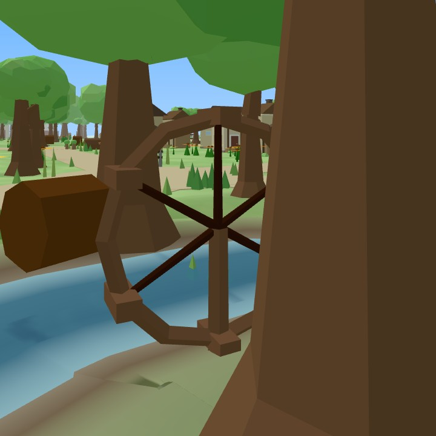 | 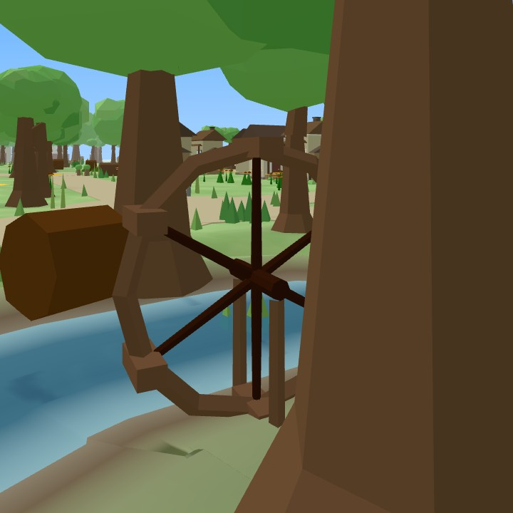 |
| prop-wheel-1 | 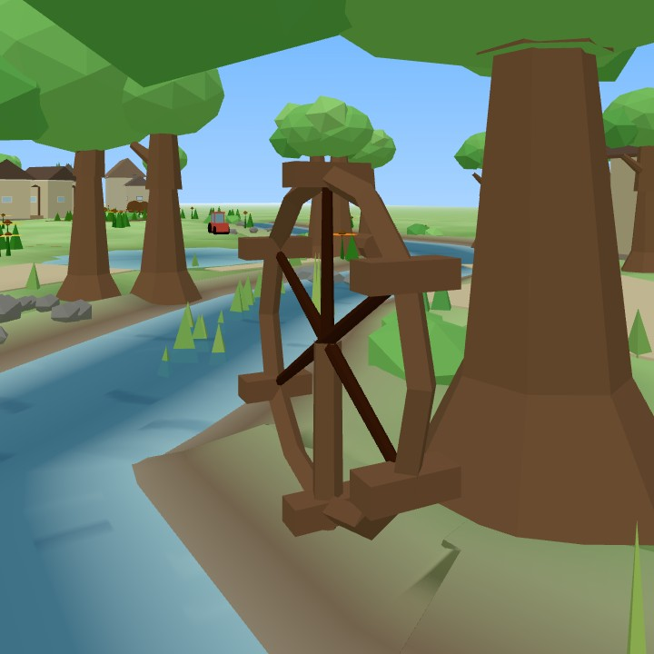 | 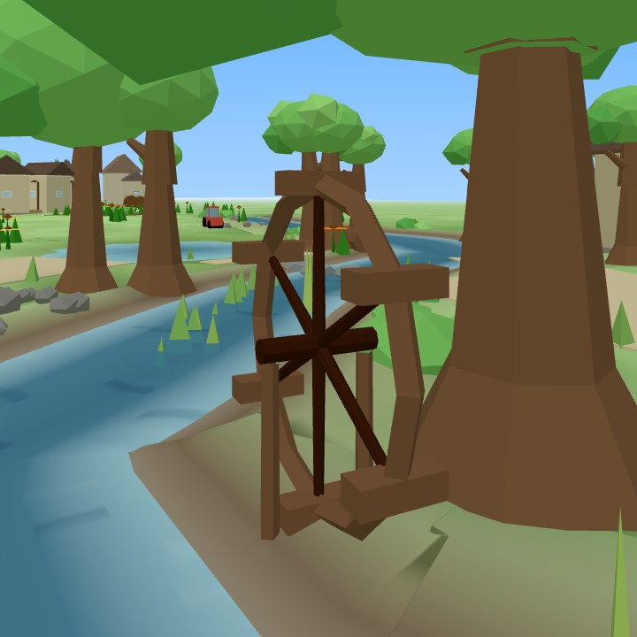 |
| prop-wheel-2 | 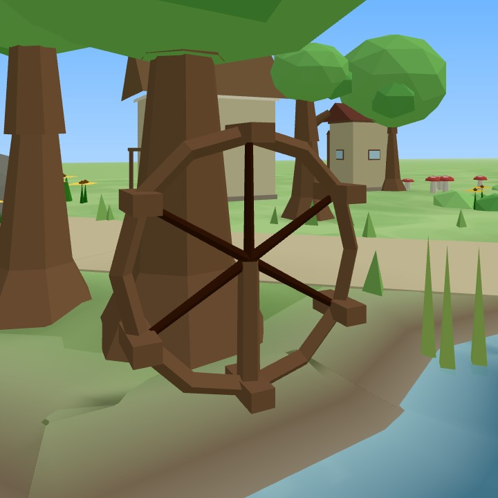 | 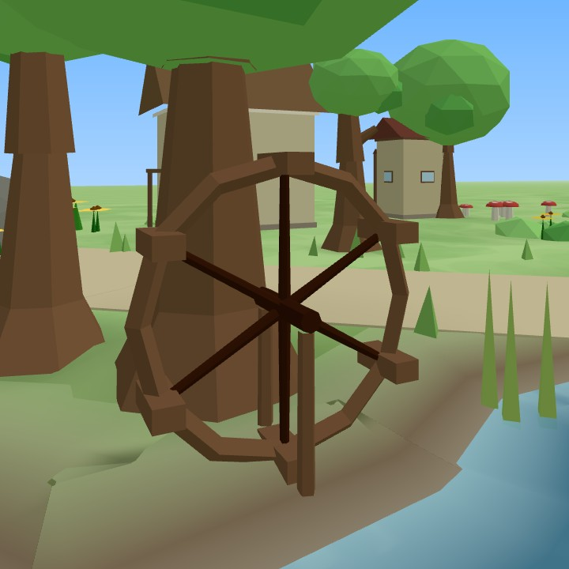 |
| prop-wheel-3 | 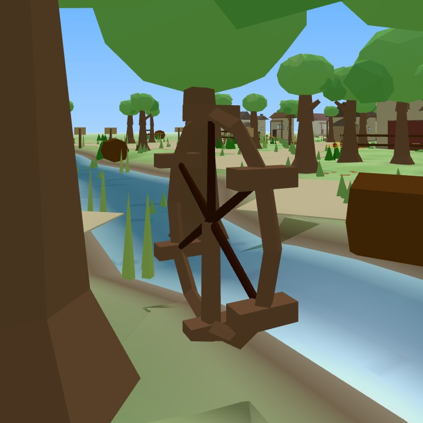 | 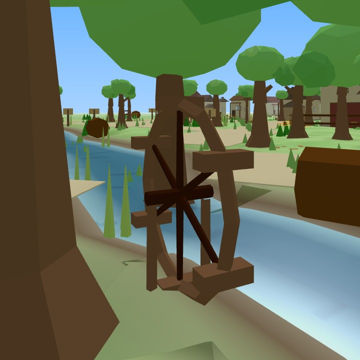 |
| prop-wheel-river-0 |  | 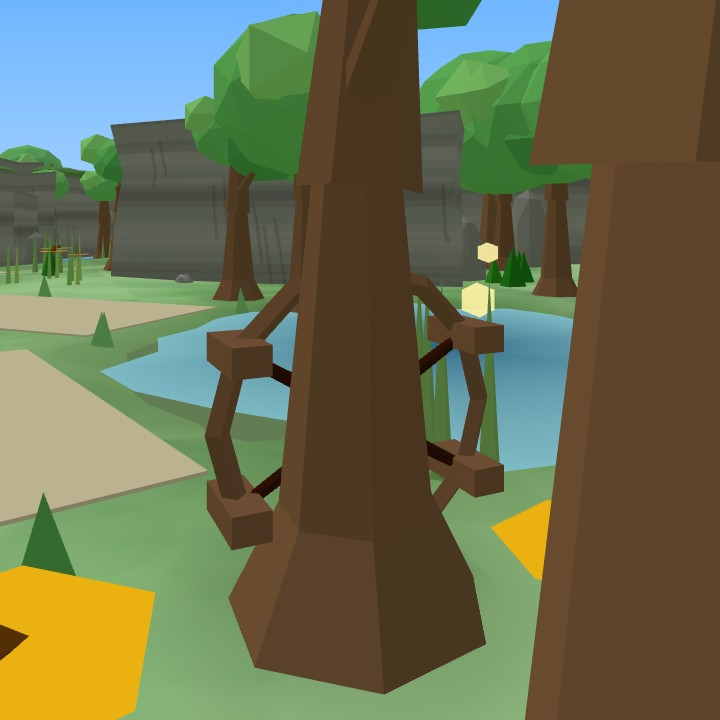 |
| prop-wheel-river-1 | 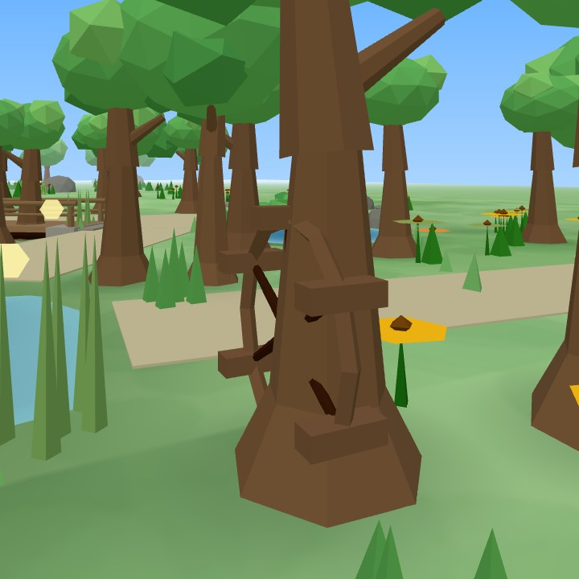 | 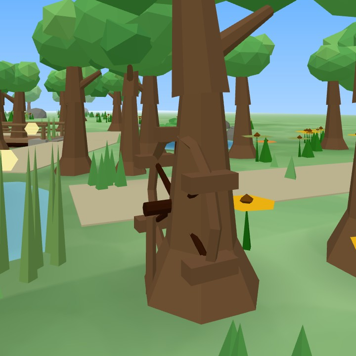 |
| prop-wheel-river-2 |  | 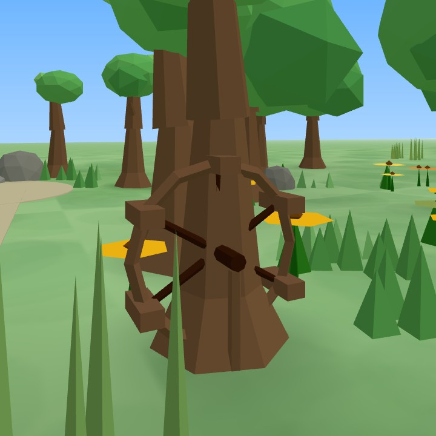 |
| prop-wheel-river-3 | 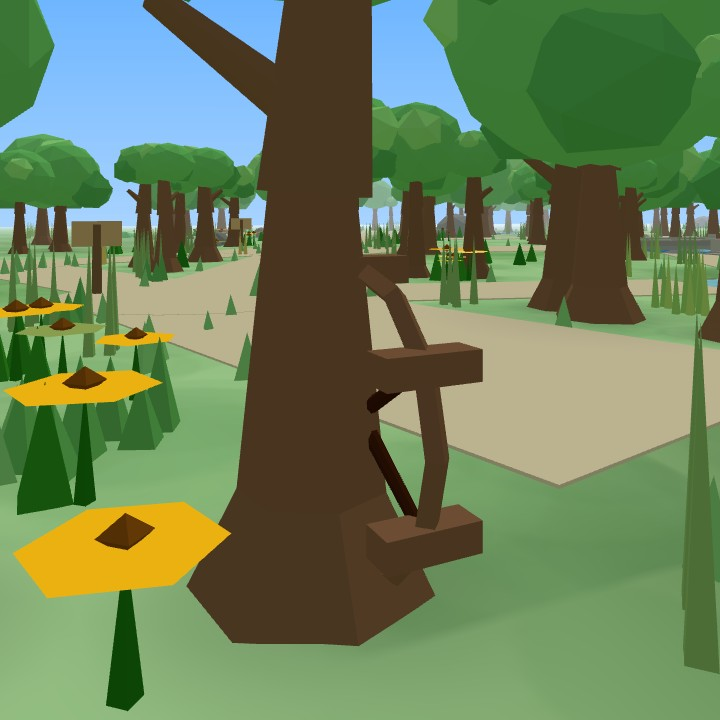 | 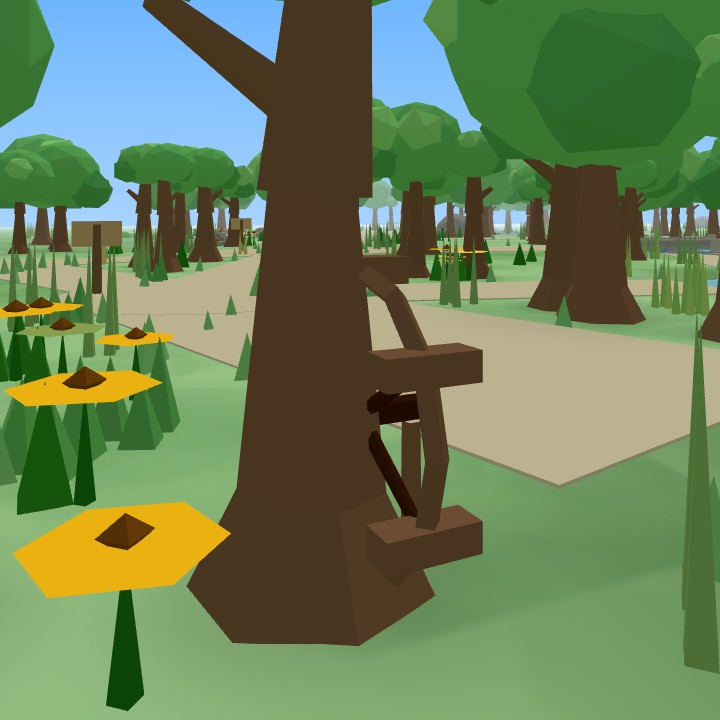 |

Human QA/iPhone performance unapproved. World incomplete; PR374 Draft/open/unmerged.
