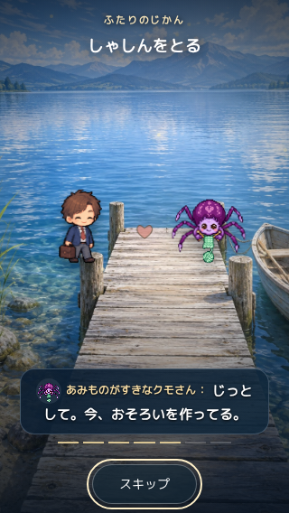
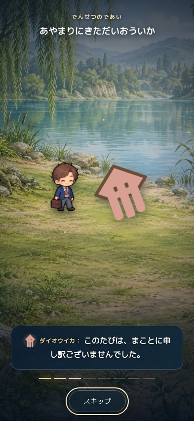

# ムービーの会話と話者表示

基準main: `d91ac12a2c5ca354eaee70aeb6e686f29ef2d17e`（#267のアイテム更新・#270のめぐる更新も統合済み）。初回検証時点は `14e0b2ae7045fca651d8fd1ac5b1c2d78f9fef4b`（#269まで）。
前回の全画面ムービー #265 はマージ済み。今回のブランチは `feature/movie-dialogue-speakers-20260914`。

## 確認した会話方針

`docs/TEXT_STYLE.md`、2026-09-10の文章監査、キャラクター／世界マスター、18恋人の待機・日常・デート・記念日の既存台詞を読んだ。

かわいい日常、少し変な観察や小さな勘違い、あとに残る余韻を軸にする。恋愛は大げさな誓いより、照れや短い掛け合いを優先する。やさしい漢字と句読点を使い、絵文字や全員共通の関西弁を加えない。ロボットの保存、ねこ社長の予定、無口なワシ、触れづらいサボテンなど、それぞれの口調や距離感を残した。

## 変更

| 内容 | 今回の候補数 |
| --- | ---: |
| 通常のプラン別小話 | 10プラン×4＝40本 |
| 深海専用の小話 | 5プラン×4＝20本 |
| 恋人固有の掛け合い（各2発言） | 18体×3＝54本 |
| 特別デートの掛け合い | 6本 |
| 指輪を持つ場合の掛け合い | 3本 |
| 記念日の小話 | 4節目×3＝12本 |
| 日常／仲直りを振り返る掛け合い | 各3＝6本 |
| 伝説の短い物語 | 5種×4＝20本 |

通常の書き出し・既存の恋人固有記念日36台詞・伝説の良い既存文を残しながら、具体的な掛け合いを追加した。文章をばらばらに抽選せず、小話や掛け合いごとに選ぶ。同じ分類を一巡するまでは再選択せず、一巡直後も直前のものを避ける。履歴はプレイ中の表示用で、再読み込み時にはリセットする。

字幕は、一人の発言か情景説明のどちらか。発言の前に28pxの絵と名前を付け、情景説明では両方を消す。本人は現在の姿、恋人は専用PNG、伝説は画面の絵を使う。旧恋人・通信相手は保存された印に対応するイラストへフォールバックする。名前・本文はエスケープし、保存された名前を書き換えない。正体不明の声は「あかりのむこうの声」と表示する。

通常デートは約25秒（指輪ありは約32秒）、特別デートは約37秒、現行恋人の記念日は約29秒。一枚につき3.5秒／4秒を保ち、スキップ・終了・報酬・消費・育成停止は従来どおり。指輪は通常・特別の両方で、保存される同じ合言葉を恋人の発言として表示する。水面の物語の波紋と消失は同じ字幕データに対応する。深海は小話・固有の掛け合い・締めを確認した。

## 検証

- ムービー専用13テスト成功。現在の姿、全18恋人、伝説の話者、情景説明への切り替え、名前のHTMLエスケープ、旧恋人／通信相手の画像、4本の重複しない選択、水中の文脈、波紋と顔の復帰、スキップ・閉じる、指輪の保存文と話者の一致を実コードで確認。
- 追加した話者・4本の選択・イカの話者・旧恋人／通信相手の画像・水中の文脈のテストは、修正前の失敗を確認してから対応した。
- 既存の会話テスト成功。全プラン、全恋人の180デート・72記念日、旧セーブ、報酬の二重消費防止、終了タイミングを確認した。
- 最新mainへの統合後、`npm test` は548件すべて成功。初回mainで再現した `tests/meguru-test.cjs:147` の `party stays near the player` は上流の#267で解消済み。今回のブランチでそのテストを変更していない。初回と最終の記録は [test-summary.txt](test-summary.txt)。
- Chromiumの実DOMで20パターン成功。320×568、393×852、844×390、1280×800、動きを減らす設定、長い恋人名、通信相手、通常／特別の指輪の合言葉を含む。画面全体の被覆、キャラ／字幕／ボタンの非重複、名前の収まり、28px画像、画像読込、字幕ごとの話者切替、終了・入力復帰、未処理例外0を確認。結果は [browser-results.json](browser-results.json)。指輪2ケースは字幕間隔に合った確認時刻で再実行し、その結果を収録した。描画確認は#267統合後の内容。続く#270はめぐる専用のスタイル・初期値・保存処理とキャッシュ更新のみで、ムービー部分は変わらないことを差分で確認し、全548テストを再実行した。
- 読み取り専用レビューで見つかった「通信相手の画像が空」「深海で風の台詞」を修正し、再レビューで未解決の重大・重要指摘なし。最新mainとの統合も再レビューし、指輪の保存・重複防止・消費・ローダーに重大な退行なし。構文・差分の空白検査も成功。

物理iPhone・Safariの実機確認は未実施。全会話全文のスクリーンショットは取得していない。上記代表20パターンの描画と、会話の実行テストを組み合わせている。

## 画面

小さい画面でも、通常コメントのように絵と名前が文章の前に出る。



イカの発言にはイカ、本人の返事には本人の絵が付く。



## 再実行

```sh
node --test tests/movie-test.cjs
node tests/dialogue-test.js
npm test
python3 -m http.server 8773 --bind 127.0.0.1
# 別ターミナルで、PlaywrightとChromiumのインストール先を指定する。
NODE_PATH="$CODEX_PRIMARY_RUNTIME_NODE_MODULES" CHROMIUM_PATH=/tmp/chromium node tests/movie-browser.cjs
```

絞り込みは `MOVIE_TEST_FILTER`、サーバーは `MOVIE_TEST_URL`、画像の出力先は `MOVIE_TEST_OUTPUT` で指定できる。
