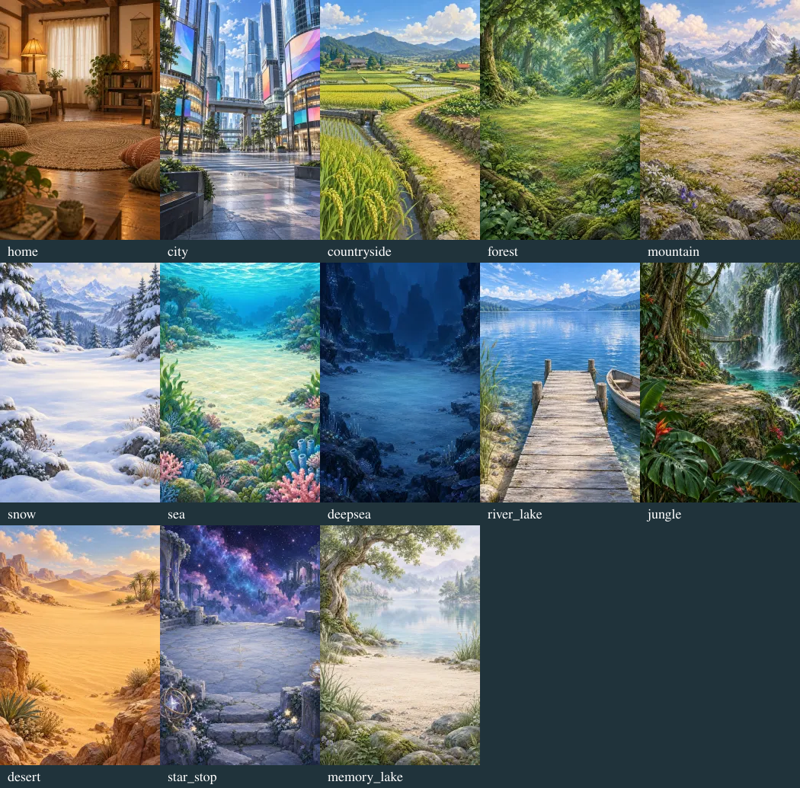

# 景色の差別化と現在地（2026-09-11）

対象: `feature/distinct-world-scenery-20260911`。開始時のmainは `5f5cdcdf1fd1462378286fd34eb81e36f915d617`（PR #240取り込み後）。

## 原画の比較

ユーザーの画面では、とかいが古い水路の街、もり・いなか・ジャングル・みずべが似た緑の広場になっていた。全13地域を並べ、建築・地面・水面・植生の違いで場所を読み取れるようにした。

この画像は**背景原画の比較**。ゲーム画面のスクリーンショットやUI配置の検証結果ではない。

| 地域 | 主な景色 | 今回の扱い |
| --- | --- | --- |
| おうち | ソファ・ラグ・照明のある居間 | 新規。屋内に雨・雪・葉・霧を出さない |
| とかい | 高層ビル・大きな交差点／夜のネオン | 昼夜の新規2枚。夜画への二重の暗色加工を抑える |
| いなか | 水田・畦道・農家 | 新規。冬は収穫後の田畑と薄い雪 |
| もり | 木々に囲まれた林床 | 季節原画を継続。共通の柳の前景を除去 |
| やま | 岩場と山並み | 既存の季節原画を継続 |
| ゆきぐに | 雪原と雪山 | 既存原画を継続 |
| うみ | 光の届くサンゴ礁 | 既存原画を継続 |
| しんかい | 暗い海底と発光生物 | 既存原画を継続 |
| みずべ | 大きな湖・桟橋・小舟 | 新規。共通の柳の前景を除去 |
| ジャングル | 巨大な葉・つる・滝・岩棚 | 新規。共通の柳の前景を除去 |
| さばく | 砂丘 | 既存原画を継続 |
| ほしぞらのていりゅうじょ | 星空の空間 | 既存原画を継続 |
| きおくのみずうみ | 霧のある静かな湖 | 既存の季節原画を継続 |

新規画像は計11枚（上記7枚＋現在地の港町2季節・山あい・一般のまちなか）。生成画像を1024×1536のWebPに変換し、生成指示・参照素材・寸法・SHA-256を [scenery-v2-provenance.json](../../../assets/world/scenery-v2-provenance.json) に記録した。

## 現在地の仕様

| 市区町村 | 景色 |
| --- | --- |
| 北海道・函館市 | 港と海、倉庫、背後の丘。冬用の原画あり |
| 長野県・飯田市 | 山あいのまちなみ |
| 大阪府・大阪市、実在する24区の正式な市区名 | 高層ビル／夜のネオン |
| 東京都の23区 | 高層ビル／夜のネオン |
| その他・対応未登録 | 一般的なまちなか |

市区町村の風景写真や忠実な再現ではなく、少数の用意した**街のイメージ**を明示して選ぶ。町名の「市」「区」だけで都会扱いにしない。都道府県が取得できた場合は照合し、同名の別地域を区別する。大阪の区は `大阪市北区` のような正式名だけを照合し、`堺市北区` や都道府県不明の `北区` を大阪として扱わない。

既存の任意の位置情報取得を利用する。起動だけではGPSを要求しない。保存するのは市区町村名・表示名・都道府県・景色IDで、緯度経度や町名・番地を保存しない。読み込み時に再検証し、保存された任意の景色IDを信用しない。取得失敗では保存済みの景色を保ち、閉じた画面から遅れて届く取得結果は選択を変更しない。

ゲーム上の地域は既存の `home` のまま。現在地の選択表示と通常の屋内のおうちを分け、両者の表示切り替えでは旅の消費を重ねない。別の地域から現在地に移る場合は、従来のおうちへの旅の消費を維持する。

[HeartRails Geo APIの公式仕様](https://geoapi.heartrails.com/api.html) を参照。公式 `getCities` の大阪府レスポンスで `大阪市北区`・`大阪市中央区` などの表記を確認した。実GPSからの住所・天気の連携はこの環境では未確認。

## 検証と制限

- `npm test`: 297テスト成功、失敗0（起動・会話・QA fixtureの検証も成功）。[実行ログ](tests.log)
- 地域×季節×時間×天気の832組のシーンモデル、おうちの屋内演出、都会の昼夜、現在地4種類の画像参照、同じゲーム地域のまま背景が切り替わること、全原画のファイルとハッシュを検証。
- 現在地の同名地域・大阪市各区・不正な保存値・再読み込み・拒否・失敗・キャンセル・通常のおうちに戻る操作・既存の旅の消費を自動テスト。
- `git diff --check` 成功。
- 独立レビューで、未選択の現在地を「表示しています」とする説明文のずれを修正。保存済みの現在地を表示中の場合と、取得した現在地をこれから選べる場合を分け、天気取得失敗時の回帰テストを追加した。

**実画面の確認は未完了。** Viteは起動したが、実行環境のブラウザー安全設定によりプレビューへの遷移が拒否された。別手段で制限を回避していない。原画の目視確認と自動テストの結果を、ブラウザーでの見た目・操作の確認と混同しない。

確認用の `tests/visual-qa.cjs` に、都会の夜、室内の雨／雪、冬の田畑、森の夜、函館市・飯田市・大阪市・未登録の町の保存データを追加した。利用できる環境で `/__qa` を開き、390×844・320×640・デスクトップでのトリミング／文字の読みやすさと、実機Safariでの位置情報許可・拒否・再読み込みを確認する必要がある。本変更はPRでのレビュー用で、mainへのマージ・公開はこの作業では行わない。
