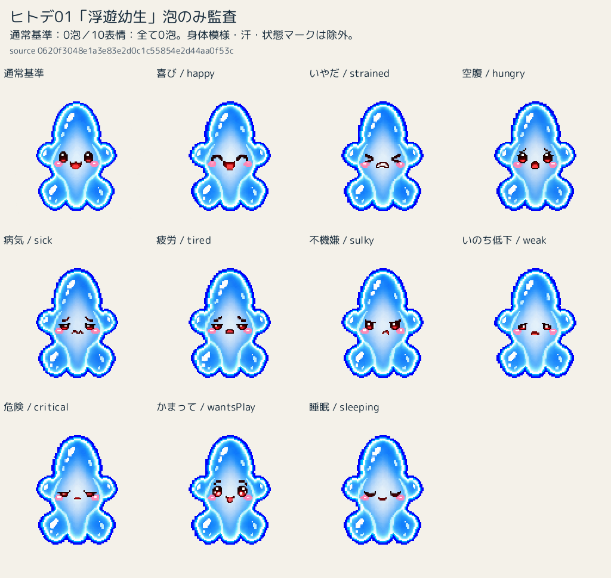
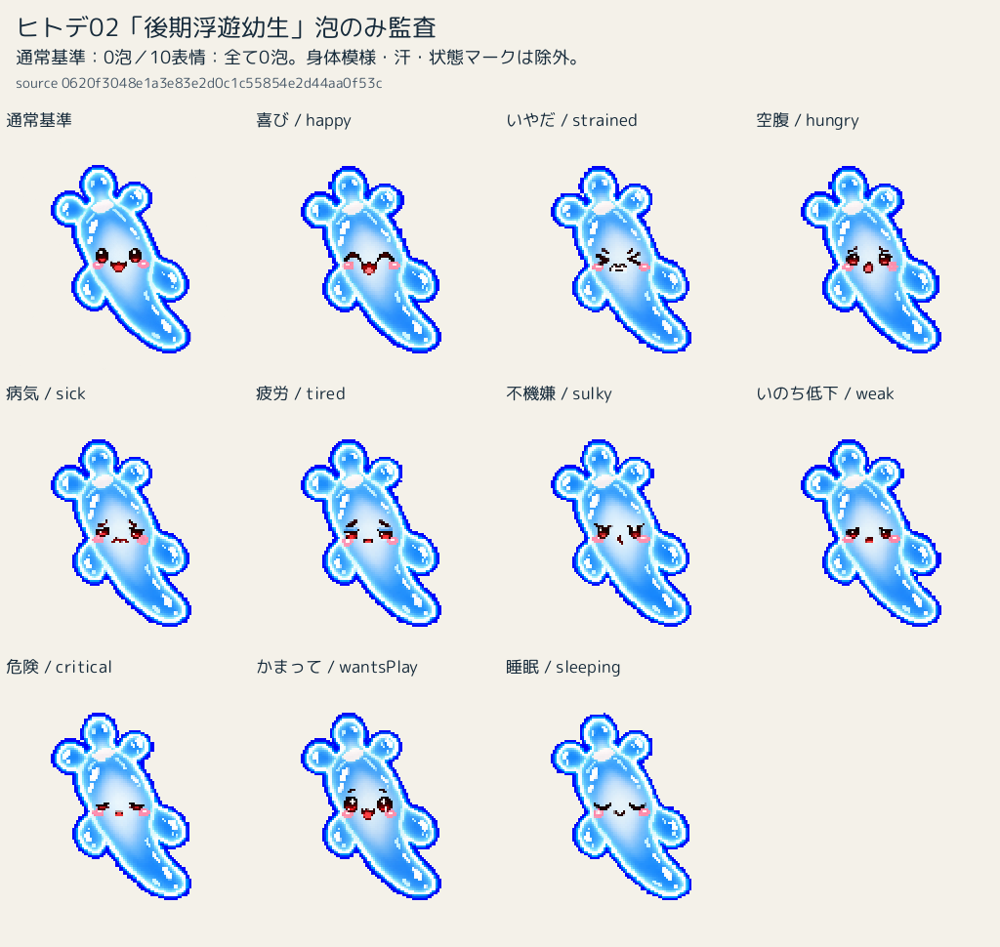
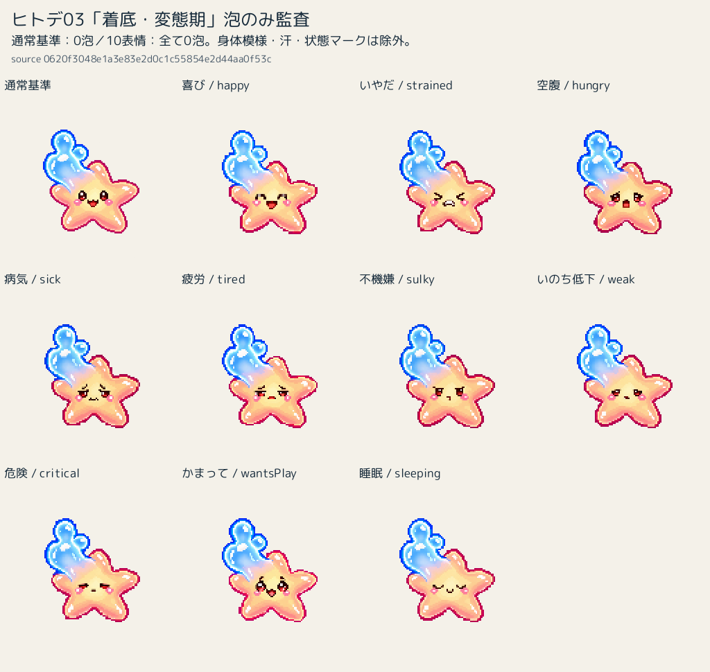
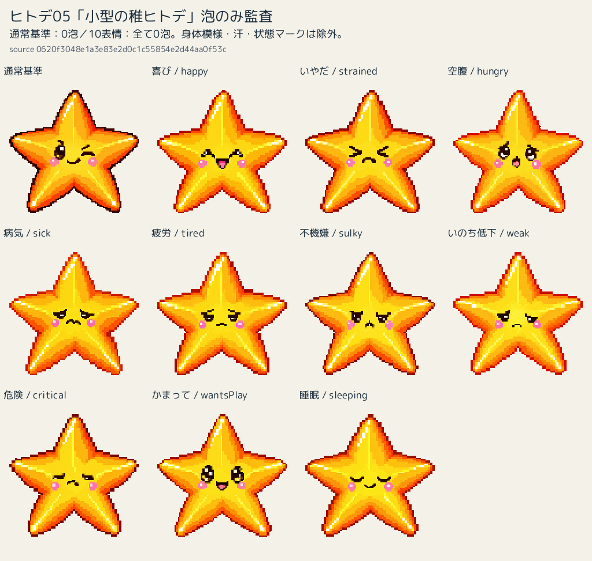
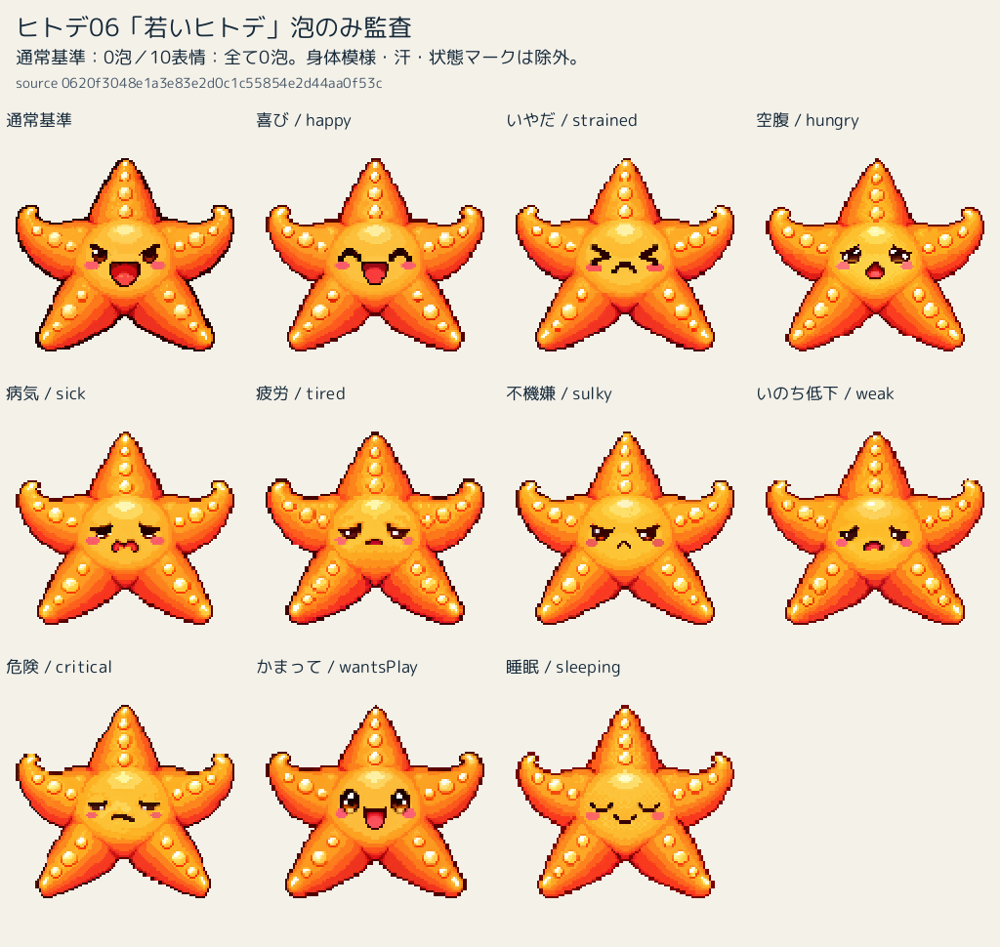
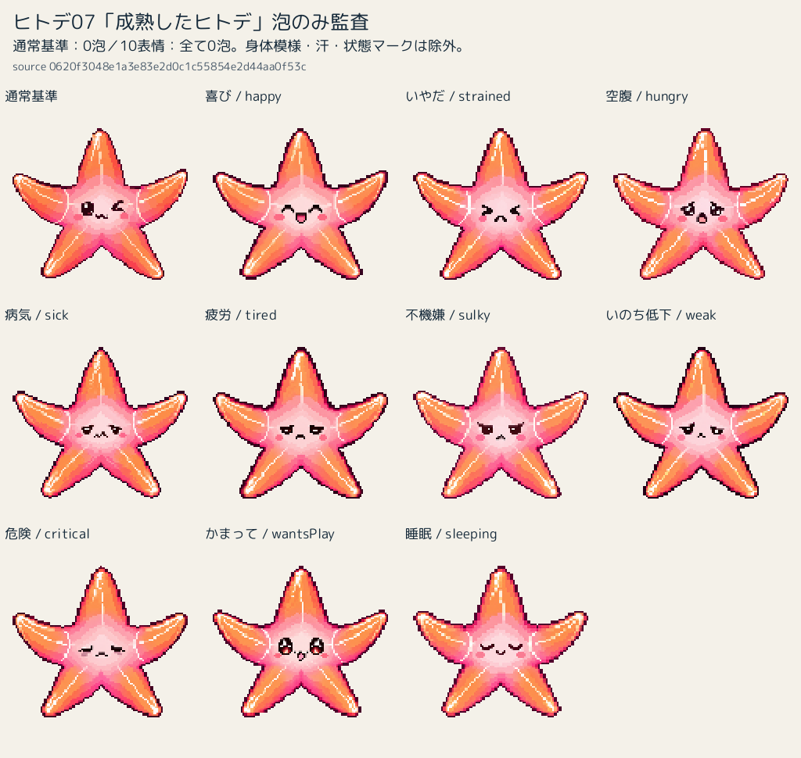
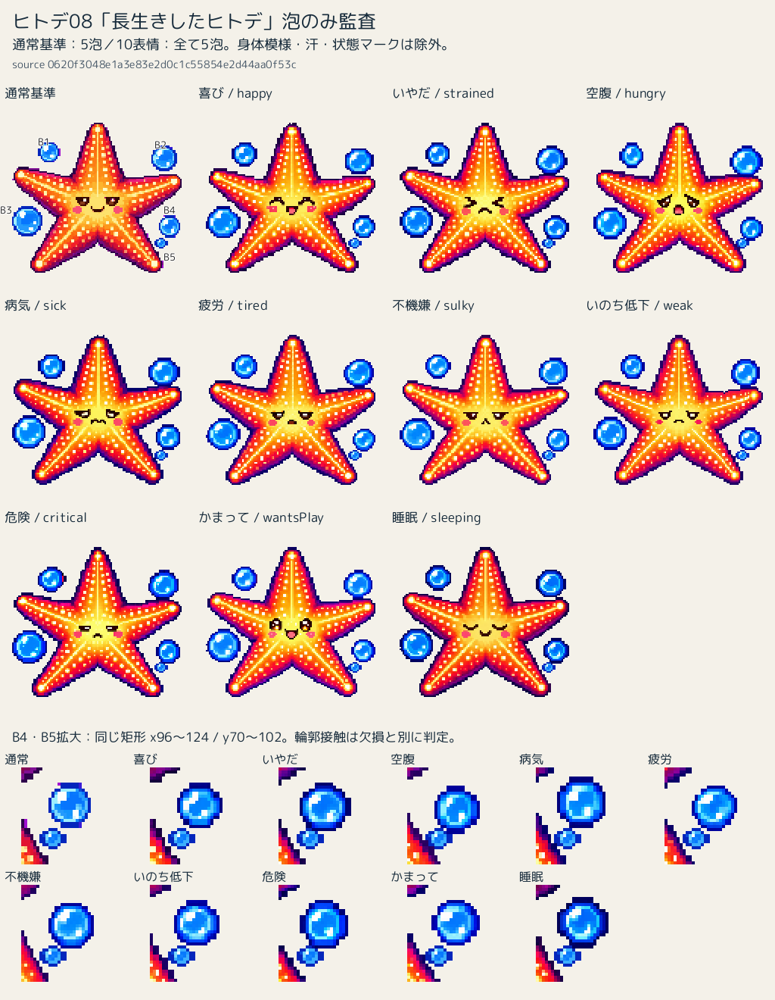

# ヒトデ01〜08：泡の元形保持監査／16枚の人間承認

2026-09-28追加：01〜07の泡数結果は人間確認済み。08は「5泡の存在・復元は承認済み、位置の一貫性のみ追加監査中」。下記の「新規補修不要」は泡数監査時点の結論で、今回の位置・形状の許容判定ではない。[追加座標監査と比較資料](starfish08-coordinate-20260928/report.md)を参照。画像変更0、人間判断待ち。

2026-09-27。**監査結果の人間確認待ち。画像補修なし。手順4全体は未完了。**

## 今回の人間決定

犬03 wantsPlay 1枚、ウスバカゲロウ07 strained／hungry／tired／weak／critical 5枚、ヒトデ08全10表情の計16枚は**人間承認済み候補**として正式承認を記録。今後再生成・再補修せず、必要なら人間判断へ戻す。

ウスバカゲロウ08は10枚未補修・元画像維持。脚の連続性を損なった前回試作は不採用。同方式を中止し、別方式検討待ち。今回新たな試作なし。26/26完了・GREENとはしない。

[16枚の補修記録と比較資料](step4-local-repair-20260927.md) ／ [既存チェックリスト](growth-hunger-expression-implementation-checklist-20260926.md)

## 結論・泡の定義

**通常8枚＋表情80枚を個別比較。01〜07に新しい泡欠損・追加は確認されず、新規修正候補0枚。08は10/10で同じ5か所の泡を保持。**

外部の独立した青い泡を数える。極小泡も独立した意匠なら1個。身体の側葉・突起・幼生残存部、内部の光沢・模様・頬、別レイヤーの汗・状態マークは数えない。泡が輪郭へ触れて連結成分になっていても、泡の同一性を画像比較で判断する。全キャラクターへ背景小物完全一致の規則を一般化しない。

|段階|通常泡数／構成|10表情の泡数|10/10保持|特定表情／全10共通の欠損・追加|合理性・修正候補・人間判断|
|---|---|---|---|---|---|
|01 浮遊幼生|0：丸い側葉・端部は幼生の身体。外部泡なし|全10枚 0|はい|なし／なし|新規補修不要。監査結果の確認待ち|
|02 後期浮遊幼生|0：前方3突起・側部・尾部は身体。外部泡なし|全10枚 0|はい|なし／なし|新規補修不要。監査結果の確認待ち|
|03 着底・変態期|0：青い残存幼生部は星型側と一身体・一顔。外部泡なし|全10枚 0|はい|なし／なし|新規補修不要。監査結果の確認待ち|
|04 変態後の稚ヒトデ|0：体内光沢・頬は外部泡ではない|全10枚 0|はい|なし／なし|新規補修不要。監査結果の確認待ち|
|05 小型の稚ヒトデ|0：光沢・頬は外部泡ではない|全10枚 0|はい|なし／なし|新規補修不要。監査結果の確認待ち|
|06 若いヒトデ|0：腕上の黄色い丸は身体模様。外部泡ではない|全10枚 0|はい|なし／なし|新規補修不要。監査結果の確認待ち|
|07 成熟したヒトデ|0：腕の光沢・頬は外部泡ではない|全10枚 0|はい|なし／なし|新規補修不要。監査結果の確認待ち|
|08 長生きしたヒトデ|5：左上・右上・左下・右下大泡・右下極小泡の5泡|全10枚 5|はい|なし／なし|新規補修不要。監査結果の確認待ち。08承認を維持|

## 個別照合（80枚）

各欄は外部泡数。全欄について通常基準との位置・大きさ・泡の同一性を比較し、欠損／追加なし。これは全RGBA一致を意味しない。

|段階|喜び|いやだ|空腹|病気|疲労|不機嫌|いのち低下|危険|かまって|睡眠|
|---|---:|---:|---:|---:|---:|---:|---:|---:|---:|---:|
|01|0|0|0|0|0|0|0|0|0|0|
|02|0|0|0|0|0|0|0|0|0|0|
|03|0|0|0|0|0|0|0|0|0|0|
|04|0|0|0|0|0|0|0|0|0|0|
|05|0|0|0|0|0|0|0|0|0|0|
|06|0|0|0|0|0|0|0|0|0|0|
|07|0|0|0|0|0|0|0|0|0|0|
|08|5|5|5|5|5|5|5|5|5|5|

## 08の泡の同一性と検出の限界

128px座標の基準成分の半開矩形：左上 B1=(25,27)–(40,40)、右上 B2=(100,29)–(117,46)、左下 B3=(8,69)–(28,89)、右下大泡 B4=(105,75)–(119,90)、右下極小泡 B5=(102,90)–(111,97)。全10表情で同じ領域の5泡を確認。既存大泡4個には輪郭・サイズの微差があるが、別位置への新規追加や同一泡の欠損とは判定しない。

復元小泡は通常45画素に対し7枚で45/45 RGBA一致。strained／hungry／criticalは既存の身体輪郭1画素を保護したため44/45一致。全11画像（通常＋10表情）で小泡の青い核18画素を検出し、目視でも小泡を確認。接触点を欠損扱いして再補修しない。人間承認済み08の判断を維持する。

alpha>16の4連結成分と、08の5領域内の青色核を補助検出。成分数そのものを泡数にしない。01／03通常高解像度には各8／9画素の幅1pxの輪郭断片があるが、円形の外部泡ではなく身体端の細片として除外。01〜07の70表情は各1成分だが、それだけを根拠にはせず画像を個別確認した。

今回の資料は状態マーク／汗を焼き込んでいない本体PNG比較。マークの一時的遮蔽と元画像の欠損を混同しない。アニメーション全位相の可視性を検証したとの主張はしない。位置・銀候補C・左汗・z-orderは一切変更しない。

## 通常基準＋10表情の確認資料

08は右下2泡の拡大も併記。他段階は身体内模様を泡と誤認しないため通常基準を同じ一覧に置く。元画像を編集せず派生QA画像だけを作成。

### 01 浮遊幼生

### 02 後期浮遊幼生

### 03 着底・変態期

### 04 変態後の稚ヒトデ

### 05 小型の稚ヒトデ

### 06 若いヒトデ

### 07 成熟したヒトデ

### 08 長生きしたヒトデ

## 検証と保存範囲

監査source HEAD `0620f3048e1a3e83e2d0c1c55854e2d44aa0f53c`、tree `81968c383b035ed49902344eca9ed54b24f9397b`。各88画像のSHA-256・寸法・成分と検出値は[機械照合JSON](starfish-bubble-audit-20260927.json)。再現ツールは `tools/starfish-bubble-audit.py`。

- `node --test tests/pet-expression-assets-test.cjs`：256 PASS、0 FAIL。
- 資料生成：8枚、監査記録88件。生成前後の全character asset hash一致。開始時manifestとの照合も実施。
- 通常基準・表情PNGの変更0。本番コード・offset・resolver・名称・食事マーク変更0。追加PNG8枚はQA比較資料のみ。
- `git diff --check`：PASS。
- 全体テスト・quick-modeは今回未実行。名称同期の既知4 FAILは未修正・今回再実行なし。quick-mode初回FAILは原因未特定で追跡継続。解消／flaky確定とはしない。
- PR278はDraft/open/未マージを維持。CIは保存後fresh確認し、0件／pendingを成功としない。

人間確認まで停止。新たな泡補修、ウスバカゲロウ08試作、手順5、Site同期、最終QA、なおと制作、Ready化、mainマージへ進まない。
