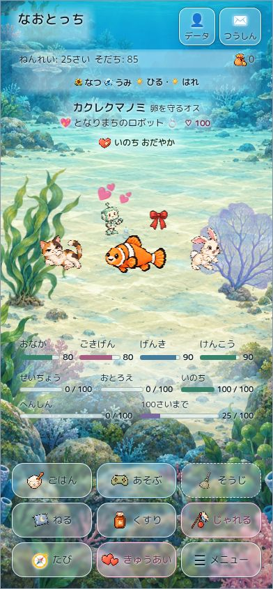
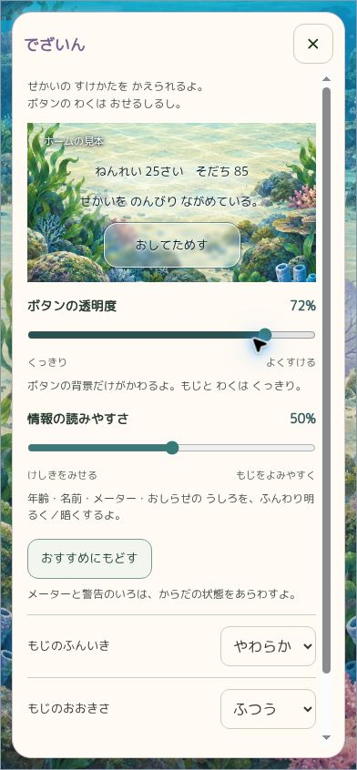
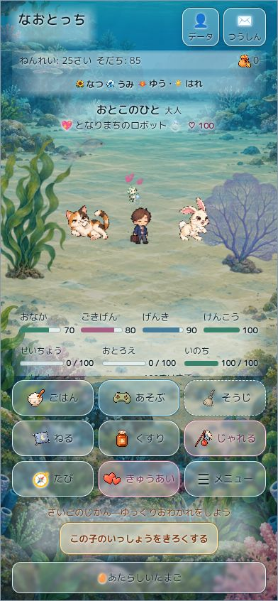
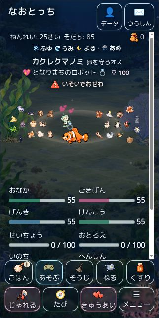
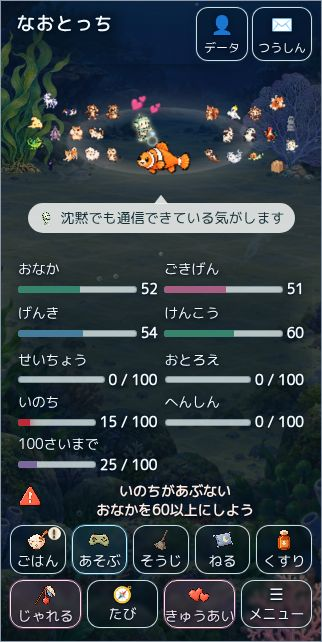
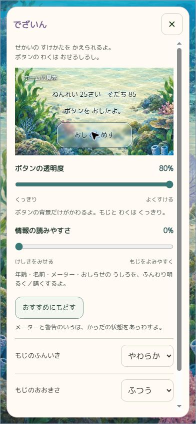

# 世界一体型ホーム：操作と情報の区別

2026-09-11。ユーザーの追加指示に従い、同じ枠が操作・情報・ナレーションを囲っていた状態を整理した。既存の [PR #240](https://github.com/Naoto214/naotocchi/pull/240) を更新する。

## 基準と競合確認

- 最新main `8de40f77b1872db479e854162c4ded207eec7a18`（#239統合済み）を取得。
- 作業親はPR #240の `7ae6d380a44831c3160baea263fd4ffdff759cde`。更新準備時にもmainとPR headが変わっていないことを確認した。
- open PRは #240 と旧 #92。#239の世界UI、関連QA・引き継ぎ、直前の「とうめい」追加を確認。別PRを重複作成せず #240 に続ける。
- Claude側から統合済みの保存v5、入力、メニュー排他、性能対応を保つ。世界背景・キャラ素材・配置solver・ゲーム状態判定を作り直していない。

## 実装した区別

| 役割 | 表現 |
| --- | --- |
| 操作ボタン | 明暗の二重エッジ、半透明ガラス、押下時の濃度変化と小さな沈み込み。キーボードフォーカスも表示 |
| 年齢・成長・地域・季節・名前・状態 | ボタン風の枠とカードを撤去。文字色と影、縁が消える局所グラデーションで補助 |
| ナレーション | 枠・塗り・ボックス影なし。昼は濃色、夜・深海・星空は明色。長文は2行分の領域内をスクロール |
| キャラの会話 | 乳白色82%の吹き出しとキャラ側の尻尾。枠線・立体ボタン表現なし |
| ゲージ・警告 | 収集テーマから独立したゲーム管理色。数値、文章、警告アイコン、推奨操作も維持 |

通常ゲージの緑 `#37836b`、ごきげんの桃 `#a65e82`、げんきの青 `#467d9d`、低残量の橙 `#b35415`、危険・いのち低残量の赤 `#be2939`。変身・目標は紫 `#7b68a1`。恋愛操作の桃色と警告の暖色は装飾テーマに置き換えない。

## 「でざいん」の変更

| 項目 | 範囲・初期値 | 実際に変わる場所 |
| --- | --- | --- |
| ボタンの透明度 | 30–80%、初期72% | 操作ボタンの下地のみ。文字・アイコン・輪郭にopacityを掛けない |
| 情報の読みやすさ | 0–100%、初期50% | 年齢・名前・メーター・ナレーション背後の、縁が消える明暗の補助 |

現在の景色・照明を使う見本に情報・ナレーション・試せるボタンを置いた。スライダーの操作中に更新し、確定時に保存する。「おすすめにもどす」はこの2項目だけを初期値に戻す。もじの種類・大きさは既存の設定を維持する。

旧「メーター／ボタンの色」は操作色の設定から、折りたたみの「あつめたいろ・がら」コレクションへ変更した。未解禁を含む獲得条件、保存済みのテーマ／柄ID、チケット等の獲得経路は保持し、ホームの実際の色には適用しない。旧ボタン色が `transparent` で新設定がない保存は透明度80%へ移行する。不正な保存値は正規化し、明示した新設定がある場合はそちらを優先する。

情報補助の実際の下地不透明度は34–62%。0%でも読みやすさの最低限を残す。これは文字全体を覆うカードではなく、縁を消した局所的な補助。暗い森で最低値を確認して調整した。

## 検証

- 最終 `npm test`：**274成功、失敗0**。[全ログ](world-ui-20260911/tests.log)。保存移行、入力中の反映・保存・再読込・リセット、コレクションと旧ID保持を含む。既存のゲーム、入力、成長、保存、世界・配置の検証も成功。
- `node --check script.js` / `world-scene.js`、キャッシュトークン検証、`git diff --check` 成功。
- ブラウザーで海昼夜、雪、夏の森・秋の森、深海、砂漠、星空、水辺の雨を確認。390×844、320×640、768×844を使用。最大透過と最小情報補助も比較した。
- 旧せいざ／レインボー保存の計算済みゲージ色は一致。低残量・危険の橙／赤を実DOMで確認。情報・ナレーションのborderは0、背景はtransparent、box-shadowはnone。
- スライダーと見本ボタンを実操作し、保存後の再読込も確認。ごはんのナレーション／会話、ミニゲームの導入と実ゲーム操作面を確認。
- 320×640・26人の仲間・大きい文字では中央情報だけスクロール。操作の最下端627px、文書高640px。スクロールして下の命ゲージと危険案内を読める。
- おわかれの記録ボタンを中央スクロールの外の既存ライフ操作欄へ移動。390×844で全体表示、他操作との重なりなし、実クリックで人生記録カードへ進むことを確認。
- 独立コードレビューでreduced-motionのCSS優先順位を修正。追加のfooter移動を含む最終確認で未解決指摘なし。ナレーション補助がスクロールバーを作る問題、変身／目標色の優先順位も実ブラウザーで検出・修正した。

[ブラウザーの計測・計算済み色](world-ui-20260911/browser-evidence.json) は調整中の背景サンプルと最終レイアウト確認を区別し、各サンプルのasset tokenを残した。最終4画面はlayoutChecksPass／checksPassともtrue。調整中の一部ではQA側の別Imageによるアイコン読込プローブがpendingとなったため、成功扱いにしていない。実表示用atlas画像はcomplete／naturalWidthを別途確認した。

クラウドChromiumでの表示・操作確認。物理iPhone/Safari、VoiceOver、全ミニゲームの実画面、全832環境のスクリーンショット比較は未実施。832環境の整合は既存の自動テストで確認している。

## 画面

| ホーム（最終） | 透明度設定（最終） | おわかれ（最終） |
| --- | --- | --- |
|  |  |  |

| 小画面・大きい文字（最終） | 下部情報へスクロール（最終） | 最大透過の見本（最終） |
| --- | --- | --- |
|  |  |  |

背景調整中の比較画像は同じディレクトリに保存した。雪・森・夜・深海・砂漠・星空・雨・紅葉の各サンプルについて、撮影時のバージョンはJSONを参照。最終版ですべて撮り直したという意味ではない。
